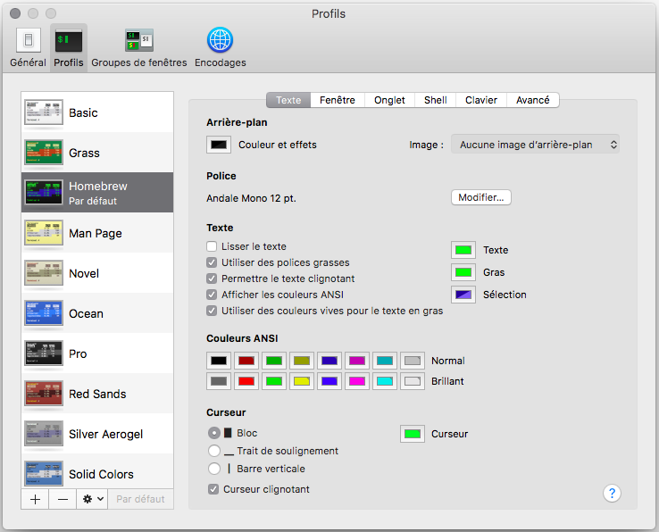
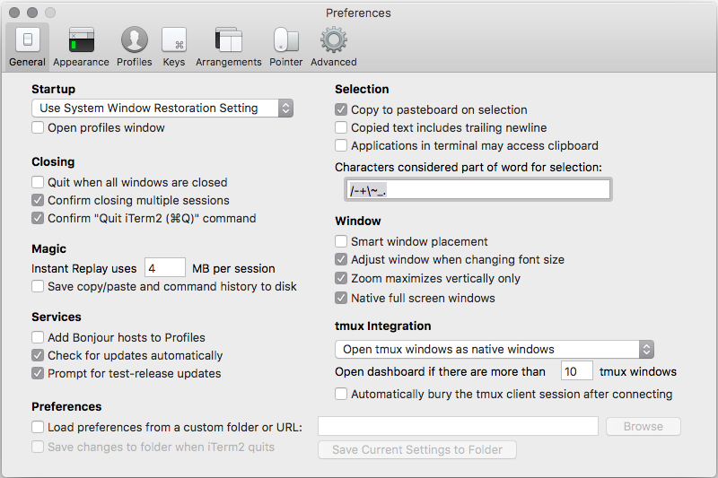
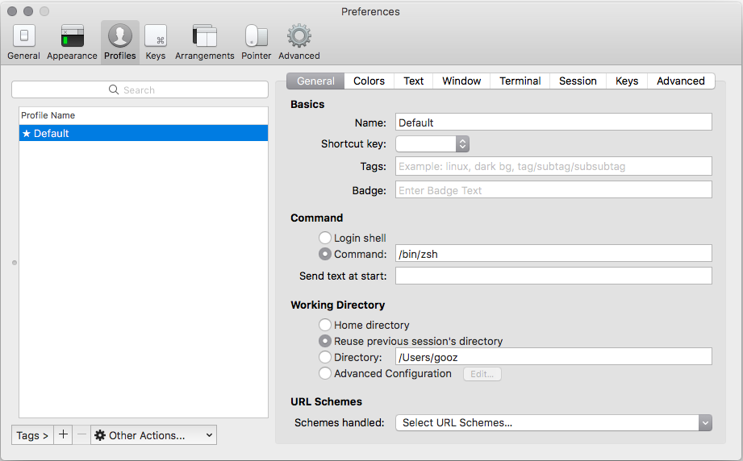
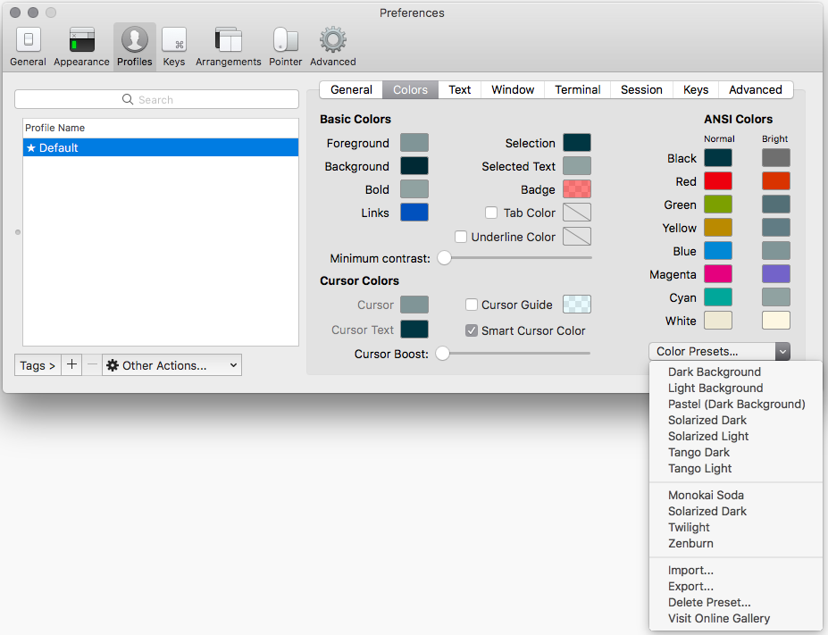
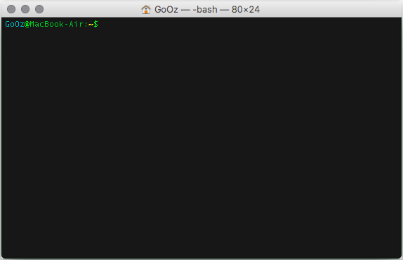
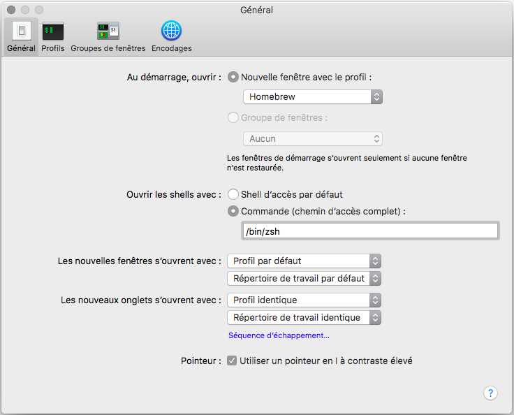
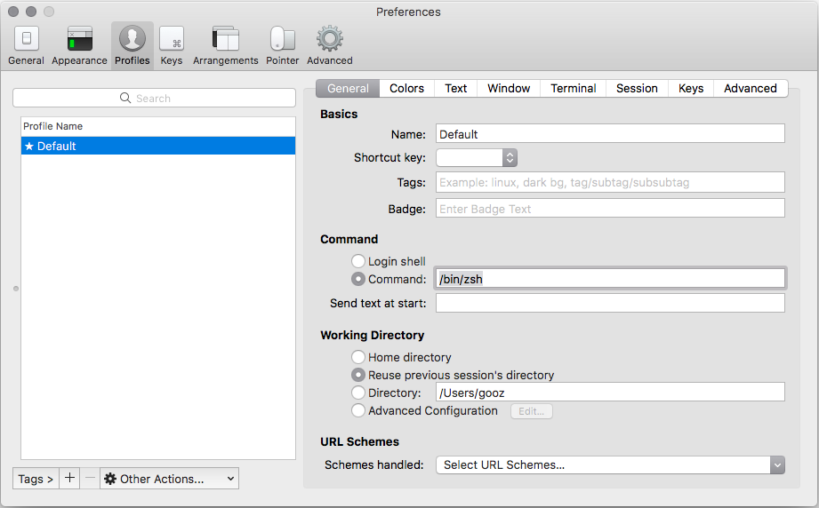

C'est là que commence la période la plus obscure de notre voyage, il va falloir toucher à des fichiers de config et coder un peu.
---

Sachant que les fichiers de config sont des fichiers cachés, ils seront plus facile à localiser et ouvrir directement depuis le terminal.

Si vous utilisez [Sublime Text](www.sublimetext.com/), je vous invite à mettre en place la commande CLI de ce dernier en suivant [ce tutoriel](https://gist.github.com/artero/1236170).

Si vous utilisez [Atom](https://atom.io/), normalement c'est déjà installé pour vous.

Si vous utilisez n'importe quel autre éditeur de texte, alors démerdez-vous ou bien utilisez *vim* ou *nano* ou n'importe quoi d'autre.

Pour mes exemples, j'utiliserai la commande `subl` mais évidemment je vous laisse le soin d'adapter la commande avec `atom` ou `vim` ou `nano` selon votre cas.

Bien, maintenant que vous êtes prêts, c'est parti.

---

Avec l'offre que je vous ai fait, vous avez dû faire des choix d'application et de shell au moins.

Alors suivez donc ce tutoriel dont vous êtes le héros :

- [Vous avez choisi Terminal](#Terminal)
- [Vous avez choisi iTerm2](#iTerm2)
- [Vous avez choisi bash](#bash)
- [Vous avez choisi Zsh](#Zsh)
- [Vous avez choisi tout autre chose](http://www.google.com)

## Personnaliser Terminal

Si vous avez choisi **Terminal** et bien il ne reste plus beaucoup de chose à personnaliser.

Je vous invite toutefois à aller faire un tour dans les options `⌘+,` et notamment l'onglet "Profils", à cocher ce qui vous intéresse.

Je vous conseille aussi de cocher les options "Utiliser les polices grasses", "Afficher les couleurs ANSI" et "Utiliser des couleurs vives pour le texte en gras" comme sur la capture ci-dessous.

Pensez donc à changer de thème aussi, le terminal est déjà tellement rustre de base que laisser la coloration neutre serait encore pis.

Choisissez donc un des thèmes de base ou, si comme moi vous ne trouvez pas votre bonheur dans le lot parce que, disons les choses, tous sont bien moches, allez fouiller le web.

Je vous recommande dans ce sens le theme [Solarized](https://github.com/tomislav/osx-terminal.app-colors-solarized) ou [Smyck](http://color.smyck.org/) ou encore, si vous tenez à le faire vraiment personnalisé, tatez donc du générateur de thème [4bit](http://ciembor.github.io/4bit/).

## Personnaliser iTerm2

Si vous avez choisi [iTerm2](http://www.iterm2.com) et que vous l'avez déjà installé, ouvrez donc les paramètres `⌘+,`.

Si vous avez déjà regardé les préférences de **Terminal**, vous remarquerez que iTerm2 peut se targuer d'être plus puissant mais je dois avouer que la moitié, si ce n'est plus, des paramétrages possibles me sont bien obscurs.

Ceci étant j'en recommande certains à cocher/décocher.

Comme sur l'onglet "Général", il vaut mieux décocher (de mémoire il est activé par défaut) l'option *Startup > Open profiles window*. Je pars du principe que vous n'aurez pas besoin de plusieurs profils de par votre utilisation du terminal.

Sur l'onglet *Profiles > General*, Cochez l'option "Reuse previous session's directory". Celle-ci vous permet à chaque nouvelle ouverture de fenêtre de ne pas repartir de la racine de votre dossier utilisateur mais du dernier dossier où vous vous trouviez juste avant.

Enfin, dans *Profiles > Colors*, vous pourrez ajouter un theme. Je recommande mes préférés toujours [Solarized](https://github.com/altercation/solarized/tree/master/iterm2-colors-solarized), [Monokai, Zenburn, Twilight ou plein d'autres encore](https://github.com/mbadolato/iTerm2-Color-Schemes) ou bien faire vous même le vôtre avec votre pouvoir créatif sur [4bit](http://ciembor.github.io/4bit/).

Au delà de ça, laissez vous aller à fouiller ce que vous propose iTerm2 mais je vous déconseille de cocher/décocher des options dont vous connaissez pas la portée.

## Personnaliser bash

**Bash** étant le shell par défaut sur mac OSX, on enchaîne direct sur sa configuration.

Déjà il faut savoir que bash a **deux** fichiers de config : *.bash_profile* et *.bashrc* qui ne sont pas utilisés dans les même cas, mais comme vous voudrez a priori hériter de la même chose, on va faire en sorte que le premier importe le deuxième… sauf que le deuxième, *.bashrc*, n'existe pas.

Vous allez donc d'abord vous assurer que vous êtes bien dans votre *home directory* à savoir */Users/votreusername* en tapant la commande `pwd`. Si vous n'y êtes pas et je me demande bien ce que vous avez fait pour ne pas y être, tapez la commande `cd`.

Une fois que vous y êtes :

- tapez la commande
`cp .bash_profile .bashrc`

pour créer le fichier *.bashrc* en copiant et donc récupérant le contenu de *.bash_profile*.
- Éditez ensuite le *.bash_profile* avec la commande
`subl .bash_profile`
- supprimez tout le contenu et ajouter l'appel d'import du *.bashrc* avec la ligne
`source ~/.bashrc`
- enregistrez et quittez.

Désormais tout se fera dans le fichier *.bashrc*.

Puisque vous avez décidé d'appliquer un thème super joli à votre application, si on appliquait de la couleur aussi à ces bien mornes lignes de commandes et résultats de commande `ls` qui liste le contenu d'un dossier ? C'est parti.

- `subl .bashrc`
- pour rendre la ligne de commande colorée, ajoutez la ligne
`export CLICOLOR=1`
- Pour colorier les résultats `ls` ajoutez la ligne
`export LSCOLORS=ExFxBxDxCxegedabagacad`
- Enregistrez et quittez

Ça commence à prendre forme mais on ira plus loin un peu plus tard.

Passons si vous le voulez bien au *prompt*.

Personnaliser son *prompt* paraît très obscur pour les profanes.

Par exemple, pour obtenir le prompt que j'ai sur mon Terminal avec ces couleurs comme le montre l'image ci-dessous, il vous faut ajouter une ligne telle quelle `export PS1="\[\033[36m\]\u\[\033[m\]@\[\033[32m\]\h:\[\033[33;1m\]\w\[\033[m\]\$ "`

Je ne vais pas vous apprendre à faire ça à la main parce que ce serait, je pense, pousser le bouchon trop loin.

En revanche, je vais vous donner quelques directions simplifiées. Il existe un générateur de prompt pour bash, qui fonctionne à base de *drag & drop*, c'est simple, clair et ça marche.

Allez donc faire un tour sur [http://bashrcgenerator.com/](http://bashrcgenerator.com/) et faites donc votre prompt comme vous le sentez.

***NB** : Les changements que vous faites au prompt ne se chargent pas automatiquement, vous devez ouvrir une nouvelle fenêtre ou mieux, taper la commande `source ~/.bashrc` pour recharger le fichier de config et donc les changements effectués.*

Si vous êtes une personne bien et que vous utilisez un outil de versioning comme SVN, ou encore mieux Git, en ligne de commande (comme les vrais :P), vous en avez probablement marre de devoir faire des `svn/git status` intempestifs pour savoir sur quelle révision/branche vous êtes. Sachez donc que vous pouvez demander au prompt de vous afficher d'emblée ces infos. Et ça c'est über cool.

Je vous conseille donc de suivre [ce tutoriel de Trevmex](http://trevmex.com/post/7320627392/how-to-add-git-and-subversion-info-to-a-bash-prompt) qui fonctionne très bien et qui rendra plus verbeux encore votre prompt en ajoutant donc, dans le cas de SVN, le numéro de révision sur laquelle vous êtes `GoOz@MacBook-Air:DepotSVN (svn:306)$`, et dans le cas de Git, le nom de la branche actuelle `GoOz@MacBook-Air:DepotGit (master*)$`.

Si vous vous sentez chaud et souhaitez vraiment tout comprendre et faire à votre sauce, [faites vous plaisir avec toute la palette de variables, couleurs et diverses possiblités que vous offre bash](http://blog.twistedcode.org/2008/03/customizing-your-bash-prompt.html).

## Personnaliser Zsh

### Installation

Vous avez choisi **Zsh** et je vous en remercie. Comme vous avez suivi, vous allez me faire le plaisir d'installer [oh-my-zsh](http://ohmyz.sh/).

Pour ce faire, ouvrez votre terminal puis tapez
`curl -L http://install.ohmyz.sh | sh`

ou (peu importe)
`wget --no-check-certificate http://install.ohmyz.sh -O - | sh`

Laissez l'installation se finir et voilà ! Sauf que en fait comme je vous l'ai dit, le shell par défaut est **bash**, et pour utiliser **Zsh** vous avez deux solutions :

- Soit vous pouvez rendre **Zsh** votre shell par défaut à la place de **bash** en tapant la commande `chsh -s /bin/zsh`
- Soit vous pouvez choisir le shell dans les préférences de l'application de votre choix

**Avec Terminal**

**Avec iTerm2**

### Les thèmes

[oh-my-zsh](http://ohmyz.sh/) vient avec pléthore de thèmes qui sont plus des thèmes de *prompt* que de coloration puisque vous pourrez écraser facilement les couleurs.

Allez donc faire vos courses sur le site [https://github.com/robbyrussell/oh-my-zsh/wiki/Themes](https://github.com/robbyrussell/oh-my-zsh/wiki/Themes) ou encore le site [http://zshthem.es/](http://zshthem.es/) pour trouver chaussure à votre pied.
***NB** : Certains thèmes requièrent l'installation de polices de caractères particulières voire de scripts shell supplémentaires, je n'en parlerai pas. Donc démerdez-vous :]*

Le theme choisi devrait être dans la liste des thèmes fournis par oh-my-zsh. Il va donc falloir charger votre thème dans la configuration de **Zsh**

Pour ce faire, vous allez ouvrir ce fichier de config qui s'appelle *.zshrc* en tapant la commande `subl ~/.zshrc` puis…

- trouvez la ligne `ZSH_THEME="robbyrussell"` qui doit être le thème par défaut et mettez le nom du thème de votre choix.
- enregistrez le fichier
- rechargez la config en tapant `source ~/.zshrc`
- ???
- Profit

Si vous souhaitez ajouter un thème de coloration, ce n'est guère plus compliqué que pour **Terminal**, faites vos courses sur le site [http://iterm2colorschemes.com/](http://iterm2colorschemes.com/), ou sur n'importe quel moteur de recherche, et pour importer un thème allez dans les préférences puis *Profiles > Colors* puis cliquez sur la liste déroulante *Load Presets > Import…*

Et voilà !

### La configuration

Ouvrez donc le fichier de config .zshrc en tapant `subl .zshrc`.

Vous remarquerez qu'il est déjà bien rempli, vous pouvez modifier les paramètres à votre convenance mais sachez juste que par défaut il est plutôt déjà bien configuré. Faites donc gaffe à ce que vous faites.

### Les Plugins

**Oh-my-Zsh** vient aussi avec plusieurs plugins disponibles. Ces plugins ajoute des fonctionnalités et/ou *aliases* (ces petits raccourcis fort utiles sur lesquelles on s'attardera dans une autre partie). C'est dans le fichier *.zshrc* que vous devrez les charger en ajoutant dans les parenthèses de la ligne `plugins=()` les noms de ceux qui vous intéressent.

Pour voir la liste disponible, faites un tour sur [le wiki de oh-my-zsh](https://github.com/robbyrussell/oh-my-zsh/wiki/Plugins).

C'est à peu près tout pour la base de configuration de **Zsh**.

---

Vous avez désormais votre application ainsi que votre shell correctement configurés avec les paramètres de base qui vont bien mais ne partez pas tout de suite, on va pousser le shell encore plus loin dans la partie suivante. ;)

[Pimp my shell pour les béotiens — Les meilleurs sont des flemmards (Partie 3)](/2014/10/13/pimp-my-shell-pour-les-beotiens-les-meilleurs-sont-des-flemmards-partie-3/)
