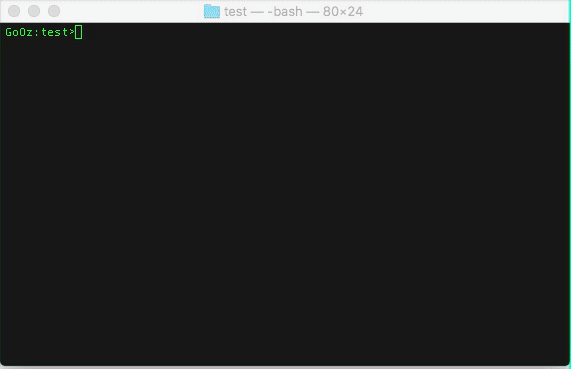
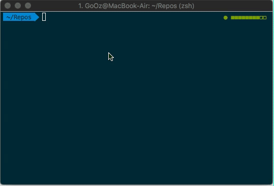

Dans cette troisième partie, nous allons voir ensemble le pouvoir des commandes et leur options cachées ainsi que la toute puissance des *aliases*.

<!-- excerpt -->

***NB** : je risque d'écrire des choses dans cette partie qui paraîtront évidentes mais je pars du principe que quand on parle à des profanes du terminal, rien n'est jamais évident. Alors, accrochez-vous, vous apprendrez peut-être quelque chose dans le tas.*

Je vais donc tenter de vous faire une rapide présentation des commandes que vous utiliserez le plus.

## Les commandes

Commençons par les commandes liées aux répertoires.

### pwd (Print Working Directory)

La commande `pwd` que vous avez entraperçue dans la partie précédente sert tout simplement à connaître votre emplacement actuel. Au cas où vous seriez perdu, c'est assez utile.


### cd (Change Directory)

La commande `cd` permet de naviguer dans les répertoires. Elle prend en argument le ou les noms des répertoires dans lesquels vous souhaitez aller.


Si vous souhaitez revenir dans le dossier parent, il vous faudra taper `cd ..`, ou revenir dans le dossier parent du dossier parent, vous devrez taper `cd ../../`, *..* étant l'équivalent d'un dossier donc il faut séparer par des slash */* si vous en avez plusieurs; et ainsi de suite.


Si vous êtes bien en profondeur dans votre arborescence et que vous souhaitez revenir dans votre *home directory*, tapez la commande `cd` sans argument ou `cd ~` (~ se fait en tapant `⌥+n`). Le caractère *~* représente symboliquement votre *home directory*.

Par exemple si vous êtes dans un lointain dossier et souhaitez aller directement dans votre dossier "foobar" à la racine de la home, vous pourrez taper simplement `cd ~/foobar`, et ce d'où que vous soyiez.

Pour finir, si vous tapez `cd -`, vous irez directement dans le dossier où vous étiez précédemment.


### mkdir (MaKe DIRectories)

Naviguer dans les répertoires c'est bien, encore faut-il qu'ils existent. `mkdir` sert donc à ça.

Tapez donc `mkdir nomdudossier` pour le créer.

Vous pouvez directement créer une arborescence en ajoutant l'option *-p* qui spécifie que si le dossier n'existe pas, il faudra le créer. Par exemple `mkdir -p nomdudossier/sousdossier`.

Si vous souhaitez créer plusieurs dossiers en même temps et au même niveau, utilisez les *{}* en tapant `mkdir {foo,bar}`


### rmdir (ReMove DIRectory)

Faut aussi pouvoir les supprimer ces dossiers, alors hop, entre en scène `rmdir`.

La petit subtilité qu'il faut connaître c'est que *rmdir* ne supprime **que** les dossiers vides. C'est pour cette raison que je ne m'en sers que très rarement.

À l'instar de `mkdir`, si vous souhaitez supprimer plusieurs dossiers d'une arborescence, il faudra rajouter l'option *-p*.


Passons donc aux commandes qui touchent aux fichiers…

### ls (LiSt directory contents)

Vous l'avez peut-être remarqué dans les exemples précédents, j'ai déjà utilisé la commande `ls` et si vous êtes malins vous aurez deviné qu'elle servait à lister le contenu d'un dossier.

Cette commande a… énormément d'options. Je vais donc vous parler des plus importantes.

Comme la quasi totalité des commandes, celle-ci prend ses options précédées d'un *-*. Par exemple, `ls -la`.

Vous aurez donc dans les plus notables :

- `a` affiche les fichiers et dossiers cachés, ceux qui dont le nom commence par un *.*, croyez-moi vous en aurez besoin.
- `F` sert à ajouter des "/" à la fin des dossiers, des "*" à la fin des executables et des "@" à la fin des symlinks (ou lien virtuel) et d'autres trucs que vous ne verrez sûrement jamais.
- `G` sert à coloriser l'output.
- `h` sert à rendre la chose plus lisible pour l'œil humain en supprimant le superflu de l'output (les poids des fichiers notamment)
- `l` sert à afficher le résultat sous forme de liste avec les éléments les uns en dessous des autres.

Il y a en beaucoup d'autres, plus ou moins utiles, mais notez surtout que vous pouvez enchainer les options, sans ordre particulier, à ceci près que certaines options s'annulent les unes les autres.

### touch

On a vu comment créer et supprimer des dossiers, comment naviguer entre dossiers et comment lister le contenu d'un dossier… mais sans fichier, tout ça paraît bien vide.

La commande **touch** permet de créer un fichier vide à la volée. Comprenez bien qu'il n'y aura strictement rien dans ce fichier, si vous souhaitez créer un fichier en lui donnant directement du contenu, il faudra passer par un éditeur de texte (Sublime Text, atom, vim, pico, etc).

Normalement, le but premier de la commande **touch** n'est pas de créer des fichiers mais de modifier le *timestamp* d'un fichier, c'est à dire les méta-données de date de modification, création, etc, mais passons, il crée bien des fichiers vides et c'est tout ce qu'on lui demandera.

Notez que vous pouvez créer à la volée une multitude de fichier en une fois.

Tapez donc `touch nomdefichier.extension`


### cp (CoPy files)

Si vous devez faire une déclinaison d'un fichier, ne vous embêtez pas à aller dans le *Finder* pour faire un copier/coller, utilisez la commande **cp**.

D'autant plus qu'avec elle vous pouvez copier **et** changer la destination du nouveau fichier créé. C'est-y-pas-beau ?

Ainsi, pour dupliquer un fichier dans un autre dossier tapez `cp fichier.txt dossier/fichier2.txt`

Pensez à rajouter l'option `-R` si vous souhaitez dupliquer un dossier et son contenu.



### mv (MoVe files)

Dans le même genre, déplacez des fichiers peut vite être laborieux avec *Finder* alors qu'avec le terminal… il suffit d'utiliser la commande **mv**.

C'est assez simple, tapez `mv fichier.txt dossier/fichier.txt`

Le petit plus c'est que vous pouvez déplacer **et** renommer le fichier en même temps. D'ailleurs c'est la commande **mv** qu'on utilise quand on souhaite renommer un fichier.


### rm (ReMove directory entries)

Et si on supprimait des fichiers superflus ?

Rien de bien folichon ici, tapez `rm (dossier/)fichier.txt`

Si vous avez bien suivi depuis tout à l'heure, **rmdir** ne permet de supprimer que des dossiers vides. C'est là qu'intervient `rm -rf`.

L'option **-r** pour récursif, c'est-à-dire qu'il va s'occuper de la cible et tout ses enfants, et **-f** pour le forcer sans être obligé de confirmer chaque suppression, sinon il y a des risques de se faire envoyer bouler.


### more/less/head/tail

Si comme moi, parfois, vous avez envie de vérifier le contenu d'un fichier sans volonté de le changer, il existe plusieurs outils à votre disposition :

#### more

Il permet d'afficher le contenu d'un fichier, sans avoir à le charger complètement ce qui explique sa rapidité d'affichage.
`more fichier.txt`

#### less

**less**, c'est **more** mais en mieux.  Finalement **less** c'est *more* que **more** d'où la blague *less is more*.

En bref, il fait tout comme son prédécesseur mais en mieux, alors ne réfléchissez pas trop et choisissez plutôt **less**
`less fichier.txt`

#### head

Il vous affichera quant à lui les premières lignes de votre fichier cible, et uniquement les premières.
`head fichier.txt`

#### tail

Il… bah… ne vous affichera que la fin du contenu du fichier cible.
`tail fichier.txt`

### du (Disk Usage)

Puisqu'on parle de dossiers et de fichiers, ils vous est sûrement arrivé de vouloir connaître le poids de tout un dossier, non ? Vous devez donc savoir à quel point c'est loin d'être pratique avec le Finder.

Alors ne perdez plus votre temps et utilisez la commande **du** dont vous apprécierez l'option `-h` qui transcrit les octets en quelque chose de plus lisible (KO, MO, GO, TO…)

Tapez donc `du -h`


### man (MANuel)

Et enfin la dernière commande indispensable, et pas des moindres, puisque, je le sais ausi bien que vous, vous ne retiendrez pas tout par cœur du premier coup donc il vous faut une doc complète et explicite. C'est le rôle de **man**.

Tapez donc `man nomdelacommande` pour lire la doc et retrouver des options oubliées notamment.

*NB: tout comme **more** ou **less**, tapez "q" pour sortir de la documentation. D'ailleurs **man** devrait ouvrir le document avec **less**.*


## Les aliases

Maintenant que les commandes basiques n'ont plus de secret pour vous, poussons un peu peu plus loin.

Je sais que vous allez dire qu'il y a plein d'options sympathiques pour chaque commande mais ça va être chiant de tout taper à chaque fois. Et vous aurez raison.

C'est là que les **aliases** entrent en jeu.

Un *alias* ce n'est ni plus ni moins qu'un raccourci. Faisons donc en sorte qu'à chaque fois que vous taperez `ls`, vous enverrez en fait `ls -GFh` au shell pour avoir un tout joli output.

Pour ce faire :

- `subl ~/.bashrc` (ou *.zshrc*)
- ajoutez la ligne
`alias ls='ls -GFh'`
- enregistrez et quittez
- tapez `ls`
- ???
- Profit

Les *aliases* sont une des plus grandes forces du shell, leur pouvoir ne connait aucune limite si ce n'est celle de votre imagination.

À noter que si vous avez choisi de prendre *oh-my-zsh*, il est livré avec pléthore d'*aliases*, liste qui s'allonge encore si vous avez ajouté des plugins à *oh-my-zsh*.

Pour savoir où vous en êtes et quels aliases vous avez jusque là, tapez la commande `alias`.

Quelques exemples chez moi :

- Pour aller dans le dossier parent `..='cd ..'`
- Pour aller dans le dossier parent du parent `...='cd ../..'`
- `bi='bower install'`
- `bl='bower list'`
- `bs='bower search'`
- `grl='grunt live'`
- `grw='grunt watch'`
- `ni='npm install'`
- Pour connaître son IP locale rapidement `ip='ipconfig getifaddr en0'`
- ls en affichant les fichiers systèmes en liste et avec les poids lisible pour "humains" `l='ls -lah'`
- ls simple juste en colorisant l'output `ls='ls -G'`
- Recharger la config de votre shell `reload='source ~/.zshrc'`
- Relancer apache `restart='sudo apachectl restart'`

Je vous laisse le loisir de faire vos propres *aliases* maintenant. :)

S'il vous vient l'exquise idée de faire des alias git, je vous conseille de plutôt les écrire non pas dans votre fichier de config shell mais dans celui de git directement.

Pour ce faire, tapez `subl ~/.gitconfig` et ajoutez vos *aliases* sous la section *[alias]* en ommettant l'implicite commande *git*.

Par exemple :
```sh
[alias] 
st = status 
br = branch
…
```

## Les plugins

### Homebrew

Installer des outils CLI sur OSX et les maintenir peut parfois s'avérer laborieux.

C'est pourquoi je vous conseille fortement de ne pas vous emmerder et gérer tout ça avec [Homebrew](http://brew.sh/index_fr.html)

Ça vous servira à installer beaucoup d'outils simplement, notamment ceux qui suivent.

### z, autojump et fasd

Que ce soit [z](https://github.com/rupa/z), [autojump](https://github.com/joelthelion/autojump) ou [fasd](https://github.com/clvv/fasd), ces trois scripts font en gros la même chose : ils vous permettent de naviguer plus rapidement dans les dossiers où vous vous rendez souvent.


Pour les installer, le plus simple est encore de passer par **homebrew**

### ranger

[ranger](http://ranger.nongnu.org/) est un explorateur de fichier "à la Finder" mais dans le shell en utilisant les flèches du clavier.

Je sais, ça parait bizarre comme ça mais c'est très pratique et plus rapide que Finder justement.



À installer via **Homebrew**

### ncdu

Avec [ncdu](http://dev.yorhel.nl/ncdu), on est toujours dans un explorateur de fichiers mais axé sur l'espace disque. C'est le petit frère de la commande **du** (disk usage) sauf que **du** est loin d'être agréable à lire. Grâce à **ncdu**, vous y verrez beaucoup plus clair sur l'utilisation de votre espace disque.


À installer via **Homebrew**

### htop

Si vous souhaitez toujours avoir un œil sur les performances de votre machine et de l'utilisation de ses ressources, [htop](http://hisham.hm/htop/), petit frère de la commande **top** imbitable à souhait, est fait pour vous. C'est beau et efficace.

*NB: Il vous faudra lancer htop en sudo (avec les droit admin donc) sinon vous n'afficherez que les processus lancés par votre user, c'est à dire pas grand chose.*


À installer via **Homebrew**

Et voilà, c'est fini, on a fait le tour… des bases en tout cas. Le reste, je le laisse à votre curiosité.

Des questions ? des retours ? Envoyez-moi un ping sur [Twitter](http://twitter.com/GoOz).

*Cover par [Nathan Congleton](https://www.flickr.com/photos/nathancongleton/6857290985)*
