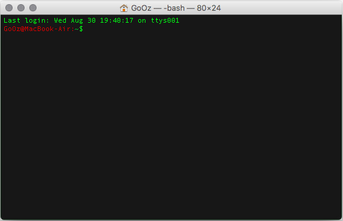
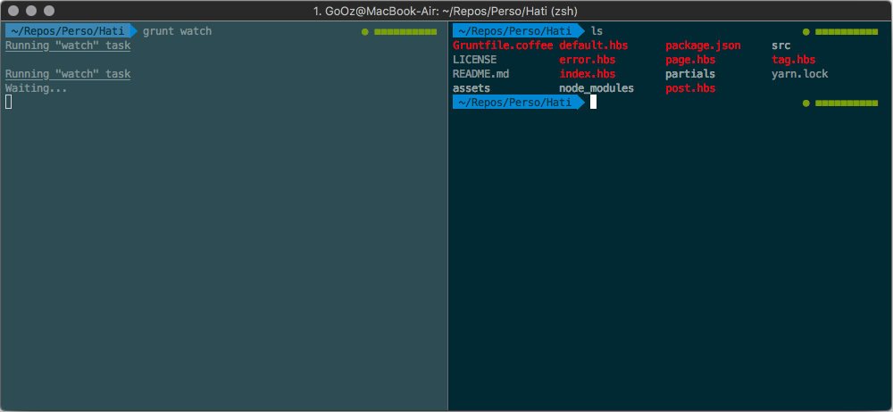
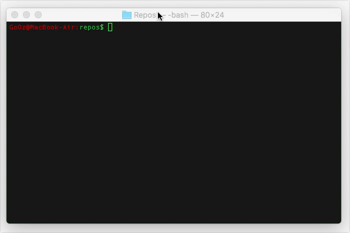

Quand on fait dans le développement Front-end ou dans l'intégration web (chacun ses appellations, je ne rentrerai pas dans le débat), si l'on veut être efficace et rapide, il faut savoir utiliser de nombreux nouveaux outils (Sass, Compass, Grunt, Bundler, Bower, Gulp, etc).

<!-- excerpt -->

Outils qui sont pour la plupart uniquement utilisables en ligne de commande (ou CLI) et par conséquent, pour mieux les dompter, il faut se préparer le meilleur des équipements.

Je me suis rendu compte que beaucoup d'intégrateurs/trices ont peur du terminal. Honnêtement, je ne les blâmerai pas, je suis passé par là aussi, cette interface rustre, sans fioriture, si loin des interfaces rassurantes avec une bonne UI, ça fait peur !

**Spoiler alert**: c'est loin d'être si méchant finalement et dieu que c'est pratique, intéressant et salvateur.

Mais trêve de mots superfétatoires, lançons-nous.

Pour bien comprendre ce que nous allons faire ensemble, il faut distinguer plusieurs parties :

- [L'application](#app)
- [Le shell](#shell)
- [Le prompt](#prompt)

## L'application

### Terminal

Votre mac est livré avec sa propre application de terminal, judicieusement appelé **Terminal**, que vous pourrez trouver dans le dossier *Applications* ou recherchez-le avec spotlight `⌘ + Space`.

*Ci-dessus, Terminal avec le theme Homebrew*

**Terminal**, même si c'est une application livrée par défaut, est largement suffisant; il fait le boulot et il le fait bien.

À chaque nouvelle version d'OSX, il rattrape ses concurrents avec des fonctionnalités qui lui manquaient; il n'a désormais plus grand chose à envier à ses comparses.

Honnêtement, si vous ne vous sentez pas l'âme aventurier bidouilleur, restez avec **Terminal**, on ne vous jugera pas. Je connais des gens très bien, de bonne famille et tout, qui l'utilisent quotidiennement. :)

### iTerm2

Dans le monde des alternatives à **Terminal**, on peut trouver **iTerm2** et… c'est à peu près tout en fait. Les autres sont quasi inexistantes.

J'aurais pu faire une liste importante des fonctionnalités qui font la différence mais finalement, à ce jour, il n'en reste plus beaucoup.

On peut noter tout de même ma fonctionnalité préférée, le *split view* ou *split pane* dont je ne peux plus me passer (raccourci : `⌘ + D`).

En bref, cela permet d'avoir des onglets dans des onglets. Très pratique quand, comme moi, vous aimez avoir un onglet par projet avec une vue dans laquelle une tâche de fond tourne et une autre sur l'arborescence de votre dépôt comme le montre la capture ci-dessous.

D'aucuns diront que **iTerm2** propose de nombreuses autres options que **Terminal** ne propose pas, mais même si c'est vrai, ce sont surtout des options pour un public assez confirmé, donc je n'en parlerai pas. :)

En bref, il n'y a pas de mauvais choix, vraiment. C'est soit vous n'avez pas envie de vous faire chier, soit vous avez envie de découvrir autre chose.

Les deux choix me paraissent aussi louable l'un que l'autre.

Si vous voulez tester et/ou adopter iTerm2, alors [rendez-vous sur le site](http://www.iterm2.com/)

## Le shell

Le shell est l'interface système, c'est ce qui vous permet de communiquer avec votre machine et ce à base de commandes.

Je ne vais pas rentrer au fond du sujet pour le shell et ce pour deux raisons.

1. je ne suis pas assez calé dans ce domaine.
2. on s'en fout un peu, pour l'utilisation que vous en aurez, il n'y a pas besoin de se prendre la tête.

Du coup, je vais juste parler de **bash** et de **Zsh**.

**Bash** est le shell embarqué avec Mac OSX depuis la 10.3. C'est donc celui que vous avez tous par défaut, à moins d'avoir du très, très vieux matériel.

J'ai pas grand chose à en dire, il est très bien, largement suffisant pour du *casual use*, c'est à dire pour nous autres, gens du *front*.
**Zsh** quant à lui est un peu plus poussé que **bash** sur plusieurs points mais encore une fois, pour du *casual use*, vous ne verrez quasi aucune différence. Les gros plus de **Zsh** seraient son système intégré de complétion de commandes, mais qui existe aussi en plugin [bash completion](http://bash-completion.alioth.debian.org/) pour combler ce manque, et l'auto-correction dans les cas où vous vous emmêlez les doigts.

Donc finalement, c'est kif-kif pour de l'utilisation de base, mais si vous souhaitez vraiment pousser votre savoir en CLI, prenez Zsh, non mais sérieusement, n'hésitez même pas. :)

D'ailleurs, si vous choisissez Zsh, allez m'installer le Framework bien connu [Oh My Zsh](http://ohmyz.sh/), c'est mieux que mieux.

Là j'en entends au fond qui raillent et se demande bien pourquoi insister sur ce point du shell si c'est pour en parler aussi peu.

Et bien, je voulais surtout bien faire comprendre la dissociation qui existe entre l'application et le shell.

En soi, vous pourriez avoir les couples *Terminal+bash*, *Terminal+Zsh*, *iTerm2+bash*, *iTerm2+Zsh* et finalement, il n'y en aurait pas un franchement mieux qu'un autre.

## Le prompt

Lorsque que le shell est prêt à recevoir une commande il affiche l'invite de commande ou *prompt* dans la langue de Shakespeare.

C'est ce vous pouvez voir tout à gauche d'une nouvelle ligne…

Sur cette image vous remarquez donc le prompt qui s'affiche comme suit : `GoOz@Macbook-Air:repos$`

- `GoOz`, le *username* de ma session utilisateur sur ma machine
- `@MacBook-Air` étant le *hostname* de ma machine
- `:`, juste un séparateur
- `repos`, le nom du dossier dans lequel je me trouve actuellement
- `$`, le séparateur ou indicatif de fin de prompt

Remarquez comme, après avoir changé de dossier en faisant la commande `cd Perso`, *repos* devient *Perso*.

Cette petite zone, mes amis, est donc ce qu'on appelle le prompt. Et ce qui est sympa avec lui, c'est qu'on peut en faire à peu près ce que l'on veut, sur tous les shells et toutes les applications.

## En méga bref

Il faut voir ce trio application/shell/prompt comme 3 poupées russes :

- Le prompt est dépendant du shell puisqu'il est configuré dans le fichier de configuration de ce dernier.
- Le Shell dépend de l'application… enfin ce n'est pas tout à fait juste puisqu'il y a un shell par défaut qui sera utilisé par les applications de terminal sauf si vous leur demandez de faire autrement, mais c'est bien l'application qui charge le shell.
- Et enfin au-dessus de tout, l'application.

Voilà voilà. Vous êtes désormais tous incollables sur le sujet, on va pouvoir passer aux choses sérieuses. :)

[Pimp my shell pour les béotiens — Choose your weapons (Partie 2)](/2014/10/13/pimp-my-shell-pour-les-beotiens-choose-your-weapons-partie-2/)
