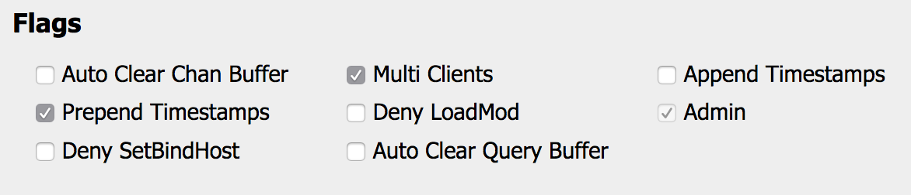

## On parle de quoi là déjà ?

Cela vous est-il déjà arrivé de vous dire qu'entre Gtalk (Hangout), IRC, le chat Facebook, Twitter, voire même Slack maintenant vous ne saviez plus où donner de la tête ?

<!-- excerpt -->

Que vous aviez peur de râter des conversations intéressantes alors que vous deviez vous déconnecter parce que quelque chose sur le feu sonnait à la porte ?

Si oui, alors vous avez connu ce que j'ai connu.

J'ai une sainte horreur d'avoir à jouer la girouette. Je veux pouvoir discuter avec les tous les gens que je côtoie numériquement au même endroit, dans le même logiciel et sans en perdre une miette.

Je ne vais pas vous mentir, utiliser tous ces protocoles différents dans un seul et même logiciel, pas forcément optimisé pour ces derniers, implique **quelques concessions**.

Vous pourrez dire au revoir à toutes les spécificités et fonctionnalités du logiciel lié au protocole en question, comme les conversations audio/video de Hangout, les superbes commandes comme `/giphy` dans Slack, les superbes emojis animés de chatons faisant la macarena dans… je sais pas mais je suis sûr que ça existe.

Vous aurez aussi besoin d'une manière ou d'une autre d'une machine constamment connecté à Internet, comme un serveur local ou distant, un NAS, ou juste un ordinateur de bureau.

Et puis finalement, il va falloir mettre les mains dans le cambouis les enfants : on va parler, mis à part le client IRC, de logiciel en ligne de commande. Mais comme vous avez bien suivi [mes articles](/2014/10/13/pimp-my-shell-pour-les-beotiens-sous-osx/)[pour pimper](/2014/10/13/pimp-my-shell-pour-les-beotiens-choose-your-weapons-partie-2/)[votre shell](/2014/10/13/pimp-my-shell-pour-les-beotiens-les-meilleurs-sont-des-flemmards-partie-3/), vous êtes forcément compétents pour ce qui suivra. :)

## De quels ingrédients aurez-vous besoin ?

### 1/ Un Gateway IRC

Pour ceux qui n'y connaissent vraiment rien à IRC (Internet Relay Chat), c'est comme [Slack](http://slack.com/), un protocole de chat à plusieurs mais en libre et ouvert, qui a fait ses preuves, et surtout nettement moins _hype_.

Donc déjà, vous aurez besoin d'un _Gateway IRC_ pour tous ces protocoles divers et variés de messagerie instantanée, en l'occurence, ce sera **[Bitlbee](https://www.bitlbee.org)** qui jouera ce rôle.

Un _Gateway IRC_ retranscrira sous forme de flux IRC toutes les communications que vous recevrez. En gros, avec Bitlbee vous vous connecterez sur les comptes de messagerie instantanée, puis Bitlbee se transformera en un pseudo serveur IRC et enverra toutes vos conversations comme un _channel_ (ou salon) IRC.

Bitlbee supporte nativement pléthore de protocoles et pour ceux qu'il ne supporte pas directement, il propose des plugins ou redirige vers d'autres solutions. Je vous laisse scruter leur [wiki](https://wiki.bitlbee.org/) pour vos propres besoins.

Je ne vais pas m'attarder sur son installation, le [wiki](https://wiki.bitlbee.org/GettingStarted) fera ça beaucoup mieux que moi. Sachez juste que si vous avez un NAS **Synology**, il existe une app, plutôt bien mise à jour et qui fonctionne très bien.

Pour ce qui est de la configuration, on verra par la suite.

### 2/ Un Bouncer (BNC)

Un _Bouncer IRC_ ou _BNC_ est un proxy IRC, c'est à dire que vous devez passer par lui pour vous connecter à IRC.

À quoi bon me direz-vous ? Et bien le plus gros intérêt, pour ne pas dire le seul, c'est qu'il sera connecté en permanence à IRC, ce qui a priori ne sera pas votre cas.

Et comme il est tout le temps sur IRC, vous serez toujours disponible pour recevoir des messages que vous pourrez lire plus tard, une fois connecté au BNC.

C'est tout l'intérêt, non ?

En guise de BNC, nous utiliserons donc [ZNC](http://wiki.znc.in/ZNC), qui lui aussi a son app sur les NAS Synology, sauf que lui n'est plus mis à jour sur les modèles pour particuliers, ils ne sont pas assez puissant. Je déconseille donc de l'utiliser sur NAS parce qu'une des fonctionnalités manquantes est justement qu'il ne retransmet pas l'historique des messages privés reçu pendant votre absence, ce qui plombe le but qu'on se fixe aujourd'hui.

Même histoire pour l'installation de ZNC, je vous laisse suivre les indications sur le [wiki](http://wiki.znc.in/Installation) et on verra ensuite pour la configuration.

### 3/ Un client IRC.

Un client IRC c'est donc un logiciel qui permet de se connecter à IRC et donc, chatter.

Il en existe [moult](https://en.wikipedia.org/wiki/Comparison_of_Internet_Relay_Chat_clients).

Personnellement, je suis sur mac donc je connais mieux ceux de cet OS mais voilà ceux que j'ai le plus souvent rencontré :

- Windows : L'indécrottable **mIRC**, **HexChat**,…
- Linux : **irssi** (cli), **weechat** (cli), **xChat**,…
- OSX : **irssi** (cli), **weechat**(cli), **Limechat**, **Colloquy**, **Linkinus**, **Textual**,…

_ceux notés "cli" sont en ligne de commande_

Je ne sais trop quoi vous conseiller, c'est du feeling, n'hésitez pas à tester, beaucoup sont soit gratuits, soit avec période d'essai.

Pour ma part, sur OSX, je suis resté longtemps sur **Limechat** et puis je suis passé sur **weechat** parce que j'avais besoin de plus de liberté dans mon arrangement de fenêtre, mais c'est vraiment au besoin de chacun.

Maintenant que nous avons vu tous les ingrédients dont nous aurons besoin, passons à l'assemblage.

## Assembler les briques

Comme tout transitera par IRC, et donc par votre BNC, voyons donc d'abord comment configurer le cœur de notre système.

### Configurer ZNC

Je pars donc du principe que vous avez déjà installé **ZNC**.

Si vous n'avez pas encore créé votre fichier de conf après le `make install`, je vous invite à le faire maintenant en tapant `znc --makeconf`. ZNC vous demandera plusieurs choses, laissez tout par défaut au départ si vous ne savez pas trop quoi mettre, rien n'est immuable de toute façon, mais retenez au moins le _nom de user_, le mot de passe et le port d'écoute que vous aurez choisis.

Configurer ZNC en ligne de commande, c'est possible mais comme on est pas trop con et qu'il y a une interface d'administration, on va plutôt aller faire ça là-bas.

Pour ce faire, ouvrez votre navigateur et tapez l'adresse de votre serveur où est installé ZNC, c'est à dire l'ip locale de la machine si c'est un serveur local, 127.0.0.1 (j'imagine) si c'est votre ordinateur de bureau, l'ip ou le DNS si c'est un serveur distant.

Dans tous les cas, avant de taper sur _entrée_, n'oubliez pas de rajouter le port que vous aviez choisi auparavant.

Ça devrait donner un truc comme ça `http://IpOuDnsDuServer.tld:1337`

Vous devriez arriver sur une page de login comme ça.

Loggez-vous donc comme il se doit avec les identifiants que vous avez renseignés à l'installation et une fois ceci fait allez directement aux "_Global settings_".

Dans la section "_Listen ports_" apparait le port que vous avez choisi à l'installation. Mais vous pouvez en ajouter autant que vous le souhaitez même si je vous conseille d'avoir une putain de bonne raison de le faire. Notez que vous ne pouvez éditer ou supprimer le port en cours d'utilisation.

Dans la section "_settings_", vous pouvez vous amuser à changer le theme de l'admin de ZNC mais ils sont tous moches, soyons honnêtes. Le thème "_Ice_" est peut être le moins dégueulasse mais bon, faites comme bon vous semble, ce n'est pas important.

Ce qui est important par contre c'est le "_Maximum Buffer Size_", c'est le nombre de lignes gardées en mémoire tampon pour **chaque** _buffer_ (c'est à dire salon IRC/Slack et message privé) pendant votre absence sur ZNC; pas votre absence devant l'écran, celle passée à être déconnecté de ZNC. Je l'ai passé à 1000 parce que je passais beaucoup de temps dans les transports déconnecté de ZNC mais 500 est déjà pas mal raisonnable.

Vous pouvez laisser le reste de cette section par défaut.

Dans la section "_Global modules_", s'activent et se désactivent les modules disponibles embarqués avec ZNC concernant l'administration et la gestion de ZNC.

Rien de vraiment intéressant ici pour vous à moins que vous décidiez de devenir fournisseur de bouncer pour vos copains. Et si c'est le cas, allez lire la doc, c'est pas le propos de ce billet. :)

Allez donc cliquer sur "_Your settings_" dans la navigation et vous arriverez sur la page de configuration de votre compte (logique, non ?).

Dans la section "_Authentication_" les options ne concernent que les informations pour se connecter à cette même admin. Rien à voir avec les serveurs IRC qu'on renseignera plus tard. Donc à moins de vouloir modifier vos identifiants, ne touchez à rien.

Dans la section "_IRC Information_" seront les informations par défaut de connexion aux serveurs IRC. Les mêmes que l'on renseigne quand on se connecte sans BNC à IRC finalement, rien de neuf. Retenons surtout les trois premiers champs _Nickname_, _Alt. Nickname_ et _Ident_.

- _Nickname_ sera votre pseudo visible, il doit être unique sur le serveur
- _Alt. Nickname_ sera votre pseudo alternatif, utilisé quand quelqu'un d'autre a déjà pris votre pseudo, ce qui arrive quand on enregistre pas son pseudonyme sur le serveur IRC
- _Ident (ou username)_, contrairement au _nickname_, n'est pas forcément unique. L'_idents_ apparaitra surtout lors de votre connexion à un salon ou si une personne utilise un `whois` sur vous. Habituellement _nickname_ et _idents_ sont identiques mais rien ne vous l'oblige.
- _Realname_ sera votre identité. Rien ne vous oblige à mettre vos véritables nom et prénom, moi je ne le fais pas, mais c'est là que vous pouvez le renseigner si vous le souhaitez.

Dans la section "_Networks_" se trouvent tous les serveurs que vous avez ajoutés, et comme on ne l'a pas encore vu, vous ne devriez rien avoir, à part peut-être Freenode si vous avez laissé ZNC installer ce serveur par défaut. Pour l'instant, on n'y fera rien mais retenez que c'est ici qu'il faudra aller pour éditer vos serveurs.

Dans la section "_Modules_" se trouvent vos modules par défaut qui seront activés sur tous les serveurs, à moins que vous ne disiez le contraire dans la configuration de chaque serveur. Il y en a pléthore et je ne vais pas passer tout en revue mais vous pouvez cliquer sur le lien du nom pour avoir plus d'infos.

Ce que je vais vous dire par contre, c'est de cocher le module "_clearbufferonmsg_" qui sert à garder le tampon intact tant que l'on n'a pas fait une action (écrire un message quelque part par exemple) ce qui permettra de garder les entrées en mémoire tampon même si une connexion est faite ailleurs sur un autre terminal (comme votre ordinateur à votre travail).

Et ce sera tout de nécessaire mais je conseille tout de même de laisser tout par défaut à moins que vous sachiez exactement ce que vous faites.

Dans la section "_Default Settings_", vous pourrez définir surtout la taille du tampon pour votre propre utilisateur. Mettons que vous gériez le _bouncer_ pour plusieurs personnes, vous pouvez mettre le _buffer size_ global à 200 et booster le vôtre à 1000 parce que vous êtes une radasse de gros chacal. Mais ce n'est qu'un exemple.

Dans la section "_Flags_", surtout, **SURTOUT**, décochez les deux options _Auto Clear Chan Buffer_ et _Auto Clear Query Buffer_, sinon l'option _clearbufferonmsg_ que vous avez coché auparavant ne servira à rien. Comme leur nom l'indique, ces deux options vident le tampon des salons et messages privés si vous êtes quelque part connecté à ZNC.

Pour le reste, vous pouvez laisser par défaut.

Dans la section "_ZNC Behavior_", rien à signaler, éditez si vous le souhaitez mais rien n'est vraiment très important.

Bien ! Là, globalement, ZNC est configuré, il ne reste qu'à ajouter des serveurs. Sur ce point je ne vais pas m'attarder, c'est assez simple.

Vous donnez un nom à votre serveur, vous pouvez laisser vide les champs relatifs aux nickname et idents si vous les avez déjà renseignés sur la page "_Your Settings_", sinon ajoutez les nouveaux.

Puis renseignez l'url du serveur avec son port et l'affaire est dans le sac.

Vous pouvez aussi dès maintenant ajouter les salons que vous souhaitez rejoindre. Sachez cependant que ZNC les gardera en mémoire automatiquement si vous les joignez via IRC.

Vous pouvez aussi activer/désactiver des modules propres à ce serveur.

Voilà, ZNC c'est fait !

Next…

### Configurer le client IRC

Je finirai par Bitlbee si vous me le permettez, vous verrez, c'est plus logique.

Quelque soit votre choix de client IRC, qu'il ait une UI ou qu'il soit en cli, c'est toujours le même credo : renseignez le serveur et votre nickname.

Bon ok, il va falloir renseigner d'autres choses pour se connecter à ZNC.

Je vais montrer la fenêtre type sur Limechat pour l'exemple.

Passons tout en revue :

- Dans le champ _Network Name_ mettez bien ce que vous voulez. Si vous voulez vous connecter sur Freenode depuis votre ZNC, mettez "Freenode", "Freenode|ZNC" ou bien "J'aimeLesSucettesAlAnis"… vraiment on s'en fout, c'est pour vous, pour vous y retrouver.
- Dans le champ _server_, il ne faut pas se tromper, ne mettez pas le dns officiel de Freenode hein, mettez le dns (ou l'ip si vous êtes très pauvre) du serveur où est installé ZNC.
- N'oubliez pas le port que vous avez renseigné lors de votre installation de ZNC.
- Dans le _Server Password_ mettez jute le même password que vous utilisez pour vous connecter à l'admin de ZNC
- Le _nickname_ est techniquement inutile, puisque c'est ZNC qui se connecte à IRC à votre place et qui utilisera donc ses propres informations de connexion. Malgré tout, nombreux sont les clients qui ne vous laisseront pas ajouter un serveur sans ajouter un _nickname_ alors mettez ce que vous voulez, de toute façon

ça ne sera pas utilisé.

- Dans le champ _Login name_ par contre, faites comme suit : **VotrePseudoZNC/NomDuServeurZNC**. Par exemple mon nom d'utilisateur sur ZNC est "GoOz" et le serveur que je veux ajouter a pour nom "Freenode" sur ZNC, donc dans le champ _login name_ je mets "GoOz/Freenode"

Et c'est tout, laissez le reste vide car ça ne servira absolument à rien.

### Configurer Bitlbee

Vous allez voir, c'est simple comme bonjour… sauf que Bitlbee, contrairement à ZNC, n'a pas d'interface d'administration et, honnêtement, les développeurs ont eu raison de ne pas se faire chier avec ça car ça n'en vaut pas la peine.

Tout d'abord, comme je l'ai dit plus tôt, Bitlbee se comporte comme un serveur IRC donc nous allons l'ajouter à ZNC comme tel. La seule petite nuance avec lui est de bien déterminer l'URL à renseigner :

- Si vous installez Bitlbee sur la même machine que ZNC, que ce soit votre machine fixe à la maison, votre serveur local ou un serveur distant, vous n'avez qu'à mettre _127.0.0.1 6667_ (6667 si vous avez laissé le port par défaut à l'installation) dans le champ "_Servers of this IRC Network_" dans ZNC
- Si vous l'avez installé sur une autre machine que ZNC, il va falloir soit renseigner l'IP de cette machine, soit y lier un DNS. Si vous l'avez installé sur votre NAS synology, sachez que la marque propose un système de DNS gratuit. Il suffit de vous créer un compte sur [leur site](https://account.synology.com/fr-fr) et de suivre les directives. Dans tous les cas, renseignez le champ "_Servers of this IRC Network_" avec l'IP ou le DNS suivi de l'IP par défaut (6667) ou celle que vous aurez choisi à l'installation.

Un fois ceci fait, allez dans votre client IRC et ajoutez ce serveur comme n'importe quel autre serveur IRC et connectez-vous.

Un salon particulier apparait normalement et devrait s'appeler **&bitlbee**. C'est le salon de contrôle : vous devrez y faire toutes vos commandes.

Allez donc sur ce salon et tapez `help` pour voir tous les types de commandes disponibles. Pour faire ça bien je vous conseille de taper `help quickstart` puisque c'est votre toute première fois. Ça devrait vous expliquer plein de choses comme, notamment, le fait que vous devez créer un compte. Alors faites-le en tapant `register votrenouveaumotdepasse` et mémorisez-le. Avant de faire autre chose, retournez dans ZNC, et dans le champ où vous aviez renseigné l'URL du serveur, ajoutez juste après le port, sans virgule ni rien, un espace suivi de votre mot de passe. De cette manière, vous serez automatiquement connecté à Bitlbee sur votre compte.

Passons donc à la suite. Toujours dans le salon de contrôle, tapez `help quickstart2` et tout devrait vous être expliqué. Pour information, le protocole pour gtalk est jabber. Vous n'avez plus qu'à suivre les instructions et taper des commandes du style `account add jabber MonAdresseGtalk@gmail.com MonMotDePasse` et ainsi de suite pour tous vos comptes de messagerie instantanée.

De bien utiles informations vous seront fournies si vous continuez le quickstart en tapant les commandes `help quickstartn` où _n_ va jusqu'à 6. Si vous voulez lire le quickstart de façon plus agréable, vous pouvez aussi le voir [en ligne](https://wiki.bitlbee.org/quickstart). N'hésitez pas non plus à lire la page dédiée à l'utilisation de [Gtalk dans Bitlbee](https://wiki.bitlbee.org/HowtoGtalk), vous pourrez y voir comment activer l'OAuth mais aussi pourquoi les noms de certains de vos contacts ont l'air foireux. _Spoiler alert : Google+ est un con_

Désormais, vous ne devriez plus avoir de conversations perdues dans les méandres des internets et en prime tout se passe dans un seul et même logiciel. C'est y pas beau le progrès.

Voilà, vous avez toutes les bases et n'oubliez pas que Google est votre ami (bien curieux mais tout de même) et la doc est votre meilleure amie.

En bonus, voici à quoi ressemble mon client IRC en action.

Comme je l'ai dit plus tôt, j'utilise [weechat](https://weechat.org/), un client en lige de commande.

Vous pouvez observer plusieurs zones distinctes :

- **en 1** vous avec la barre des serveurs sur lesquels je suis connecté et les salons divers où je fais acte de présence. Les salons weechat, chanmon, highmon et iset sont des outils propres à weechat, **Bitlbee** (IM) avec deux comptes gmail (Pro et Perso), **Freenode** (IRC), **Mozilla** (IRC), **SlackClever** et **SlackOonops** (Slack to IRC)
- **en 2** vous avez la fenêtre principale de discussion. Dans cette fenêtre s'affiche donc le salon dans lequel je suis en train de parler. Notez qu'avec weechat, je peux avoir plusieurs fenêtres de discussion ouvertes en même temps.
- **en 3** vous avez la nicklist (liste des users présents) associée au salon dans la fenêtre principale.
- **en 4** j'y ai mis le plugin _chanmon_ de weechat qui me permet d'avoir un œil sur ce qu'il se passe dans les autres salons, sans avoir à y aller directement depuis ma fenêtre principale.
- **en 5** j'y ai mis le plugin _highmon_ de weechat qui me permet de voir tous les _highlight_ ou _ping_ de n'importe quel salon ainsi que tous les messages privés et de juger si cela vaut mon attention immédiate ou non.

Si certains aventuriers sont intéressés par ma configuration de **weechat**, je peux aussi en faire un prochain billet.

Bref, voilà, j'espère que ça vous a plu et si vous avez des questions, n'hésitez pas à me les poser sur [Twitter](http://twitter.com/GoOz).
