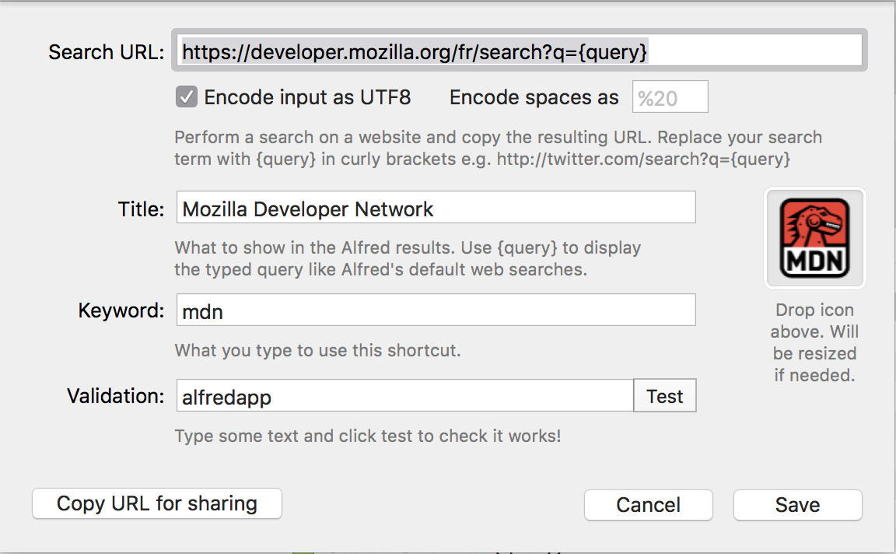
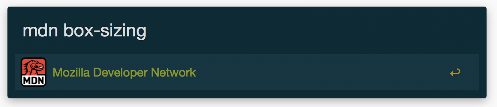
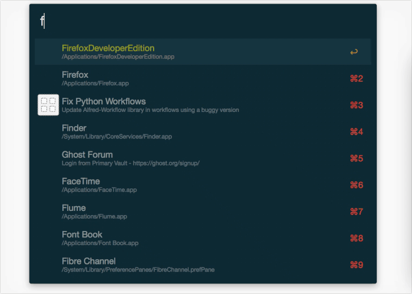

Plus les années passent, moins je touche à ma souris. C'est un fait. Je pense que la raison principale est que je passe beaucoup de mon temps sur ma machine à coder et que ça, ça se fait uniquement au clavier.

<!-- excerpt -->

Du coup, on apprend vite les raccourcis pour ne pas avoir à lâcher ce clavier. C'est sûrement ce qui m'a le plus attiré chez les _launchers_

Au commencement **[Spotlight](https://support.apple.com/fr-fr/HT204014)** n'existait pas. Mais on avait **[Quicksilver](https://qsapp.com/)**. Pas franchement très connu et pas toujours très stable, il avait le mérite d'être déjà très pratique à l'époque.

Mais vint le sauveur des feignasses, celui qui faisait beaucoup et promettait encore plus : **[Alfred](https://www.alfredapp.com/)**

Si je vous en parle aujourd'hui c'est surtout que la v3 va très bientôt sortir et que je me suis rendu compte que trop peu de personnes connaissaient ce _launcher_ et même ceux qui le connaissaient, n'étaient pas au fait de son grand pouvoir.

Alors oui, la version gratuite d'**Alfred** n'a pas grand chose de plus que **Spotlight** si ce n'est tout de même une plus grande souplesse et "configurabilité". Mais je ne vais pas là vous faire un comparatif, je vais juste vous montrer quelques trucs que peut faire Alfred… en version **[Powerpack](https://www.alfredapp.com/powerpack/)**, c'est à dire payante mais honnêtement, le logiciel vaut son pesant de cacahuète.

En plus de permettre des recherches sur des moteurs classiques et lancer des applications, Alfred permet aussi de :

## Personnaliser vos moteurs de recherches.

En plus d'avoir les grands classiques comme Google, Bing, Duckduckgo, Wikipedia, Youtube, Twitter, etc vous pouvez donc ajouter ceux de vos sites préférés.

Par exemple, j'ai ajouté celui de MDN ou celui du conjugueur. Pour la configuration, pas besoin d'accès à l'API, il suffit de connaitre l'URL des recherches, pour peu que le site en question le permette.

Ça ressemble globalement à ça :

Tout est expliqué et c'est plutôt simple tout de même.

Pour l'utilisation, tapez juste le _keyword_ choisi puis votre recherche. Simple, non?

Vous pouvez aussi imaginer un moteur de recherche avec des suggestions mais pour ça il faudra passer par un workflow et on verra ça plus tard. :)

## Une gestion du presse-papier (clipboard) au petits oignons

Alfred intègre un gestionnaire de clipboard, qui va mémoriser tout ce que vous y mettez, sauf quand ça provient d'applications que vous aurez blacklistées. Par défaut, Keychain, Wallet et 1Password sont dans cette liste notamment, pour des raisons évidentes de sécurité.

Toujours est-il que vous avez la possibilité de configurer beaucoup de choses, comme la durée du cache des choses copiées (image ou texte), avoir la possibilité de fusionner des éléments, pour peu qu'ils soient "fusionnables".

## Gérer vos fichiers sans avoir besoin de Finder

Vous venez de faire une capture d'écran et vous voulez l'ouvrir dans un logiciel, ou bien vous ne vous souvenez où vous avez foutu ce pdf du manuel du [super jeu](http://www.keeptalkinggame.com/) que vous venez d'acheter de fiche de personnage de votre jeu de rôle préféré mais vous voulez l'ouvrir et vite ?

Pas de problème !

Les possibilités sont grandes. :)

## Le plein de petits trucs sympatoche…

Comme…

- L'intégration de **1Password**
- Gérer **iTunes** depuis Alfred
- Chercher et afficher ses contacts en un éclair
- Envoyer des commandes Shell directement depuis Alfred
- Config qui peut être sync via **Dropbox** (nativement) ou bien vous pouvez le faire à la main via un `ln -s` ou autre solution comme [Mackup](https://github.com/lra/mackup)
- Une calculatrice de compétition
- Fouiller dans le dictionnaire
- Ajouter et gérer des snippets directement dans Alfred.
- etc…

## …mais surtout, des Workflows

C'est la pièce maitresse d'Alfred, pouvoir créer ses propres fonctions automatiques. Un peu ce que permettait **Automator** mais en mieux (d'ailleurs Alfred gère vos fichiers Automator, je dis ça, je dis rien)

Tout ce que fait de base Alfred n'est limité que par l'imagination du developpeur d'Alfred. Heureusement il a permis à tout ceux qui ont leur propre problèmes et tâches répétitives de laisser leur imagination porter Alfred encore plus loin.

Ces workflows, il en existe déjà beaucoup sur la toile. Je vous recommande d'ailleurs le très bon site [Packal](http://www.packal.org/) pour faire votre marché.

Vous y trouverez des workflows qui intéragissent directement avec une app installée sur votre machine comme **Wunderlist**, **Evernote**, **Spotify**, etc.

Par exemple, j'utilise [Dash](https://kapeli.com/dash) pour avoir de la doc en local, quand je n'ai pas de connexion. Et bien il y a un workflow qui permet de lancer une recherche directement dans **Dash**

Et puis il y a les petits workflows plus ou moins inutiles mais définitivement indispensables.

### Colors

On me file un code couleur hexadecimal d'une charte graphique mais moi, je veux du RGB…

hopla, je clique (ou je tape entrée) et le code RGB est dans mon presse-papier.

### Convert

Parfois, à force de trainer sur des sites anglosaxons, je galère à faire la conversion d'unités de mesure, ou bien encore de devises. Pas de problème, j'ai _convert_.

### Down for everyone

Un problème de proxy ? Un problème de DNS ? Je ne sais pas mais je n'ai pas accès à ce site. Est-ce juste moi ou…

### Encode/Decode

Parfois, je dois faire (encore…) un bon vieux mailto et j'ai besoin d'encoder du texte, mais je ne connais pas par cœur les codes. Pas de problème !

### Une traduction avec WordReference

Bien plus fiable que Google Translate, WordReference ne me trompe jamais, mais dieu que c'est énervant de devoir aller sur son navigateur préféré, ouvrir un onglet, aller sur le site et enfin faire sa recherche alors qu'avec Alfred…

Pour celui-ci par contre, il vous faudra une APIKey, disponible gratuitement, c'est juste pour éviter le flood.

### Et puis aussi…

- faire un screenshot et l'envoyer directement sur votre Dropbox
- Faire un ping rapidement
- Chercher dans vos favoris **Github**
- Faire une recherche avec suggestions sur **Stack Overflow**
- Connaitre l'heure dans tel pays en ce moment même
- Savoir quel logiciel prend le plus de ressource processeur
- Kill une application qui prend beaucoup trop de ressources processeur
- Des raccourcis pour vos emoticons les plus compliqués à mémoriser
- Faire des calculs de pourcentage en un clin d'œil
- Faire une recherche dans le catalogue de **Netflix**
- Lancer Firefox avec un différent _profile_
- Ouvrir une connexion FTP avec Filezilla alors que l'app n'est même pas encore lancée
- Et toujours plus… la limite n'est que celle de votre imagination.

Je n'ai pas mis la liste exhaustive de tout ce que j'utilise mais vous voyez l'idée.

Vous pouvez retrouver sur [cette page Github](https://github.com/willfarrell/alfred-workflows) une liste de workflows spécialement pour les dev web pour aller encore plus loin.

Finalement, **Alfred** n'est pas juste un concurrent de Spotlight, son but est vraiment de vous rendre plus productif à **TOUS** les niveaux.

En espérant que j'aurais réussi à vous apprendre des trucs, et si vous avez des questions, n'hésitez pas à me les poser sur [Twitter](https://twitter.com/GoOz) ou IRC (##openweb sur Freenode).

_Cover de [clickonkirai](https://www.flickr.com/photos/clickonkirai/7175120640/)_
