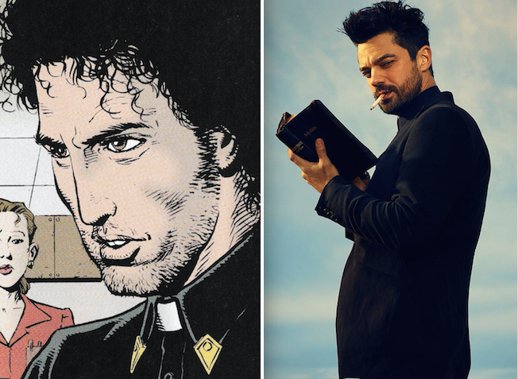
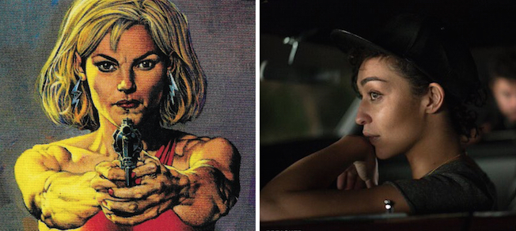
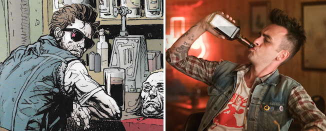
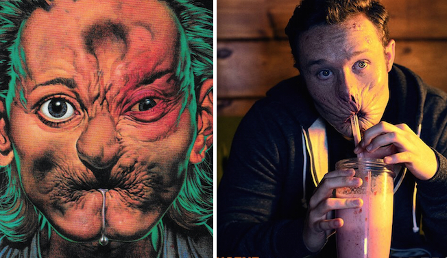
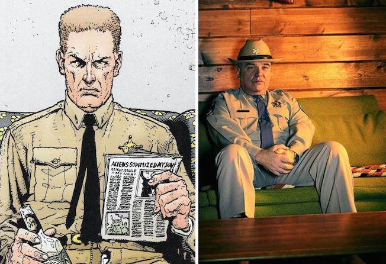

Je ne suis pas un critique émérite de séries télé ou même de comics mais hé, je me suis dit que ça couterait rien de donner mon avis sur cette fraîche nouvelle série qu'est **Preacher** et de quelques autres adaptation de comics.

---

**GARANTI 100% SANS SPOIL**

## On dit que je ressemble à Alain Deloin

Comme je disais, je lis les comics de _Preacher_ et je les adore. Du bon _[Vertigo](https://fr.wikipedia.org/wiki/Vertigo_%28DC*Comics%29)* comme on fait plus, vraiment.

Alors quand j'ai appris son adaptation télévisuelle j'ai tout de suite été intrigué. Je suivais son actu et j'avais lu que les créateurs annonçaient d'emblée que la série ne suivrait pas les comics.

Et en effet...

Les intrigues donc ne se suivent finalement pas des masses. Que ce soit l'arrivée de "l’entité", les rencontres des personnages ou le démarrage de la série tout court, tout ça ne se passe pas du tout comme ça dans les comics. Ils avaient prévenu en même temps. Il est trop tôt pour parler de différences dans l'intrigue étant donné que deux épisodes c'est bien trop peu pour ça mais ça commence très vite loin de l'original alors passons à autre chose.

Les personnages par contre sont globalement fidèles, à quelques nuances près.

**Jesse Custer**, le pasteur, joué par **[Dominic Cooper](https://fr.wikipedia.org/wiki/Dominic_Cooper)** est bien un pasteur torturé au passé trouble et à la foi branlante. Physiquement on est à peu près dedans. Évidemment l'acteur ne ressemblent pas comme à deux gouttes d'eau au personnage des comics mais finalement on s'en fout de ça.

**Tulip O'Hare**, l'ex petite amie de Jesse et jouée par **[Ruth Negga](https://fr.wikipedia.org/wiki/Ruth_Negga)** par contre est un brin différente.

Déjà parce qu'au lieu d'être blanche aux cheveux blonds et lisses comme dans les comics, elle est métisse au cheveux courts bouclés dans la série. Ça a dû faire encore une polémique chez l'oncle Sam mais, personnellement, je dis "et pourquoi pas". Absolument rien dans son histoire ne justifie qu'elle soit caucasienne donc…

Puis, alors que dans les comics elle ne cesse de se battre pour prouver à Jesse qu'elle n'est pas une faible femme à protéger, dans la série elle est directement montrée comme une femme à forte caractère, complètement autonome, sachant rester féminine en prime, ce qui est assez rarement le cas des femmes badass dans les fictions pour le noter.

Et pour ceux qui la voit comme une vile tentatrice, c'est loin d'être le cas dans les comics, au contraire, et j'espère que les auteurs de la série garderont cet aspect. C'est pas parce qu'elle est badass que c'est une vilaine succube qui détournera le "héros" du droit chemin.

**Cassidy**, le vampire irlandais, joué par **[Joseph Gilgun](https://fr.wikipedia.org/wiki/Joseph_Gilgun)** (que j'ai adoré dans Misfits) n'est physiquement pas très proche. Là où dans les comics, il garde perpétuellement ses lunettes de soleil en plus d'être blond/châtain clair lui aussi, on perd tout ça dans la série. Mais est-ce gênant ? Je suis un peu déçu pour les lunettes, mais globalement non, on s'en fout.

Il garde son accent irlandais, son franc parler et ses faiblesses et forces de vampire.

**Arseface** ou _Eugène Root_, joué par **Ian Colletti** est sûrement, à mon goût, le plus fidèle aux comics, physiquement et psychologiquement.

Son père, le shérif **Hugo Root**, joué par **[W. Earl Brown](https://fr.wikipedia.org/wiki/W._Earl_Brown)** lui... C'est le plus éloigné de tous, en tout point. Je vais même pas m'étendre à lister les différences. Je me demande juste, même si j'en doute fortement, s'il lui arrivera les même choses que dans les comics qui m'ont vraiment bien fait marrer.

## Et pourtant...

Et pourtant malgré ces "digressions" ça m'a l'air bien prometteur. Ils ont apparemment gardé ce qu'il fallait de l'intrigue pour faire un scénario qui tienne la route tout en gardant l'essence de l'histoire des comics.

La force des dialogues a l'air ancré dans l'esprit elle-aussi qui est un point très fort dans l'œuvre originale.

Et puis j'ai trouvé la réalisation et mise en scène vraiment sympa. Une bonne ambiance texane pesante, bien comme il faut, bien dosée. Il y a aussi de bien magnifiques plans "pour une série".

J'attends d'en voir un peu plus pour forger mon avis. Mais je suis plutôt emballé pour le moment.

## Une bonne adaptation ou une adaptation bonne ?

Je n'ai pas la recette pour une bonne adaptation, je ne saurais dire. Certaines sont plus fidèles que d'autres mais est-ce que la fidélité fait la bonne adaptation finalement ? Je n'en suis pas si sûr.

Prenons les adaptations de comics en série par exemple.
**The Walking Dead**, même si elle a adapté avec le concours du même scénariste que les comics, a perdu beaucoup de sens à mon goût. J'ai arrêté de la regarder, c'est dire.

Les zombies n'étant vraiment qu'un contexte dans les comics, c'est le comportement humain qui est au centre de tout et je trouve que, même si c'est toujours bien présent dans la série, on la perd beaucoup. Et c'est dommage.

**Constantine** (**Hellblazer** en comics en fait, puisque Constantine n'est que le nom du héros) a eu le droit a plusieurs adaptations. Notamment une [série](<https://fr.wikipedia.org/wiki/Constantine_(s%C3%A9rie_t%C3%A9l%C3%A9vis%C3%A9e)>) en 2014 qui n'a eu le droit qu'à une saison de 13 épisodes et un [film](<https://fr.wikipedia.org/wiki/Constantine_(film)>) avec **Keanu Reeves** en 2005.

Concernant le film, je dirai que c'est une mauvaise adaptation mais une adaptation bonne. C'est à dire que je trouve le film plutôt sympa à voir mais qui n'a pas franchement pas grand chose à voir avec Hellblazer. Différente ambiance, psychologie et physique des personnages très loin de l'original. Ça n'a de Constantine que le nom.

La série, elle, est beaucoup plus proche, sur plusieurs point, c'est une bien meilleure adaptation mais qui avait peut être un scénario un peu juste en rebondissement et en intensité. C'est sûrement une des raisons de son arrêt d'ailleurs. Et c'est bien dommage.

**Daredevil** et **Jessica Jones** qu'on peut voir sur [Netflix](http://www.netflix.com) sont de plutôt bonnes adaptations aussi. Ayant pris le parti de ne pas trop insisté sur le côté super-héros et plus sur le côté Noir de l'ambiance et la construction des personnages. Et c'est plutôt une très bonne idée.

Je pourrais continuer longtemps comme ça…

J'ai trouvé que **V pour Vendetta** passait complètement à côté des idéologies anarchistes qu'on y trouve mais reste un bon divertissement, que **Sin City** et **300** était beaux mais essayaient trop de ressembler à la BD même si les mediums différaient en bien trop de points au risque de perdre une intention, que **Watchmen** aussi voulait peut être un peu trop rester fidèle visuellement en perdant quelques notions sur les psychologies des caractères. Mais je les tous bien aimé ces films malgré tout. C'était loin d'être dégueulasse en tant que tel.

Bref, Il y a toujours de gros fans hardcore pour bitcher mais je me pose la question sur l'idée d'une bonne adaptation.

Est-ce qu'une bonne adaptation de comics est une adaptation fidèle ? et si oui, fidèle à quel niveau ? Visuellement ? dans l'ambiance ? dans l'essence des personnages ou du contexte ?

Pourquoi une adaptation ne serait-elle pas bonne si elle ne fait que prendre un personnage d'une série et le planter dans un nouveau contexte jusque là inconnu à ce personnage ? N'est-ce pourtant pas ce qu'il se passe lorsqu'un nouvel arc ou un reboot ou que sais-je se passe dans les comics. Pourquoi est-ce plus tolérable dans ce cas ?

Je pense que, naïvement, on attend d'une adaptation à l'écran qu'elle soit le reflet de l'œuvre originale et c'est un tort. Pourquoi ne pourrait-elle pas juste étendre l'univers de l'originale, plutôt que de le mimer ? N'en sortirait-on pas tous plus riche ?

Tout ça pour dire que je pense que la série **Preacher** peut franchement être sympa même si elle ne suit presque rien des comics.

Donnez-lui une chance si vous avez lu les comics et êtes frileux à l'idée de l'adaptation.

Et allez lire les comics pour les autres, c'est vraiment de la bombe et en plus [Urban Comics](http://www.urban-comics.com/preacher/) est en train de les rééditer.
