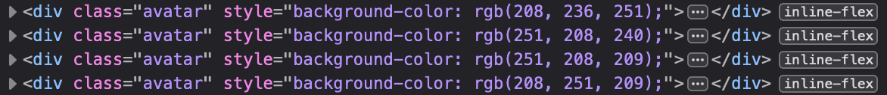
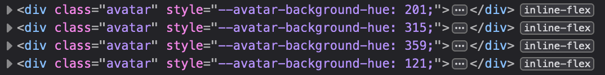

CSS c'est cool, JavaScript c'est cool. Mais mettre à jour du CSS avec du JS ça sous-entend de faire du CSS inline et ça c'est pas cool. Le truc c'est que JS ne sait pas vraiment faire autre chose que ça, à moins que…

<!-- excerpt -->

La plupart du temps on peut très bien changer du style avec JS en appliquant ou en supprimant uniquement une classe CSS pré-écrite. Et quand c'est possible c'est encore ce qu'il y a de mieux à faire mais il arrive parfois que cette option ne soit pas suffisante, notamment quand on cherche à écrire du CSS dynamique ou "_à la volée_".

Mettons que sur mon site ou ma webapp j'utilise un composant d'avatar qui affiche par défaut les initiales de l'utilisateur et que, parce que je veux que ce soit sympa, je veux que le `background-color` de ce composant soit calculé en fonction des lettres de ces initiales afin d'être un brin plus personnalisé. Ça a l'air un peu con comme exemple mais j'ai déjà fait ça et c'est vrai que ça rend bien.

D'abord fabriquons la base du composant.

```html
<div class="avatar">JC</div>
```

```css
.avatar {
	width: 2em;
	height: 2em;
	margin: 0.25em;
	display: inline-flex;
	align-items: center;
	justify-content: center;
	background-color: lightgrey;
	border-radius: 50%;
	font-size: 2em;
	color: black;
}
```



```css
.avatar {
	width: 2em;
	height: 2em;
	margin: 0.25em;
	display: inline-flex;
	align-items: center;
	justify-content: center;
	background-color: lightgrey;
	border-radius: 50%;
	font-size: 2em;
	color: black;
}
```

```html
<div class="avatar">JC</div>
```



Et voilà !

Maintenant ajoutons donc notre JS pour changer ce `background-color` en fonction des initiales…  
En l'occurrence j'ai choisi de jouer avec du [HSL](https://developer.mozilla.org/fr/docs/Learn/CSS/Building_blocks/Values_and_units#valeurs_hsl_et_hsla) afin de ne changer aléatoirement que le hue tout en gardant le contrôle de la saturation et la luminosité pour ne pas avoir à gérer les contrastes pour l'accessibilité.

```js
// Fonction honteusement pompée sur
// https://gist.github.com/0x263b/2bdd90886c2036a1ad5bcf06d6e6fb37
function hue(str) {
	if (str === null) return;
	let hash = 0;
	for (var i = 0; i < str.length; i++) {
		hash = str.charCodeAt(i) + ((hash << 5) - hash);
		hash = hash & hash;
	}
	return hash % 360;
}

// On va récupérer tous les avatars de la page qui sont personnalisés
const avatars = document.querySelectorAll(".avatar");

// Et on va calculer la valeur du hue pour chacun d'entre eux
// et le mettre sur un background-color dans du CSS inline
Array.from(avatars).forEach((element) => {
	element.style.backgroundColor = `hsl(${hue(element.innerText)},85%,90%)`;
});
```



```css
.avatar {
	width: 2em;
	height: 2em;
	margin: 0.25em;
	display: inline-flex;
	align-items: center;
	justify-content: center;
	background-color: lightgrey;
	border-radius: 50%;
	font-size: 2em;
	color: black;
}
```

```html
<div class="avatar">JC</div>
<div class="avatar">YL</div>
<div class="avatar">CR</div>
<div class="avatar">SD</div>
```

```js
function hue(str) {
	if (str === null) return;
	let hash = 0;
	for (var i = 0; i < str.length; i++) {
		hash = str.charCodeAt(i) + ((hash << 5) - hash);
		hash = hash & hash;
	}
	return hash % 360;
}

const avatars = document.querySelectorAll(".avatar");

Array.from(avatars).forEach((element) => {
	element.style.backgroundColor = `hsl(${hue(element.innerText)},85%,90%)`;
});
```



Ça marche bien, par contre on se retrouve avec du style inline ce qui en plus d'être indiscutablement moche (je suis évidemment objectif 🙃) devient aussi compliqué à surcharger. À part écrire directement par dessus, il ne reste que l'option `!important` ce qui est encore plus moche, indiscutablement toujours.


<div class="notabene">
Oui les navigateurs traduisent le HSL (entre autres) en RGB. C'est un truc qu'ils font apparemment, je sais pas trop pourquoi mais ça change pas grand chose pour nous ici.
</div>

**MAIS !**

Il existe un petit nouveau plus si nouveau que ça dans le gang CSS : Les **CSS custom properties** !

Reprenons un peu alors notre code.

Pas de changement sur le HTML.

```html
<div class="avatar">JC</div>
```

Pour le CSS, on va se reposer désormais sur une CSS custom property pour le `background-color`.

```css
.avatar {
	width: 2em;
	height: 2em;
	margin: 0.25em;
	display: inline-flex;
	align-items: center;
	justify-content: center;
	background-color: hsl(var(--avatar-background-hue, 0), 85%, 90%);
	border-radius: 50%;
	font-size: 2em;
	color: black;
}
```

La notation `background-color: hsl(var(--avatar-background-hue, 0), 85%, 90%)` se traduit comme ceci : Je veux que le `background-color` de mon élément soit une couleur HSL avec comme valeur de hue la valeur de ma propriété CSS `--avatar-background-hue` si elle existe, sinon ben tu lui mets une valeur de 0 en guise de filet de sécurité.

Puis pour le JS, on va juste adapter un peu ce qui sera envoyé au DOM.

```js
// Fonction honteusement pompée sur
// https://gist.github.com/0x263b/2bdd90886c2036a1ad5bcf06d6e6fb37
function hue(str) {
	if (str === null) return;
	let hash = 0;
	for (var i = 0; i < str.length; i++) {
		hash = str.charCodeAt(i) + ((hash << 5) - hash);
		hash = hash & hash;
	}
	return hash % 360;
}

// On va récupérer tous les avatars de la page qui sont personnalisés
const avatars = document.querySelectorAll(".avatar");

// Et on va calculer la valeur du hue pour chacun d'entre eux
// et le mettre dans une CSS custom property
Array.from(avatars).forEach((element) => {
	element.style.setProperty(
		"--avatar-background-hue",
		`${hue(element.innerText)}`
	);
});
```



```css
.avatar {
	width: 2em;
	height: 2em;
	margin: 0.25em;
	display: inline-flex;
	align-items: center;
	justify-content: center;
	background-color: hsl(var(--avatar-background-hue, 0), 85%, 90%);
	border-radius: 50%;
	font-size: 2em;
	color: black;
}
```

```html
<div class="avatar">JC</div>
<div class="avatar">YL</div>
<div class="avatar">CR</div>
<div class="avatar">SD</div>
```

```js
function hue(str) {
	if (str === null) return;
	let hash = 0;
	for (var i = 0; i < str.length; i++) {
		hash = str.charCodeAt(i) + ((hash << 5) - hash);
		hash = hash & hash;
	}
	return hash % 360;
}
const avatars = document.querySelectorAll(".avatar");
Array.from(avatars).forEach((element) => {
	element.style.setProperty(
		"--avatar-background-hue",
		`${hue(element.innerText)}`
	);
});
```



Ce qui donne exactement le même résultat… mais quand même en mieux parce que maintenant on peut surcharger simplement ces styles depuis le CSS si besoin.

Et puis franchement c'est plus beau à voir, indiscutablement toujours.


<script src="{{ script }}"></script>
