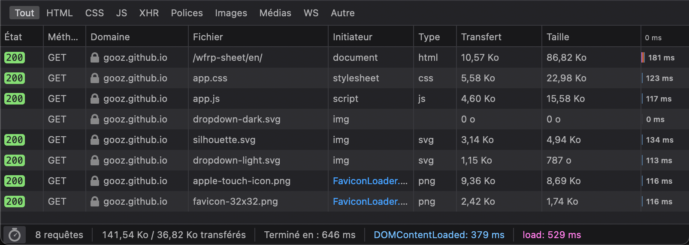

Je bosse vraiment dans le développement web depuis 2007 et j'ai jamais vraiment fait un projet open-source de A à Z qui serve à quelqu'un d'autre que moi depuis tout ce temps. Mais je crois que ce temps est révolu.

<!-- excerpt -->

Voyez, je suis à mes heures perdues grand amateur de jeu de rôle sur table et à la fois un peu fan de technologie. Tout ça pour dire que, souvent, plus le jeu a des règles complexes plus la sempiternelle feuille de personnage sous forme papier devient vite chiante à maintenir à jour. Pas impossible mais chiante.

Pour la plupart des grands noms du jeu de rôle il existe déjà souvent une solution numérique de cette feuille de personnage. Mais pas tout le temps. Et que fait donc un développeur web flemmard quand une chose ne lui convient pas ? Il tente de le faire soi même évidemment.

Vous l'aurez compris c'est exactement ce qu'il m'est arrivé. Avec mon groupe de JdR on a récemment changé de jeu et on est passé à **Warhammer Fantasy Role Play** (à ne pas confondre avec Warhammer 40K ou Warhammer Fantasy qui sont des jeux de batailles avec des figurines, là on parle d'un jeu de rôle papier ou sur table). Mais l'offre de solution numérique s'arrêtait à un vulgaire PDF éditable.

C'était pas assez pour bibi.

## La genèse du projet

J'ai alors d'abord commencé à réfléchir le truc, comment ça se présenterait, quelles technologies, quelle fonctionnalités, etc.

Puis je suis vite arrivé à la conclusion qu'une fiche de personnage de jeu de rôle ce n'était finalement rien d'autre qu'un simple formulaire de données. Dans le cas de WFRP (Warhammer Fantasy Role Play donc), il y a aussi moult données qui dépendent les unes des autres. Donc quelques calculs à prévoir mais rien de folichon.

Alors je me suis dit… Et pourquoi pas ?

Et pourquoi je me lancerais pas dans ce petit projet qui j'en suis sûr servirait à d'autres personnes de part le monde ?

Du coup je l'ai fait !

## Choix techniques

Je suis développeur front donc j'ai d'entrée évincé toute notion de backend. Ce serait un projet uniquement front.

### Base de donnée

Mais il me fallait malgré tout une base de donnée pour stocker toutes les valeurs des champs du formulaire. J'ai du coup opter pour du **localStorage** pour plusieurs raisons :

- je ne voulais pas avoir à gérer des comptes utilisateur, faire du support là-dessus, gérer les mots de passes oubliés ou encore les histoires de données personnelles avec le RGPD, etc.
- Je ne voulais pas avoir à gérer des mis à jour de sécurité d'une base de données backend et tous les potentiels hacks qui pourraient subvenir.
- Je n'avais pas l'intention de prendre un hébergment dédié pour l'app. J'avais déjà décidé que ça se passerait sur Github.io directement depuis le repository git

Alors pourquoi localStorage plutôt que IndexedDB ou autres ? J'ai honnêtement longuement hésité entre ces deux-là. J'ai choisi le premier pour sa simplicité d'utilisation mais je ne me ferme pas l'idée de migrer vers IndexedDB si le besoin technique se fait ressentir.

### Hébergement

Comme dit plus haut, j'avais l'intention de base de faire un repo open-source de l'app et directement l'héberger sur Github Pages, histoire de faire direct et simple (au final c'était pas si simple mais on verra ça plus tard). Mais disons que cette solution avait le mérite de faciliter le déploiement et la configuration du serveur avec du Gzip et du HTTPS par défaut notamment. Choses que je ne sais pas faire et que je n'ai même pas envie de savoir faire.

### Technologies

Forcément si on parle de front uniquement ce serait du HTML/CSS/JS. Mais est-ce que j'utilise un système de templating pour HTML du genre Handlebars ? Est-ce que j'utilise un pré ou post-procésseur CSS comme Sass ? Est-ce que j'utilise un Framework JS pour monter tout ça comme ReactJS ?

Les réponses à ces questions étaient : Non. À chacune d'entre elles.
Je suis parti en mode Vanilla de bout en bout.
Enfin presque. Mais on verra plus tard. En tout cas ça allait être une app complètement statique.

### Fonctionnalités

Ce que je voulais à minima c'était que les champs qui sont des duplicatas d'autres champs soient gérés automatiquement et que les champs qui sont le résultat d'addition de plusieurs autres champs soient remplis aussi automatiquement.

Puis les potes du club de JdR m'ont dit que ce serait cool de pouvoir mettre en exergue une compétence de carrière parce que, dans ce jeu, ce sont les compétences qu'on doit améliorer si l'ont veut passer au niveau de carrière suivant. Normalement sur une feuille on met une croix ou on entoure cette dernière mais il me fallait un moyen de faire ça sur l'app.
Puis ils m'ont dit aussi que ce serait cool si l'app calculait automatiquement le poids des affaires que le personnage possède sur lui puisque, dans WFRP toujours, le personnage ne peut porter un poids d'objet limité.

Ça faisait déjà deux nouvelles fonctionnalités.

Ensuite personnellement je voulais faire deux thèmes différents : Un clair et un foncé (ou ce qu'on appelle plus allègrement le Dark mode).

Évidemment je voulais que ce soit un minimum responsive, la base quoi.

Et pour le challenge, mais aussi pour la sécurité, je voulais qu'on puisse exporter puis importer les données, que ce soit pour faire une sauvegarde (le localStorage c'est pas fiable à 100%) ou pour un transfert sur un autre device.

Ensuite j'ai pensé à faire un partage par URL de la fiche, en mettant les données dans des queryStrings.

Finalement, je me suis dit que si je proposais la fiche en français et en anglais ça toucherait plus de monde, donc je me suis mis bille en tête de rajouter de l'i18n.

Voilà j'avais ma liste de fonctionnalités de départ.

## Développement

En 2-3 semaines j'ai beaucoup tatonné mais j'arrivais globalement à mes fins. Toutes mes fins? Non…

Il s'avère que mon formulaire a beaucoup de données, beaucoup trop pour tout passer en queryStrings pour faire du partage via URL parce que tous les browsers ont une limite de longueur d'URL et ils sont loin d'être égaux. Certains sont à 60 000 caractères, d'autre à 2 000… De base mon URL, à vide, serait dans les 4 000 et même si je bidouillais pour optimiser la longueur des queries ça ne serait jamais assez bon.

J'ai donc dû abandonné cette fonctionnalité. En tout cas telle quelle. Peut être que j'y reviendrai mais différemment plus tard.

Puis je suis passé à l'i18n qui quand on veut faire du statique s'avère un brin plus compliqué que prévu.

J'ai dû abandonner l'idée de faire sans dépendance et après moult recherches je me suis arrêté sur [11ty](https://www.11ty.dev/) qui semblait plus qu'à propos pour faire du statique. Dépendance qui aura le mérite de n'exister que pour builder l'app, alors ça va je le vis bien.

Par contre, déployer tout ça sur Github Pages quand on a un builder, c'est une autre paire de manche que de simplement lui dire tu prends les fichiers html présent et tu me sers ça comme j'avais au début. J'ai dû me familiariser avec les Github Actions pour régler ça, non sans mal. Mais c'est passé !

J'ai globalement construit ça au mieux, aussi bien que je savais le faire.

Et je suis vraiment satisfait du résultat. Rien que de voir les données de performance ça me laisse en joie.

- moins de 10 requêtes HTTP
- ~140 Ko tout compris
- ~37Ko une fois Gzippé

Alors je dis pas que l'app est parfaite, faut encore la tester à plus grande échelle que juste moi, il y a sûrement des axes d'améliorations et j'ai déjà des nouvelles fonctionnalités dans les tuyaux.
Mais c'est là, ça marche et c'est disponible pour qui souhaite l'utiliser.

Le repo est sur [Github](https://github.com/GoOz/wfrp-sheet) et l'app disponible sur [Github Pages](https://gooz.github.io/wfrp-sheet/#en) !

Je tiens à remercier certaines personnes pour leurs coups de mains et conseils.
Notamment les gens cools de ##openweb@Libera.Chat sur IRC comme [Anthony](https://indieweb.social/@anthony) ou [Julien](https://pouet.chapril.org/@julienw), mais aussi les copains du web comme [Yvain](https://mamot.fr/@ryuran) et [Nicolas](https://mamot.fr/@nhoizey) et puis enfin Raf pour la QA bénévole.

Voilà c'est tout pour moi.
