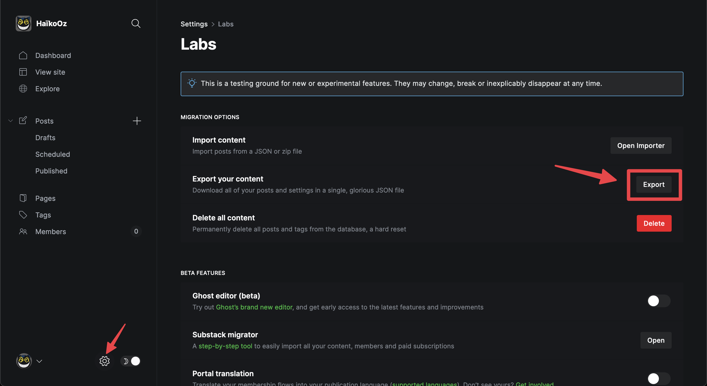

Après plusieurs années d'utilisation de Ghost comme CMS de ce blog ainsi que mon portfolio, j'ai décidé de migrer sur Eleventy. Ça n'a pas été super facile mais franchement pas très compliqué non plus.

<!-- excerpt -->

## Pourquoi changer ?

Pour plusieurs raisons en fait.  
Techniques d'abord puisque quand **Ghost** est sorti l'éditeur était très centré sur _Markdown_, la base de donnée était du simple **NoSQL** et c'était globalement très orienté sur le blog personnel. Maintenant l'éditeur, bien qu'il accepte toujours le _Markdown_ en entrée mais plus comme un insert, n'est rien d'autre qu'un <abbr title="What You See Is What You Get">wysiwyg</abbr> un peu mieux foutu que la moyenne, la base de donnée par défaut est **MySQL** et c'est beaucoup plus orienté sur CMS générateur de communauté payante. Un peu comme ce que ferait [Patreon](https://www.patreon.com) en fait mais en plus personnel et moins plateforme.  
Alors je ne critique pas **Ghost** ou son équipe, c'est très bien ce qu'ils font, c'est toujours très souvent mis à jour et franchement si demain je devais vendre du contenu personnel en ligne je passerais très probablement par **Ghost** de nouveau.
Mais pour ce qui est d'un bête blog personnel, j'ai préféré rester simple.

En plus de ça je passais d'un serveur dédié OVH d'un pote à un serveur personnel mutualisé et il s'avère qu'installer **Ghost** sur un serveur où l'ont pas les accès _root_, c'est un brin plus chiant et compliqué.

Alors je me suis mis bille en tête de migrer tout ça sur [Eleventy](https://www.11ty.dev/), un générateur de sites statiques, parce qu'à la fin de la journée, ce blog n'a pas besoin de grand chose d'autre que de simples fichiers statiques.

## Récupérer les données

Le nerf de la guerre d'une migration c'est d'abord de pouvoir récupérer les données et ce de manière exploitable. Heureusement, **Ghost** fait ça très bien puisqu'il suffit d'aller dans les _Settings_ puis _Labs_ et cliquer sur le joli bouton _Export_ pour obtenir un magnifique JSON.



Seul inconvénient, mais pas irrémédiable, il ne s'agit que du contenu textuel des billets et pas les autres potentiels _assets_ extérieurs comme, notamment, les images. Pour obtenir ces derniers vous pouvez aller récupérer tout ça sur votre serveur via un client FTP par exemple et prendre tout ce qui est dans le dossier `content` de votre instance **Ghost**.

Et voilà, vous avez tout. Enfin… vous avez vos backup de billet mais, même si _JSON_ c'est bien c'est quand même pas du markdown, ce qui est la façon pour **Eleventy** d'écrire des billets. Il va donc falloir transformer tout ça.

Pas d'inquiétude, installez [ghost-to-md](https://www.npmjs.com/package/ghost-to-md) et suivez son _readme_, c'est un petit script open source qui transformera votre json en autant de fichier Markdown que vous avez écris de billets.

## Le temps des retouches

Aussi magique soit ce petit script, il y aura probablement des ratés. Enfin ça dépend du contenu que vous écriviez mais si comme moi vous aviez écrit des snippets de code, ou du html comme des _iframes_, etc… en fait tout ce qui n'est pas du texte ou de l'image alors ça sera très probablement pété. Je vous suggère donc de bien garder votre blog en ligne en guise de source de vérité le temps de régler tout ça.

C'est honnêtement ce qui m'a pris le plus de temps pendant cette migration, passer au crible chaque billet que j'ai écris depuis le temps (une trentaine à peu près) et régler ce qu'il y a avait à régler.

Occupez vous du contenu textuel d'abord, laissez les images à part un moment, on y reviendra plus tard.

Ah aussi, vous remarquerez au tout début de chaque fichier _Markdown_ des metadata contenant un _title_, _slug_, etc, ça s'appelle le _frontmatter_ chez **11ty**.
N'y touchez pas pour le moment on y reviendra plus tard.

## Setup de Eleventy

De base, **11ty** est simple, **11ty** est sobre.
J'aurais pu partir de zéro et c'est sûrement ce que je ferai la prochaine fois que je l'utiliserai pour un autre projet mais je ne maîtrisais pas encore assez quand j'ai commencé cette migration alors j'ai pris comme base de travail le dépôt git tutoriel officiel pour blog [Eleventy-base-blog](https://github.com/11ty/eleventy-base-blog) qui est comme son nom l'indique une base pour un blog. Parfait, n'est-ce pas ?

Je ne vais pas m'attarder plus ce que ça sur comment installer à la base **11ty**, lisez donc le… _readme_ du dépôt.

### Cool URIs don't change comme on dit dans le bouchonnois.

Un principe de base du développement web, et particulièrement à propos pour notre migration, c'est qu'un URI ne doit pas changer. Comprendre qu'on va faire en sorte que les URIs de vos billets sur **11ty** soient les mêmes que celles que vous aviez sur **Ghost**, parce qu'on est pas des bêtes quand même.

Si vous avez regardé un peu les URIs sur **Ghost** ressemblent à ça :
`domain.tld/YYYY/MM/DD/slug`

**11ty**, lui, par défaut va garder l'architecture de votre dossier de contenu si vous ne forcez pas une URI spécifique.

Donc pour arriver au même résultat sur **11ty** vous aurez deux choix qui s'offrent à vous :

1. soit vous faites en sorte que l'architecture de votre dossier de billet de blog sur **11ty** soit du même format que vos URI de **Ghost**
2. Soit vous faites en sorte de forcer le `permalink` de chacun de vos billets un par un.

Personnellement j'ai choisi la première option, j'aime bien architecturer proprement mes dossiers alors ça m'allait de faire ça comme ça.  
Et pour ce qui est du `slug`, ça va être simple, vous l'avez déjà en fait, il est dans le _frontmatter_ de chaque fichier _.md_, c'est fourni grâce à **ghost-to-md**. Vous n'avez qu'à faire en sorte que le nom de votre dossier soit raccords avec ce _slug_. Une fois fait vous pouvez virer ce `slug` du _frontmatter_ il ne nous servira plus.

Du coup grosso modo on se retrouvera avec une architecture de la sorte :

```
content/
├─ 2023/
├─ 2022/
│  ├─ 12/
│  │  ├─ 31/
│  │  │  ├─ mon-titre-de-billet/
│  │  │  │  ├─ index.md
│  ├─ 06/
│  │  ├─ 13/
│  │  │  ├─ mon-titre-de-mon-autre-billet/
│  │  │  │  ├─ index.md

```

### Les tags

Normalement, vous les avez récupérés avec **ghost-to-md** mais ils sont très probablement mal intégrés, donc retouchez un peu ça dans vos _.md_.

Si vous n'avez qu'un seul tag, vous pouvez écrire ça sur une ligne ou sur plusieurs comme cela :

```yaml
---
tags: humeur
---
```

```yaml
---
tags:
	- notes
---
```

Et si vous avez plusieurs tags, il vous faudra utiliser une de ces deux syntaxes :

```yaml
---
tags: [code, humeur]
---
```

```yaml
---
tags:
	- code
	- notes
---
```

### Gérer les images

Revenons-en aux images maintenant.
Le dépôt **Elventy-base-blog** vient avec quelques plugins 11ty déjà installés dont **eleventy-img**. Ce dernier gère plusieurs choses en même temps, il va :

- Déplacer les images dans un dossier `img` global
- Générer des images dans d'autres formats (avif, webp, etc) qui pourraient être mieux adaptés
- Générer des images à différentes taille pour le responsive
- Mettre tout ça au carré en insérant une balise `picture` avec des éléments `source` et leurs attributs `srcset` et `sizes`

C'est vraiment cool et pratique honnêtement, le seul petit inconvénient que je lui trouve c'est qu'il va falloir écrire du code spécifique au langage de templating que vous utilisez dans **11ty** directement dans votre fichier _Markdown_, ce qui n'est pas très gênant j'imagine si vous écrivez dans un éditeur de code mais un peu plus si vous écrivez dans un outil dédié au _Markdown_ comme moi avec [Obsidian](https://obsidian.md/).

Par soucis de simplicité, je mets toutes mes images d'un billet dans le répertoire de ce billet dans un dossier `img`.

Et donc, utilisant [Nunjucks](https://mozilla.github.io/nunjucks/) pour le templating, je vais devoir écrire pour chaque image insérée quelque chose comme ça :



```liquid

```



Ça c'est la base mais vous pouvez aussi choisir une `width` et surtout générer les `sizes` pour le responsive par exemple :



```liquid

```



Alors ça peut paraître lourd à l'usage mais en fait vous pouvez mettre des valeurs par défaut et ne les spécifier que si vous voulez un truc différent.  
Pour ma part, toutes mes images de contenu ont les tailles `[400, 812, 1400, "auto"]` (auto étant la taille de l'image telle quelle) et leur `sizes` est `(min-width: 50em) 812px, 100vw`.

Avec juste ça le plugin **eleventy-img** génèrera une balise picture belle comme il faut :

```html
<picture>
  <source
    type="image/avif"
    srcset="
      /img/v4TA5RtKYq-400.avif   400w,
      /img/v4TA5RtKYq-812.avif   812w,
      /img/v4TA5RtKYq-1170.avif 1170w
    "
    sizes="(min-width: 50em) 812px, 100vw"
  />
  <source
    type="image/webp"
    srcset="
      /img/v4TA5RtKYq-400.webp   400w,
      /img/v4TA5RtKYq-812.webp   812w,
      /img/v4TA5RtKYq-1170.webp 1170w
    "
    sizes="(min-width: 50em) 812px, 100vw"
  />
  <source
    type="image/jpeg"
    srcset="
      /img/v4TA5RtKYq-400.jpeg   400w,
      /img/v4TA5RtKYq-812.jpeg   812w,
      /img/v4TA5RtKYq-1170.jpeg 1170w
    "
    sizes="(min-width: 50em) 812px, 100vw"
  />
  
</picture>
```

### Les _feature image_

**Ghost** permet sur chaque billet de lui mettre une image de présentation, que ce une personnelle ou venant directement de [Unsplash](https://unsplash.com) et j'utilisais beaucoup cette option.  
Donc pour tenter de reprendre ça, j'ai tout d'abord récupéré toutes les images utilisées, je les ai stockées dans le dossier `img` de mon billet et dans le _frontmatter_ de chaque billet j'ai rajouté des données custom.

```yaml
---
title: Titre de mon billet
date: 2023-03-27
featured: img/featured.jpg
featured_author: Carolina Heza
featured_url: carolinahdzz
tags:
	- notes
---
```

- `featured` étant le chemin vers l'image en question
- `featured_author` étant le nom de l'auteur
- `featured_url` étant le _handle_ de l'auteur pour générer le lien qui va bien vers sa page **Unsplash**

Ensuite dans mon template de billet j'ai mis :



```liquid

<figure class="feature">
	
	
	<figcaption>Photo de <a href="https://unsplash.com/@{{ featured_url}}">{{featured_author}}</a> sur Unsplash</figcaption>
	
</figure>

```



Tout ça parce que, une fois encore, on est pas des bêtes, il **faut** mettre les sources des photos que l'on vous laisse utiliser gracieusement.

Alors oui tout ça demande _un peu plus_ de travail pour chaque billet puisque tout ça était géré quasi automatiquement par **Ghost** mais c'est le jeu quand on veut se passer de CMS au final.

### Le flux RSS

**11ty** vient par défaut sans générateur de flux RSS mais il existe un plugin officiel bien nommé [eleventy-plugin-rss](https://www.11ty.dev/docs/plugins/rss/) qui, si vous utilisez le dépôt **eleventy-base-blog** comme moi, vous aurez automatiquement.  
Honnêtement y a pas grand chose à faire de ce côté, c'est plutôt direct. Le seul _hic_ c'est qu'il génère un fichier xml sur lequel on doit pointer mais que **Ghost**, lui, faisait une URL du genre `domain.tld/rss/` alors histoire de ne perdre personne pendant la migration j'ai dû rajouter une redirection 301 (Moved Permanently) sur le serveur.

Un simple _Redirect_ ne suffira pas malheureusement, il faudra faire un _RedirectMatch_ à la place, du coup dans votre _.htaccess_, allez écrire un truc comme ça :

```txt
RedirectMatch 301 ^/rss/?$ /feeds/posts.xml
```

Et voilà, ça devrait faire le travail.

### Les petits plus.

11ty a quelques [plugins officiels](https://www.11ty.dev/docs/plugins/#list-of-official-plugins), et souvent indispensables, à vous proposer. Une flopée viennent avec le dépôt **eleventy-base-blog** comme :

- [Navigation](https://www.11ty.dev/docs/plugins/navigation/) pour générer une navigation ou un fil d'ariane
- [RSS](https://www.11ty.dev/docs/plugins/rss/) pour générer vos flux RSS, Atom, JSON…
- [Syntax highlighting](https://www.11ty.dev/docs/plugins/syntaxhighlight/) pour mettre en lumière vos bouts de code avec [PrismJS](https://prismjs.com/)
- [Bundle](https://github.com/11ty/eleventy-plugin-bundle) pour "concaténer" vos fichiers CSS ou JS

Mais de nombreux autres sont disponibles via la [communauté 11ty](https://www.11ty.dev/docs/plugins/#community-contributed-plugins) et dans le tas j'en ai déjà choisi quelques uns (et c'est sûrement pas les derniers puisque je lorgne sur quelques autres) :

- [Embed everything](https://github.com/gfscott/eleventy-plugin-embed-everything) pour générer de belles _iframes_ pour vos média externes (Youtube, Vimeo, Spotify, etc) en ne mettant que le lien du média dans vos billets
- [Time to read](https://github.com/JKC-Codes/eleventy-plugin-time-to-read) qui va calculer le temps de lecture de vos billets et vous permettre de l'afficher comme il vous plait
- [Reader bar](https://github.com/thigoap/eleventy-plugin-reader-bar) qui va permettre de rajouter une barre d'avancement de lecture (purement cosmétique)
- [SVG Sprite](https://github.com/patrickxchong/eleventy-plugin-svg-sprite/) pour générer un sprite SVG et faciliter son utlisation
