Quand il s'agit de voyage, je suis plutôt du genre dépaysement par la nature que par le soleil, plage et tout le toutim. Je préfère la verdure et le calme. Pendant des années j'ai rêvé de visiter l'Écosse et ça m'aura peut être pris une dizaine d'années mais c'est enfin chose faite. Alors voici mon retour de voyage, pour partager et si jamais ça peut servir comme base à quelqu'un d'autre qui serait intéressé pour vivre la même expérience alors tant mieux.

---

On est donc parti sur un road trip de 9 jours.  
Évidemment on a pas pu tout faire.  
Évidemment il a fallu faire des concessions.  
Mais on est pas déçu de nos choix.

Voilà très rapidement notre itinéraire, en commençant et finissant par Edinburgh durant ces 9 jours :

1. Edinburgh
2. Edinburgh
3. Glencoe
4. Glencoe
5. Skye Islands
6. Inverness
7. Cairn Gorm (Nord)
8. Cairn Gorm (Ouest)
9. Edinburgh

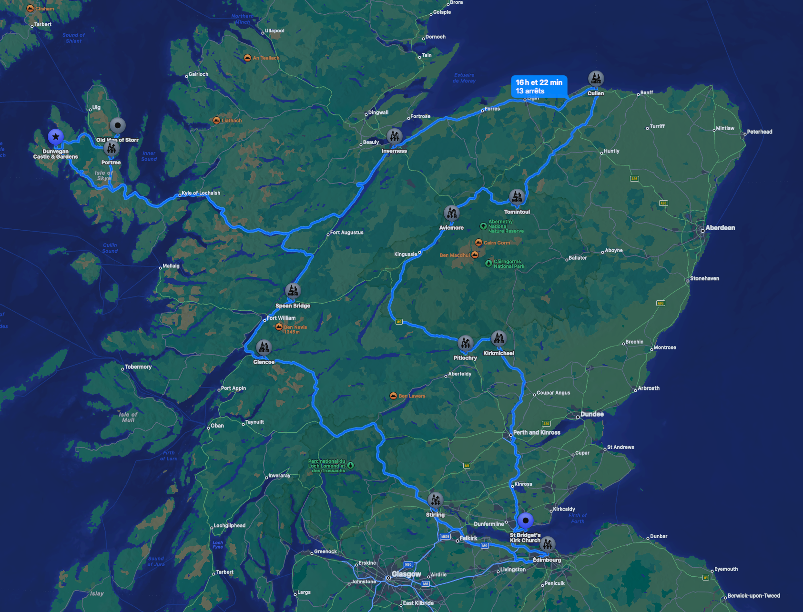

## Jour 1 : Edinburgh

On s'est organisé 2 jours à Edinburgh en se disant que 3 jours seraient de trop et on a eu raison. Non pas qu'il n'y a pas de quoi faire 3 jours à Edinburgh mais quand on a que 9 jours alors il faut optimiser un brin et honnêtement 2 jours suffisent à se faire plaisir déjà.

### New Town

Le premier jour, on est arrivé vers 10h30 à l'aéroport et on a pris la navette _airline 100_ jusque **New Town**.

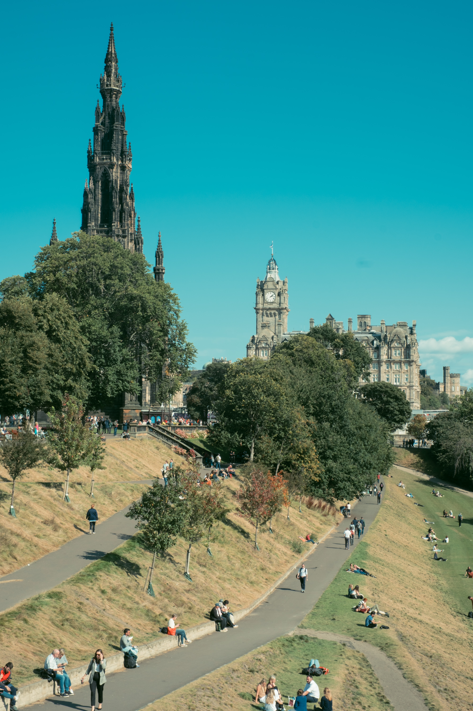

### CeX

On a dû d'emblée faire un crochet par **CeX**, un magasin d'occasion de matériel informatique parce que ma compagne avait oublié son téléphone en France… et elle voulait pouvoir envoyer ses propres photos et messages à ses proches pendant le voyage et puis… 2 téléphones valent mieux qu'un quand on cherche un endroit à visiter ou bien à manger. On a pas eu besoin qu'elle se prenne une carte SIM étant donné que la majorité des lieux à Edinburgh proposent un WiFi gratuit ce qui était amplement suffisant. Toujours est-il donc que chez **CeX** le staff était adorable et ont vite compris notre besoin. C'était notre première véritable interaction avec des écossais et leur accent particulier. Je suis assez content de mes capacités à les comprendre au final. C'est pas toujours facile mais globalement ça se gère.

### Old Town

C'est dans ce quartier qu'on avait notre B&B pour 2 jours et il était donc très bien placé car c'est principalement dans **Old Town** et aux alentours que la majorité des choses qu'on avait à voir étaient situés.

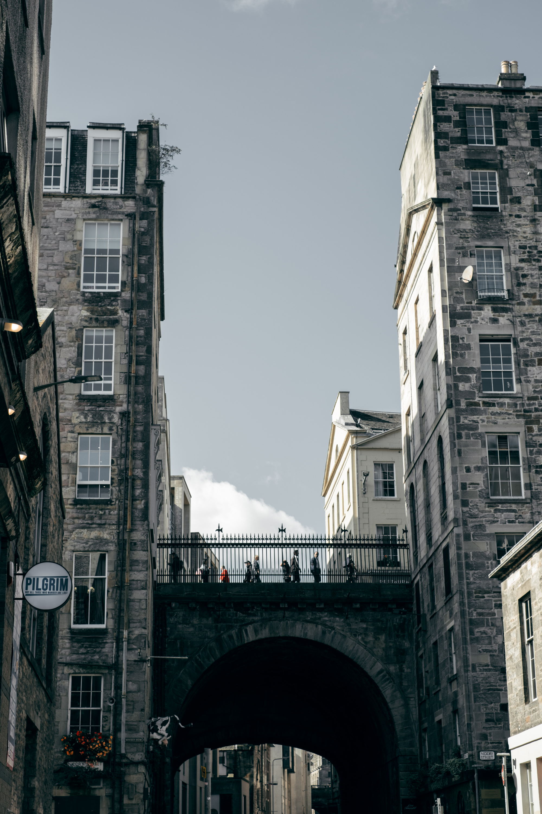

#### Grassmarket

Le coin de **Grassmarket** (où les pubs les plus emblématiques du coin résident comme The Last Drop, The White Hard Inn, etc…) est le lieu où se passaient les exécutions publiques dans le temps. D'ailleurs, le nom du **Last Drop** qui apparemment offrait un dernier verre aux condamnés à mort vient de cette histoire.  
C'est très touristique donc très chargé, surtout en haute saison j'imagine mais c'est mignon comme tout comme place.

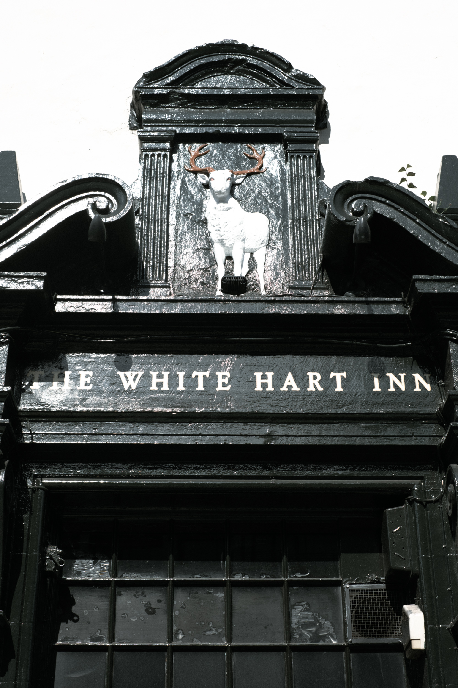

#### Victoria Street

De **Grassmarket** on a remonté **Victoria Street**, rue qui aurait inspiré **[J. K. Rowling](https://fr.wikipedia.org/wiki/J._K._Rowling)** pour [Diagon Alley](<https://fr.wikipedia.org/wiki/Chemin_de_Traverse_(Harry_Potter)>) (et c'est vrai qu'il y a un petit truc, il y a même des magasins de pop culture qui vendent, évidemment, du _merchandising_ Harry Potter). C'est une rue en pente, qui rejoint directement The Royal Mile, la rue la plus importante d'Edinburgh.

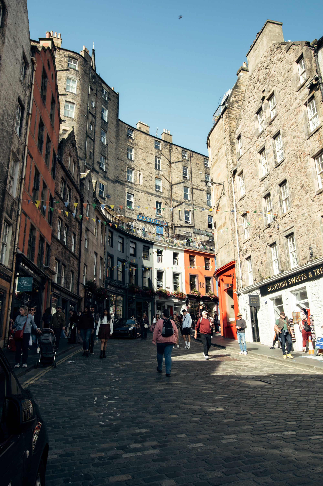

## Greyfriars kirk

On a redescendu **Grassmarket** pour rejoindre le très beau et singulier cimetière **Greyfriars kirk** où se trouve une copie de la statue de **Bobby**, ce gentil chionchion qui serait resté 14 ans à surveiller la tombe de son maître, jusque sa propre mort, et où **J. K. Rowling** aurait pompé directement sur les tombes pas mal de nom des personnages de sa fameuse saga.

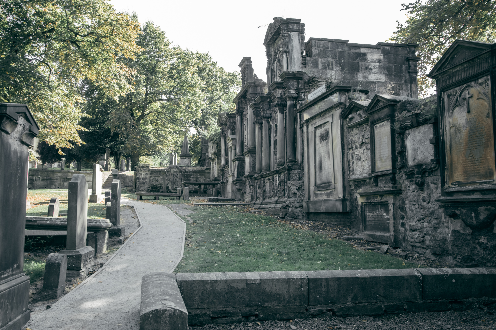

### Edinburgh's Central Library Jeunesse

Après moults pérégrinations on est tombé sur la bibliothèque centrale jeunesse et ma compagne étant une bibliothécaire branchée jeunesse on y est allé. Ils y étaient très sympathiques.

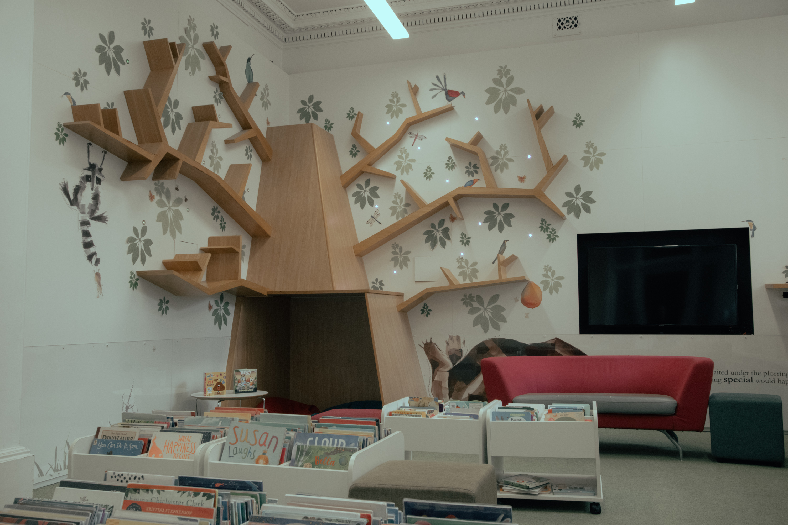

### The Royal Mile

On est finalement allé à **The Royal Mile** qui, _spoiler alert_, fait plus que 1 mile. C'est la rue qui joint le **château d'Edinburgh** au **Palais de Holyrood**. C'est une si ce n'est la rue la plus touristique d'Edinburgh et c'est une très belle rue avec plein de beaux bâtiments et de belles boutiques.

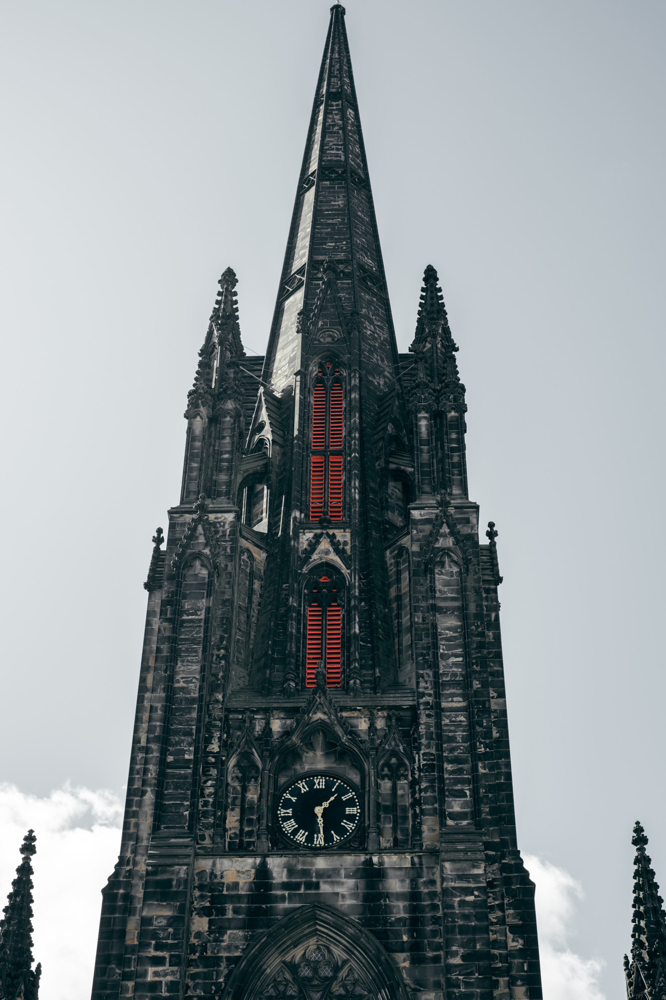

### Tea time

On s'est posé dans un salon de thé pour se remplir le gosier et j'ai pris un chocolat chaud… sauf que j'ai compris plus tard que les Ecossais le buvaient avec du lait entier. Mon bidou, peu habitué, a crié à l'infamie pendant quelques heures ensuite. Grosse erreur de ma part.

### Mystery tour

On avait réservé de 18h30 à 20h30 une visite guidée dans la ville centrée sur les histoires de fantômes, _true crime_ et compagnie. Notre guide **Niamh** était géniallissime et nous a raconté plein de petites histoires plus glauques les unes que les autres, et ce sur les lieux mêmes où elles se sont passées.  
Notez que marcher pendant presque 2 heures m'aura permis de mieux digérer mon chocolat chaud. 🙃

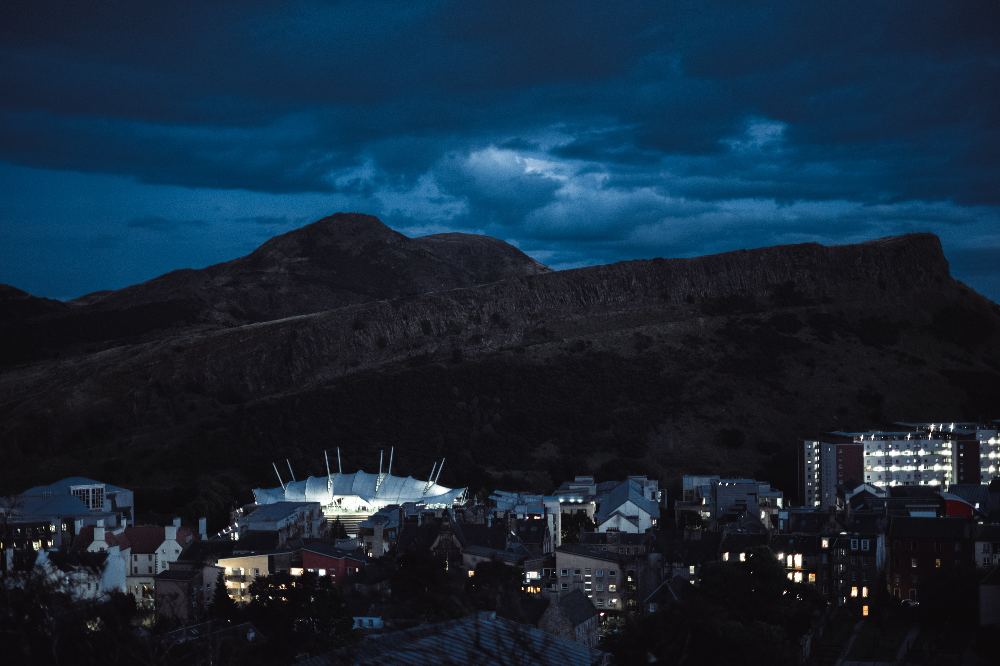

### The banshee labyrinth

Pour finir la journée on est allé boire un verre dans **[The Banshee Labyrinth](https://www.thebansheelabyrinth.com/)**, un pub à l'ambiance unique. Pas de mensonge sur la marchandise puisqu'il est compliqué de s'y retrouver, en tout cas la première fois qu'on y entre.

## Jour 2 : Edinburgh

Deuxième journée à Edinburgh pour compléter la première : on aura évidemment pas tout fait, notamment les gros trucs comme le château ou le palais de Holyrood qui sont des nids à touristes même en fin de saison. Mais ne les ayant pas fait, je ne peux en dire ni du bien, ni du mal.

### Scottish breakfast

Je ne suis pas du matin et mon estomac non plus mais j'ai quand même essayé un _scottish breakfast_ (ce qui est comme un _british breakfast_ - beans, sausage, bacon - mais avec des trucs scots avec en prime comme du haggis, du boudin noir et des potato scones).
C'était gras et lourd, en tout cas pour moi, mais c'était bon. Faut juste être prêt à digérer tout ça.

### Dean Village

Dean Village n'a pas grand chose de particulier si ce n'est que c'est un mignon petit quartier résidentiel avec une rivière qui passe en son centre et une jolie balade à faire, surtout que tout ça est un peu au centre d'Edinburgh, c'est assez rare pour être notable.

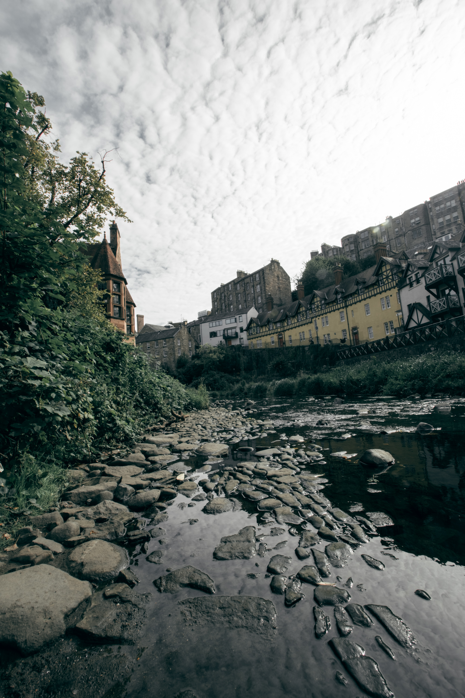

## Calton cemetery

On s'est baladé dans un autre cimetière ancien plus au nord qui vaut le détour, dans la même veine que **Greyfriars kirk**.

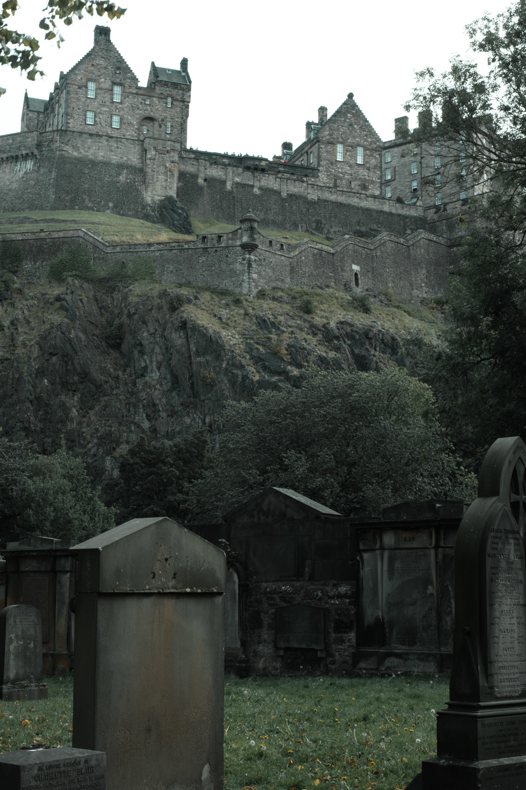

### Surgeons' Hall Museums

Ensuite on est redescendu plus au sud pour visiter le [musée de la chirurgie](https://museum.rcsed.ac.uk/). Très sympathique à faire, sauf si vous n'aimez pas l'idée de voir de véritables restes humains conservés ou des organes dans des jarres de formol. Je préfère prévenir.

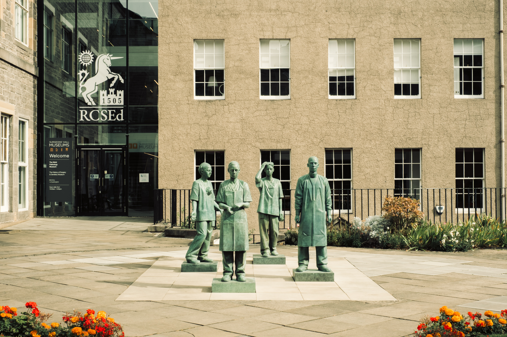

### Edinburgh's Central library

Toujours dans l'optique de satisfaire la curiosité de ma compagne bibliothécaire on est parti faire le reste de la _Edinburgh's central library_, c'est un autre bâtiment que celui pour la jeunesse qu'on avait vu la veille. C'est un très beau bâtiment ancien.

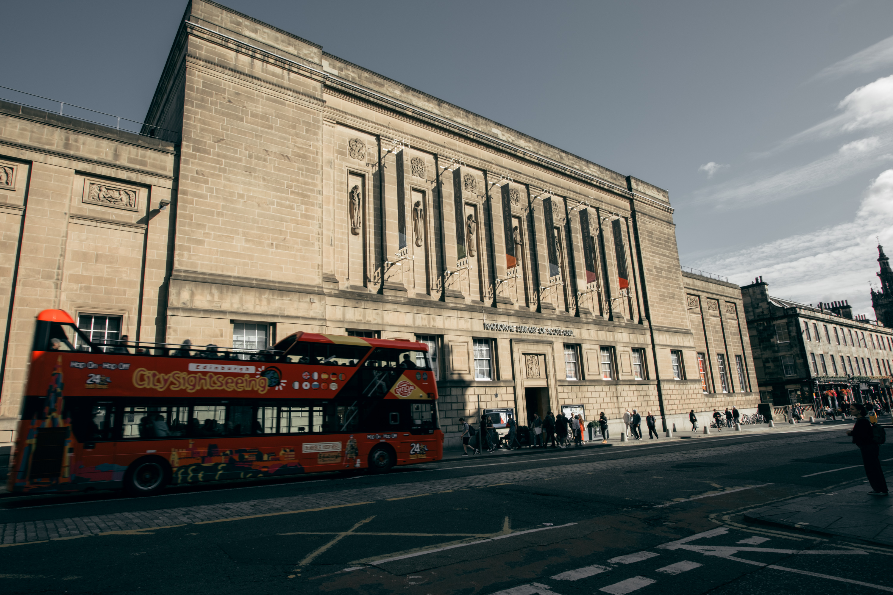

### Necrobus

On s'est fait un tour du Nécrobus, un Ghost tour comme il y en a beaucoup, à ceci près que celui-ci se passe dans un bus typique des UK redécoré de façon glauque. C'était très fun, un peu de redite avec la visite guidée qu'on avait faite la veille mais on a pu aller plus loin, bus oblige, qu'à pied. Le but de cette visite est clairement de faire un peu peur et beaucoup rire et ça marche bien.

### Whistle Binkies

Pour finir la soirée, et pour se mêler aux autochtones, on est allé boire notre dernier coup dans un pub de concert live, le [Whistle Binkies](https://whistlebinkies.com/), dans la même rue que le **Banshee Labyrinth**. La déco était jolie, pub à la british, et ils avaient un bon choix de whisky et de bière.

## Jour 3 : Glencoe

C'est l'heure du départ pour les contrées "sauvages" de l'Écosse: belles pour les yeux et exigeantes pour les jambes.

### Location chez Avis

On avait réservé une Fiat 500 chez Avis pour 6 jours.  
Pourquoi Avis ? Parce que c'est un gros du domaine et surtout car c'était un des rares à accepter les cartes de débit. Normalement, chez la majorité des loueurs là-bas c'est la carte de crédit qui fait loi. J'étais sûr de rien alors comme je ne voulais pas prendre de risque et me retrouver comme un con sans voiture sur place, j'ai préféré aller chez eux. Et pour le coup je confirme que la carte de débit fonctionne chez eux.

Pourquoi une petite Fiat 500 ? Parce que on était que 2 donc c'était suffisant mais surtout parce que beaucoup de petites routes en Écosse ne sont que des une voie avec des "_passing places_" tout le long des deux côtés. Du coup, plus ta voiture est petite plus c'est simple de rencontrer d'autres véhicules en face qui ne sont généralement pas aussi petits, bien au contraire. Et j'ai vite compris pourquoi il y avait autant de pick up… C'est un paysage magnifique l'Écosse mais très vallonné, du coup faut un peu de patate sous le capot (ce que la Fiat 500 n'avait pas). Je n'ai jamais été bloqué dans une côte mais j'en ai parfois chié à la faire grimper.  
Avec le recul, je me dit que c'était une parfaite voiture pour la ville mais pas vraiment pour la campagne.

Au départ, j'étais un peu anxieux pour la conduite à gauche, mais en y allant doucement et prenant son temps on s'y fait.

### Stirling

Sur le chemin pour Glencoe on a fait un arrêt à **Stirling** où on peut y visiter le château, chose que l'on a pas fait par manque de temps (et parce que trop de touristes) alors à la place on a simplement visité la ville et son cimetière à pied puis on est allé dans un salon de thé se recharger et on est reparti.

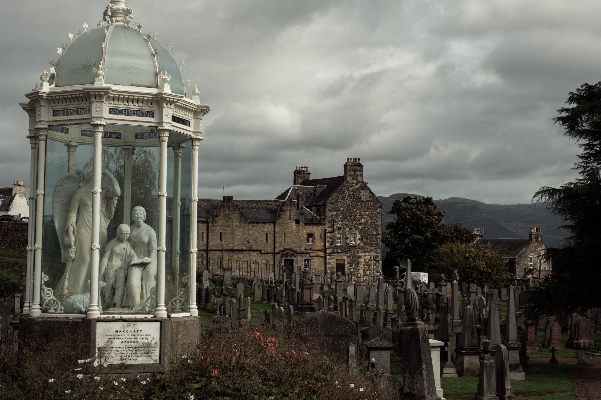

À noter que c'était la première fois que j'avais un parcmètre à payer et comme j'avais entendu que l'Écosse était très _Carte Bleue first_ je n'avais pas tiré d'argent en liquide. Or à Stirling les parcmètres était à payer en liquide ou via une app mobile appelée Ring-Go que j'ai essayé d'utiliser (j'attends toujours le sms de validation d'inscription à ce jour, je crois que l'app n'aime pas trop les numéros étrangers). Il faut donc faire attention à ça, partout ailleurs où l'on est allé les parcmètres étaient compatible CB donc plus le problème mais je doute que Stirling soit l'unique exception.

Bref, on a fraudé.

### Lost Valley

Arrivé dans la contrée de **Glencoe**, on a directement commencé par une randonnée célèbre, la Lost Valley. C'était une très très belle randonnée, qui grimpe pas mal, avec beaucoup de passages à gentiment escalader mais rien de surhumain. On n'a malheureusement pas pu la finir parce que c'était un jour humide et au 3/4 du chemin on était censé traverser un cours d'eau, qui par temps sec reste gérable en sautant sur les rochers, mais qui, par temps humide, avait son niveau et son courant trop élevés. On a bien cherché d'autres chemins mais on n'a rien trouvé de satisfaisant. Alors on rebroussé chemin sans voir le fameux point de vue de Lost Valley. C'est pas grave on s'est rattrapé plus tard. 😛

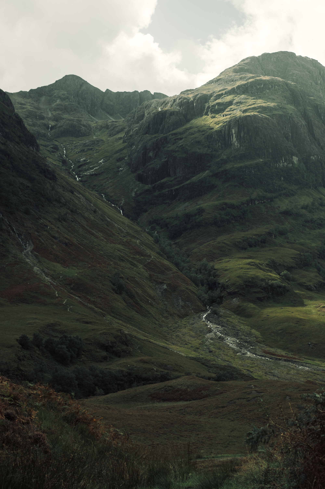

### Old station

Sur conseil de note logeuse de **Spean Bridge**, au nord de **Fort William** qui est au Nord de la ville de **Glencoe**, on a réservé une table au **Old Station**, un bar/restaurant situé dans une ancienne station de gare. C'est sympathique comme ambiance. Mais c'est à ce moment là qu'on a compris un truc fondamental sur l'Écosse : aux UK on mange pour se nourrir, pas pour le plaisir. C'était correct mais tout juste alors que c'est un endroit réputé.  
En fait, la majorité de la cuisine locale, quand ce n'est pas de la cuisine du monde, est grasse et rarement assaisonnée. On avait déjà eu cette impression à Edinburgh mais on s'était dit que c'était juste la faute à pas de chance. Mais en fait non, c'est gloabelement partout pareil.

## Jour 4 : Glencoe

Deuxième jour à Glencoe, puisque trop de belles choses à voir et trop peu de temps sur une journée.

### Glen Nevis et the Steall falls

On a commencé par une autre randonnée connue au **Glen Nevis** où l'on peut y voir la cascade de **Steall Falls**. Un peu comme la **Lost Valley**, on grimpe pas mal au départ pour arriver dans une vallée magnifique et vide d'humains (pour peu d'y aller tôt le matin). C'était ressourçant. Une de mes randonnées préférées sans aucun doute.

### Remontée mécanique de Glencoe Mountain Resort

Pour se reposer un peu les guiboles, on est allé au **[Glencoe Mountain Resort](https://www.glencoemountain.co.uk/)** qui, comme son nom ne l'indique pas forcément, est aussi actif en dehors de la saison de ski. En effet, on peut y prendre des télésièges pour monter en haut de la montagne, ce qui permet d'y avoir une magnifique vue sur la vallée et ses Lochs. À noter aussi, pour les amateurs, qu'on peut descendre ensuite en VTT sur une piste dédiée.

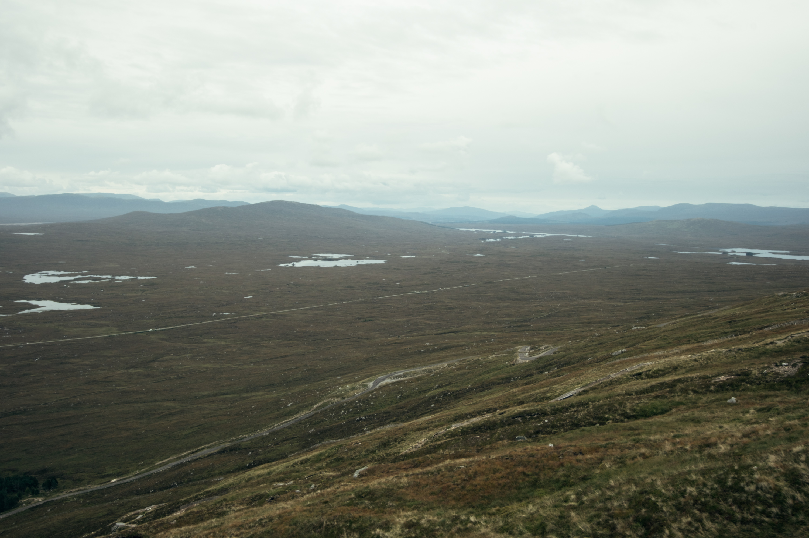

### Glencoe

Une fois reposés, on est reparti pour Glencoe faire une randonnée au départ de la ville et qui rejoint le Loch le plus proche par la forêt. C'était une randonnée plutôt tranquille mais c'était magnifique.

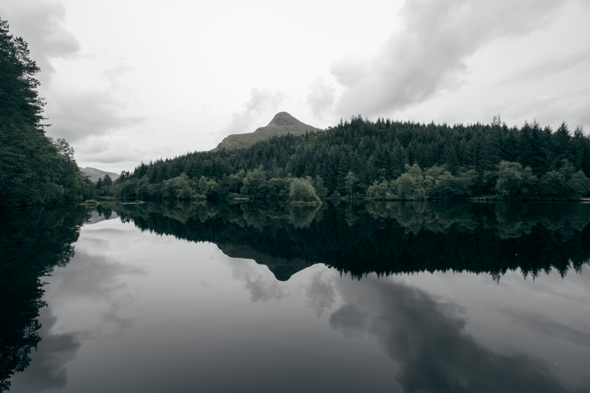

### The Whispering Pine Lodge

Pour finir la journée, on est allé dîner au **[Whispering Pine Lodge](https://www.blacksheephotels.com/the-whispering-pine-lodge/)**, un hôtel restaurant, un brin cher mais pour une fois c'était bon. Enfin bon… normal quoi. Bon comme un restaurant pas franchement gastro en France. Et avec une facture d'environ 100£, c'était cher payé.  
C'était malgré tout le premier bon repas en 4 jours qu'on prenait, alors je m'en plains pas trop.

## Jour 5 : Skye islands

En route pour les **Skye Islands**, où il y avait tellement de choses à voir et à faire et tellement peu de temps. Surtout quand on a des surprises pas si bonnes : Au départ on devait faire le **château d'Eilean Donan** sur l'aller et le **Caisteal Maol** sur le retour mais on a dû changer nos plans. Je vous explique.

### Pression des pneus

La voiture nous a mis un warning sur la pression des pneus et ce à peine 3 jours après la location, je l'avais un peu mauvaise (surtout que j'avais pas pris l'assurance crevaison et je commençais à paniquer). On s'est alors mis à la recherche d'une station service qu'on a vite trouvé. Seul problème, il faut du cash pour la machine… cash que je n'ai pas. On s'est donc mis à la recherche d'un distributeur de billet (qui était assez proche) puis à regonfler nos pneus sur une machine récalcitrante. Grâce à l'aide de la gentille dame de la station, on est reparti les pneus vigoureux et beaucoup moins anxieux.

### Fairy pools

On est arrivé un peu tard aux **Fairy pools** et il y avait, à mon grand regret, déjà beaucoup de monde. Les gens c'est bien pour le tourisme mais pas fou pour les photos. C'était sympa comme balade malgré tout, on y remonte un cours d'eau avec de multiples petites piscines naturelles (où se baignent les fées donc). Ce n'était pas la meilleure rando, même sans le monde.

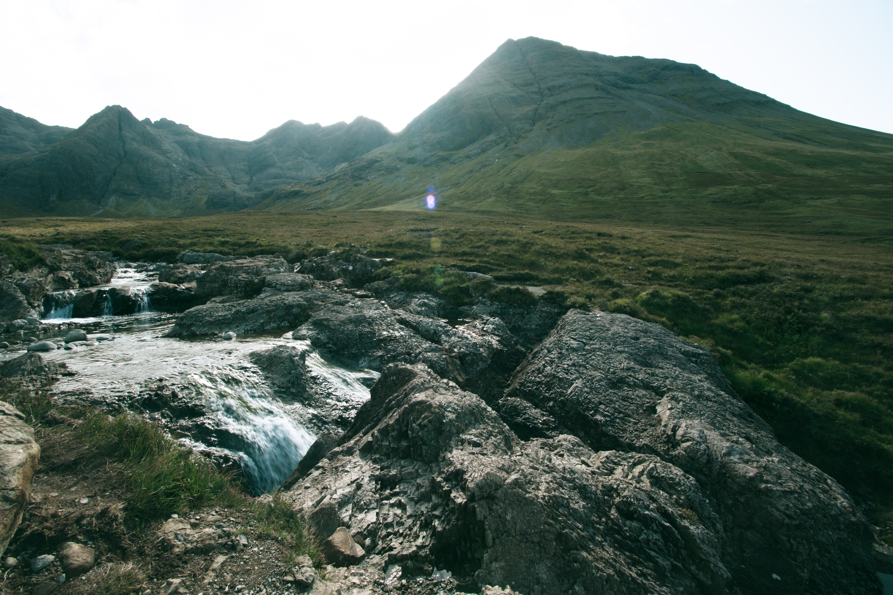

### Dunvegan castle

On a fait le **Dunvegan Castle** et ses jardins : ça faisait un bon arrêt tranquille pour se reposer. De très jolis jardins et un château sympa à visiter. C'était celui du clan McLeod mais j'y ai pas vu d'immortel. 🤷

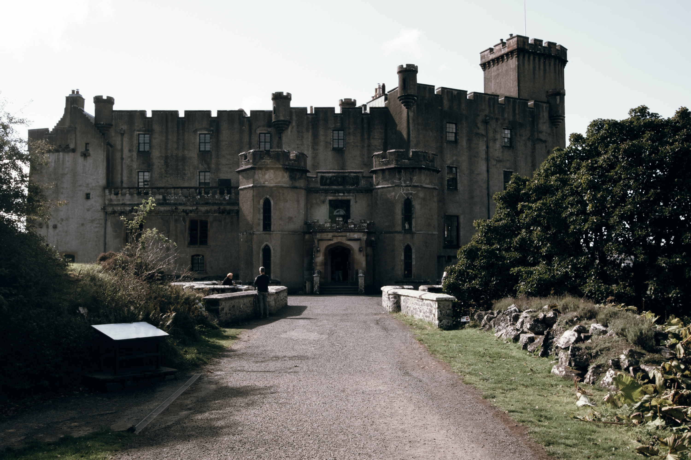

### Portree

C'est à Portree qu'on avait pris un véritable B&B avec petit déjeuner inclus. Portree est une des plus importantes villes portuaires des îles Skye, bien que pas si grande au final. Mais une rapide petite promenade nous a montré une ville vivante malgré tout.

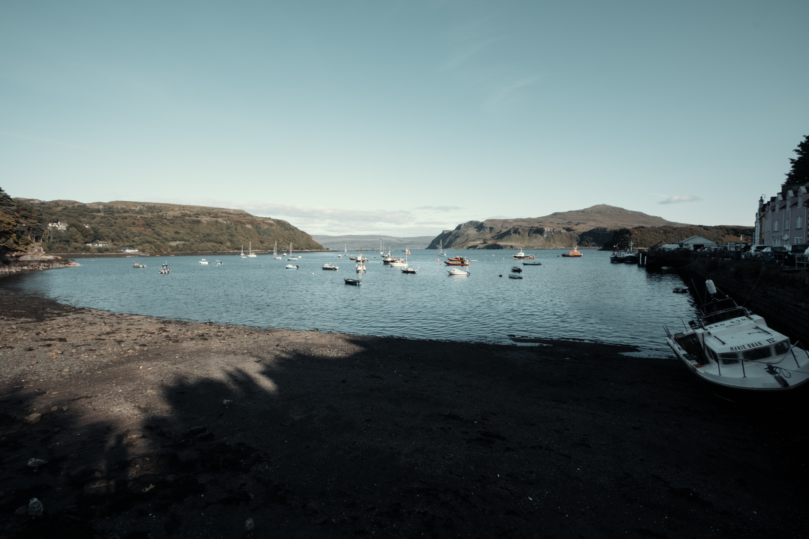

### Fairy glen

Pour le dîner, on a décidé d'aller pique-niquer dans le **Fairy Glen**. C'est un coin mignon de petites collines à l'herbe tondue naturellement par sa population de moutons. Et comme on y est allé le soir c'était calme et peu peuplé. Combo parfait pour apprécier un joli coucher de soleil avec son sandwich et sa canette de _cider_. 😃

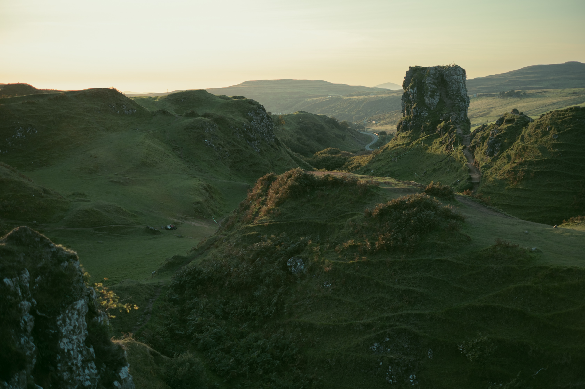

## Jour 6 : Inverness

Départ pour Inverness, mais avant d'y arriver on a fait un dernier truc aux Skye Islands…

### The Old man of Storr

Cette fameuse randonnée un brin plus exigeante que les précédente nous fait grimper assez haut. Toute la montée est magnifique, jusqu'à la toute fin. Je suis assez fier d'avoir réussi à le faire et honnêtement la vue en valait vraiment la chandelle.

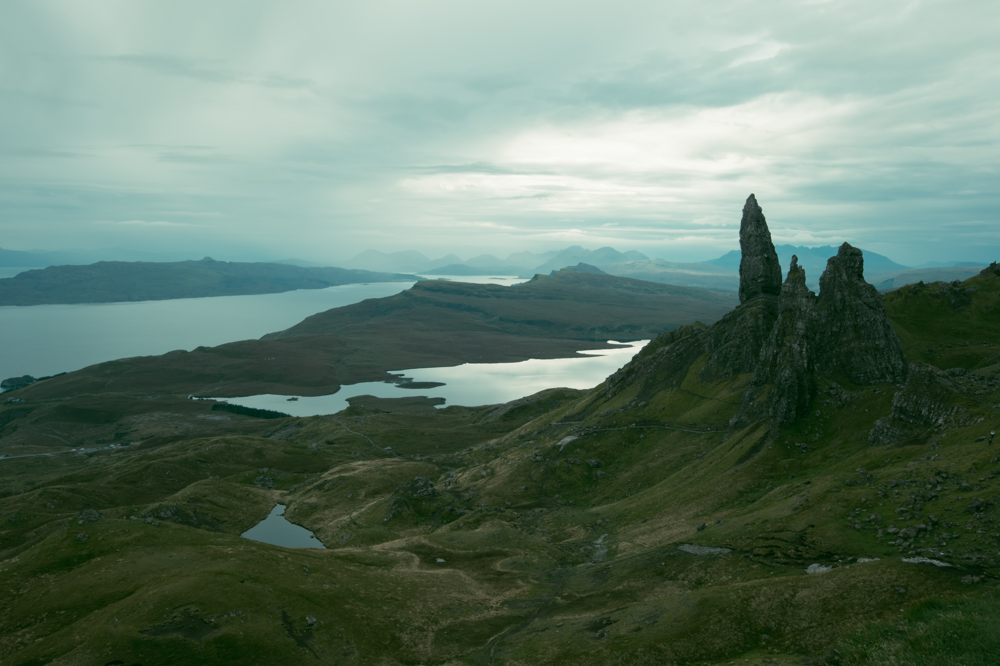

### Eilean Donan

Sur le chemin du retour des Skye Islands on a donc fait ce qu'on aurait dû faire à l'aller : **Eilean Donan Castle**, un joli petit chateau sur un Loch, seulement accessible par un pont. On est arrivé quand la marée était basse, on n'a pas eu la meilleure vue mais ça reste un très joli château agréable à visiter.

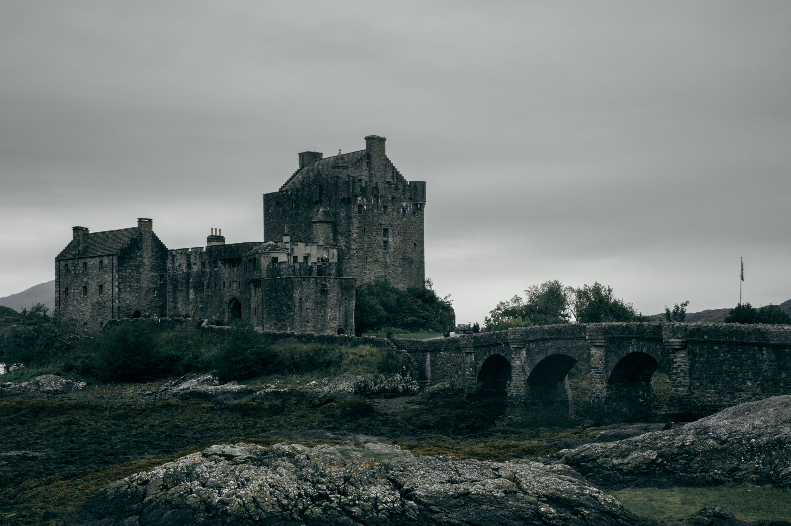

### Inverness

Arrivé à Inverness on y a fait un petit arrêt pour visiter à pied mais il pleuvait, on était dimanche (beaucoup de boutiques fermées) et c'était très urbain. En plus de ça, le château était en travaux. Bref, on est pas resté très longtemps. Je ne dis pas qu'il n'y avait pas d'intérêt à le visiter mais c'est pas tellement ce qu'on recherchait.

### Clava Cairn

On est donc allé voir des vieux Cairns ensuite. Avec la météo capricieuse et la fin de journée, il y avait peu de monde, ce qui était encore plus agréable.

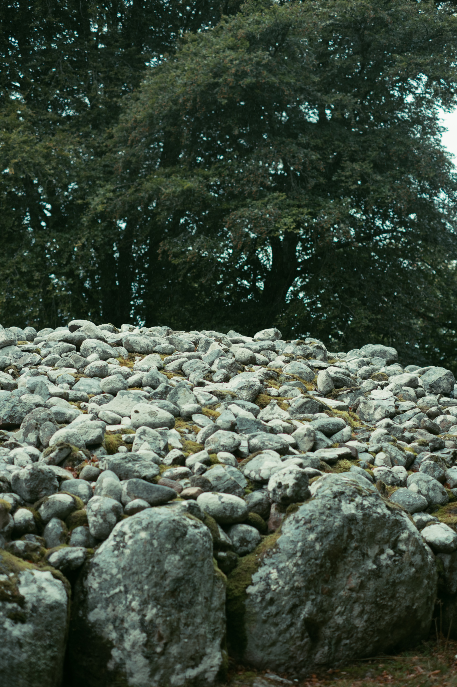

## Culloden Battlefield

Le terrain de la fameuse bataille de **Culloden** où les clans rebelles se sont bien fait défoncé par l'armée britannique en 1746. En vrai y a pas grand chose à y voir. Contrairement à ce que montre le film Braveheart, c'est tout tout plat, ce qui n'a pas stratégiquement aidé les écossais. On est arrivé un peu trop tard pour voir le musée donc c'est probablement intéressant mais le champ de bataille en lui-même n'est rien autre qu'un grand champ de vide avec quelques pierres en hommage aux différents clans.

### Urquhart's

Premier et unique coup de cœur culinaire : le restaurant **[Urquhart's](https://www.urquharts-inverness.co.uk)**, à ne pas confondre avec le château qui se trouve sur le **Loch Ness**, tout près d'Inverness aussi. La nourriture y était bonne, très bonne, et cuisinée, ce qu'on a franchement apprécié après 6 jours à manger des trucs passables.
Si vous voulez y aller, réservez impérativement.

## Jour 7 : Cairn Gorm (Nord)

Fort d'une météo merdique (le genre de pluie qui rend toute balade désagréable), nous sommes parti d'Inverness vers les **Cairn Gorm**, sorte de Massif central à l'écossaise.

### Elgin

On voulait faire un crochet par Elgin où l'on peut trouver les ruines d'une vieille cathédrale bien entretenue. Mais une fois arrivé on s'est rendu compte que c'était en travaux avec des échafaudages partout et que l'entrée était à 10£ par personne. Alors ajoutez à ça la pluie… on a préféré rebrousser chemin.

### Pluscarden Abbey

Pour se venger du fiasco d'Elgin, on est allé visiter la dernièra abbaye encore en activité d'Écosse, la **[Pluscarden Abbey](https://www.pluscardenabbey.org/)**. C'était mignon, ça a tué le temps mais c'était pas l'arrêt du siècle non plus.

### Cullen-Portknockie

Toujours sous la pluie, on s'est arrêté sur le port de **Cullen** pour faire une randonnée longeant la plage vers **Portknockie** avec une superbe vue, notamment sur le **Bow Fiddle Rock**. On a commencé au bon moment parce qu'à notre retour la marée était haute et nous aurait probablement empêché de rejoindre les falaises. À surveiller donc si vous comptez la faire aussi. Quand on y est allé c'était un jour de pluie et de vent et autant au port c'était gérable autant sur les falaises la vitesse du vent était décuplée, ça aurait pu être dangereux.

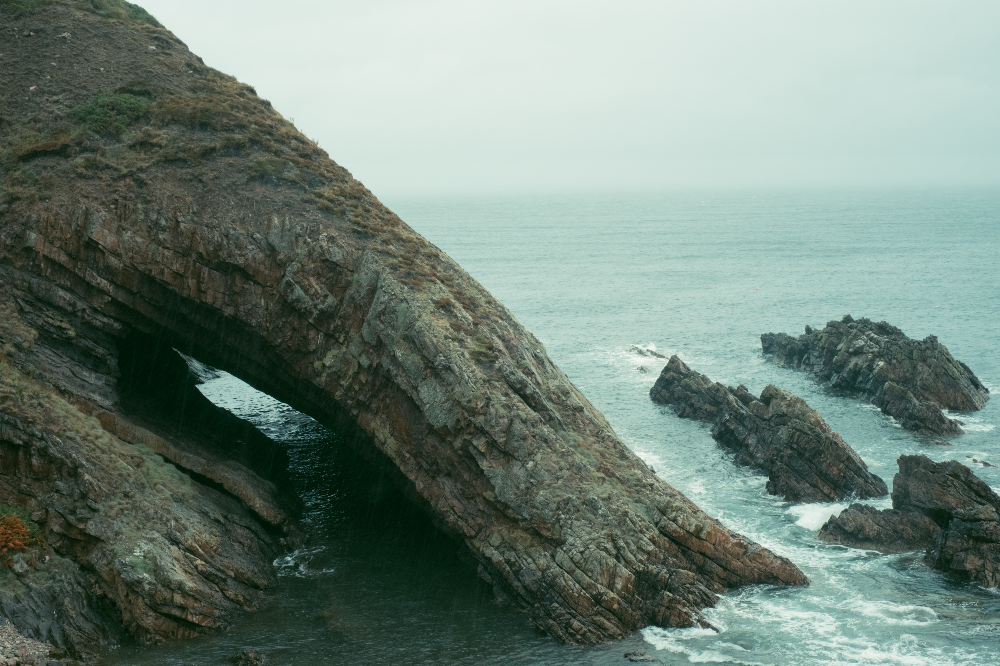

### The Royal Oak Hotel

Arrêt pour déjeuner dans ce qui semble être la pire erreur culinaire de ma vie : j'ai commandé un burger et ils m'ont dit qu'il ne pouvait pas cuire la viande bleue ou saignante comme je l'aime mais je l'ai pris quand même. Je ne sais si c'est leur cuisine qui ne permet pas ou si c'est une règle en Écosse mais ils devaient sur-cuire la viande. Toujours est-il que le steak était encore plus difficilement mangeable qu'un burger de fast-food… à chaque bouchée j'avais l'impression de mordre dans une tablette de chocolat, mais sans goût.  
Tout le reste du burger était fade. Même moi, qui suis très loin d'être ne serait-ce qu'un amateur en cuisine, j'aurais pu mieux faire. Je pensais ne pas prendre de risque en choisissant un burger mais je me suis trompé : c'était juste pas bon.  
Je ne sais pas si j'ai fait une mauvaise pioche ou si c'est comme ça sur tous les plats mais toujours est-il que j'étais terriblement déçu. Je ne recommande pas du coup.

### Balmoral cairns

On est alors parti vers la boucle des **Balmoral Cairns**, cairns plus ou moins récents en hommage à certaines personnes décédées dans une magnifique forêt de pins et de mousses. On a dû la raccourcir faute de temps mais elle aurait mérité d'être faite en entier.

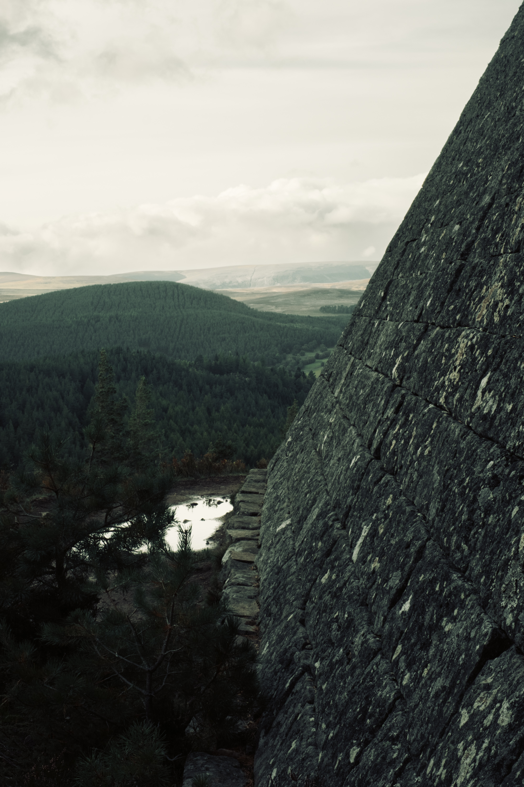

### Tomintoul

Notre hôtel, le **[Richmond Arms](https://www.richmondarmstomintoul.co.uk/)** était à **Tomintoul**, un simple village étape parfait pour les randonneurs et leurs périples dans les **Cairn Gorm**. Cet hôtel était une vieille bicoque, c'était tellement old school. Je déconseille si vous aimez les trucs récents, mais nous, pour une nuit, on a bien aimé, on y a bien dormi et le petit déjeuner y était compris.

## Jour 8 : Cairn Gorm (Ouest)

### Loch An Eilein

Le lendemain on est reparti en direction d'**Aviemore** à l'Ouest des **Cairn Gorm** pour aller voir "le Loch le plus instagramable d'Écosse", le **loch An Eilein**. C'était une très jolie balade dans la forêt autour du Loch, pas du tout exigeante. Alors certes c'est joli mais j'ai pas trop pigé pourquoi c'était le plus instagramable des Lochs. 🤷  
C'était pas exceptionnel non plus.

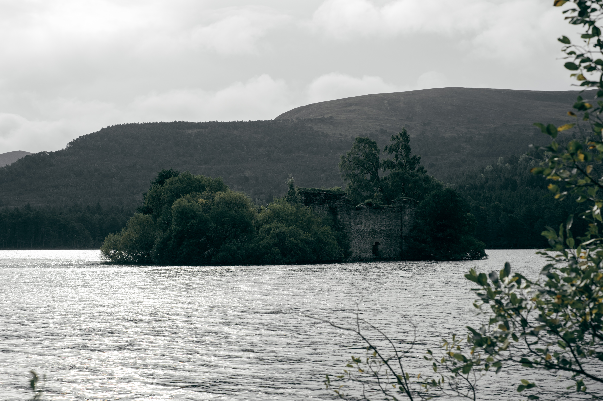

### Pitlochry

Mignonne tout petite ville, assez touristique, où l'on s'est fait plaisir avec encore une fois dans un salon de thé.

### Black Watch Museum, Perth

On est allé au **[Black Watch Museum](https://theblackwatch.co.uk/)** de **Perth** en pensant que c'était un musée sur les fantômes, mais on a dû se foirer ou confondre un truc parce que c'était pas ça du tout : c'était donc un musée sur la **Black Watch**, la section écossaise de l'armée britannique et donc toute son histoire. C'était très intéressant malgré tout.

### Kirkmichael

Notre tout dernier gîte était dans un tout petit bled, non loin de Pitlochry, **Kirkmichael**.  
Pour une fois, c'était un appartement entier et non pas une chambre donc on a mangé sur place avec des courses qu'on avait faites plus tôt. Et donc on s'était pris des plats préparés et… c'était à l'image de la cuisine écossaise dans les restaurants : pas bon. 😔
Mais bon on a bien dormi. On a bien apprécié notre apéro aussi, puisque dans les restaurants quand on commande à boire, le repas arrive très peu de temps après. On en a conclu que les Ecossais ne sont pas familiers avec le concept d'apéro dans les restaurants.

## Jour 9 : Edinburgh

Toute la nuit il avait plu à **Kirkmichael**, et en partant joyeusement pour Edinburgh le lendemain matin, sans une goutte de pluie, on fait pas 1 mile avant de tomber sur une route inondée… genre 20cm d'eau sur seulement 5 mètres, mais tout de même assez pour me faire flipper avec ma pauvre petite Fiat 500… Mais elle est passée !

### St Bridget's kirk

Au Nord d'Edinburgh, juste avant de passer le pont, se trouvent cachées dans un coin les ruines d'une ancienne église, juste au bord de la mer. Le matin, quand le soleil se lève encore et qu'il n'y a personne, c'est un joli spectacle.

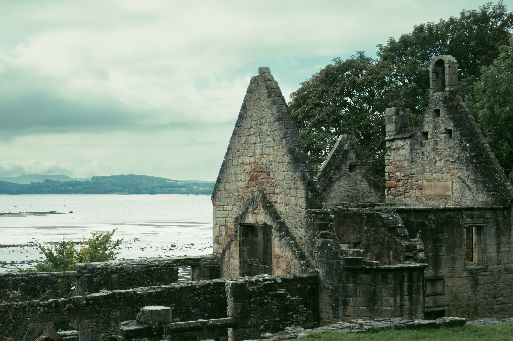

### Ibis hotel

On est passé à notre hôtel déposer les bagages avant de rendre la voiture. Rien de bien folichon, juste qu'il est bien placé pour repartir à l'aéroport le lendemain matin (surtout qu'on avait un vol à 6h du matin) puisque en périphérie Ouest d'Edinburgh, juste avant l'aéroport à 15 min de route.

### The Witchery

Après avoir rendu la voiture on est allé manger dans un restaurant qu'on avait repéré quelques jours auparavant, **[The Witchery](https://www.thewitchery.com/)**. C'est un peu plus _fancy_ que la moyenne mais on avait encore un peu de budget, alors on s'est fait plaisir. Vraiment, c'était très très bon, on sent qu'on est dans le haut de gamme tout de suite. La déco était aussi superbe. Je recommande vraiment si vous avez les moyens et pensez à réserver car c'est très vite complet.

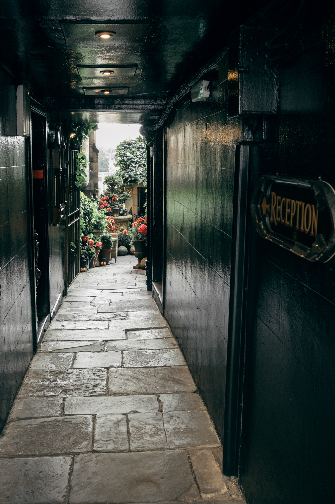

### Arthur's seat

Pour digérer on s'est dit qu'on allait faire notre ultime randonnée, **Arthur's seat**, qui est la formation rocheuse typique au beau milieu d'Edinburgh. Alors je sais pas si c'était vraiment difficile ou si mon corps n'en pouvait plus après toutes ces randonnées plus ou moins compliquées mais j'en ai chié un peu sur la fin.

<video controls width="100%">
	<source src="img/23-09-20 16-04-20 3303.webm" type="video/webm">
</video>

### Sheep Heid Inn

Une des recommandations typiques après avoir fait **Arthur's Seat** est d'aller boire un verre en redescendant à **[The Sheep Heid Inn](https://www.thesheepheidedinburgh.co.uk)**, apparemment le plus vieux pub de toute l'Écosse et dans le quel il y a aussi de très vieilles mais charmantes _skittle alleys_ (ancêtre du bowling quoi).

### Go home

Pour finir on a repris le chemin vers le centre d'Edinburgh pour choper un tram vers l'hôtel et se préparer à rentrer à la maison. J'étais à la fois triste parce que les vacances étaient finies mais aussi un peu content de rentrer chez moi après presque 10 jours en vadrouille sans trop me reposer.

## Quelques chiffres

Ayant toujours ma montre connectée sur moi pendant le voyage j'ai eu le plaisir d'avoir quelques stats au retour :

- On a fait **191608** pas
- On a parcouru **126,3** km à pied
- On a gravi pour l'équivalent de **508** étages

Ça donne un peu le tournis… 😅

## En résumé, quelques points d'attention avant d'aller en Écosse

- Vous n'avez pas vraiment besoin d'argent liquide. J'ai tiré 30£ et au final je n'ai vraiment eu besoin que de 10£. Quasiment tout se paye en carte là-bas, même les troubadours dans les rues touristiques ont du matériel de paiement sans contact, c'est dire.
- Pour la location de voiture, pensez à vérifier quel type de carte vous avez et ce que le loueur accepte. Et pour la voiture, si vous avez l'intention d'aller au Nord dans les Highlands, prévoyez de prendre une voiture avec un peu de patate pour grimper les côtes.
- La bouffe n'est pas très bonne mais y a beaucoup de restaurants indiens ou asiatiques où l'on peut se venger.
- Certains restaurants incluent le service dans la note, d'autres non, pensez à bien vérifier. C'est si vous voulez faire des tips en plus qu'il vous faudra de la monnaie.
- Levez-vous tôt. Vous profiterez des paysages sans le gros des touristes et c'est vraiment mieux.
- On a pas trop eu ce problème parce qu'on est arrivé en fin de saison mais si vous allez dans les coins les plus humides, pensez à acheter dans une pharmacie de quoi repousser les _midges_, un genre de moustique qui chasse en troupeau.
