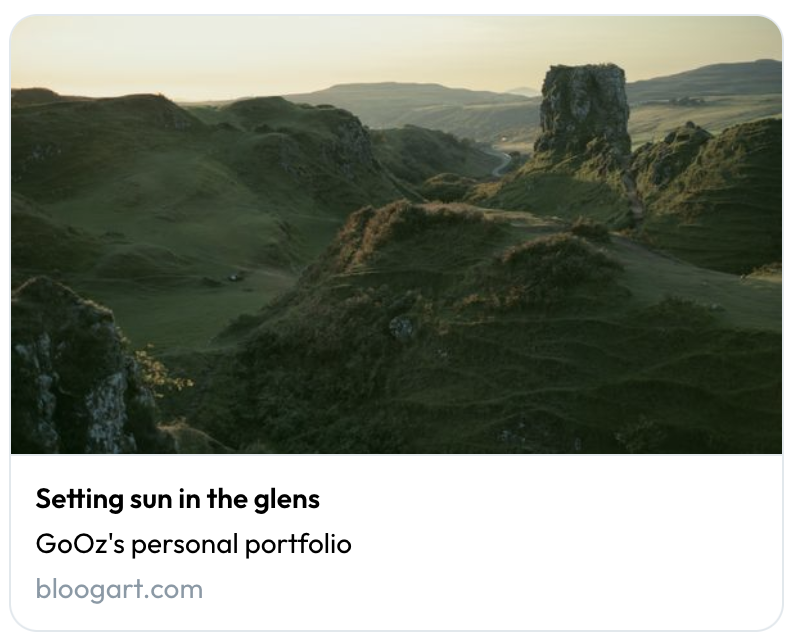
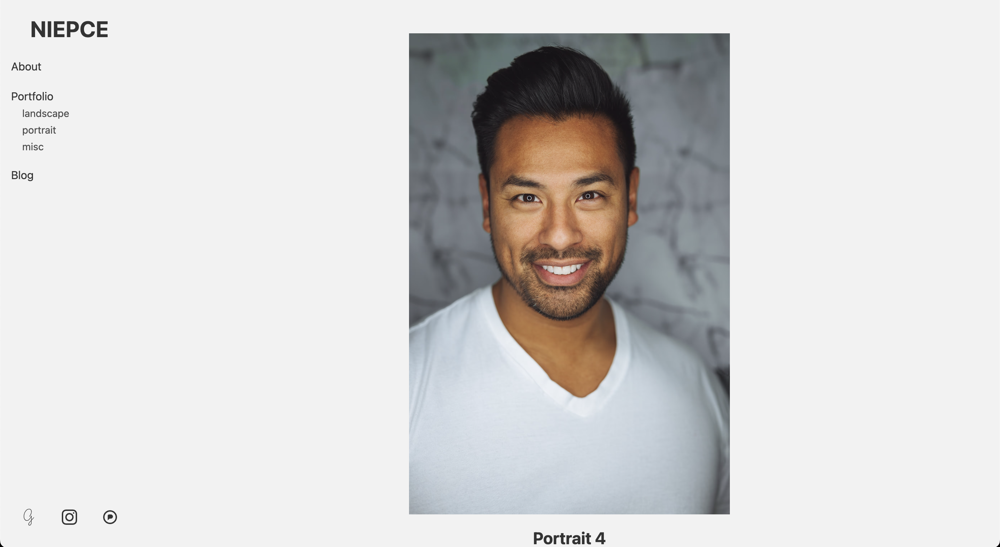

Depuis que j'ai refait ce blog en site statique avec [Eleventy](https://www.11ty.dev/) je suis tombé amoureux de cet outil et j'ai décidé de refaire aussi mon portfolio avec. Mais j'ai remarqué qu'il y avait peu ou pas de starter kit dans la communauté pour créer son portfolio. Alors je l'ai fait… pour moi d'abord et puis pour les autres ensuite.

<!-- excerpt -->

## Pourquoi, comment et à quoi ça ressemble donc ?

**Niepce** est un *starter kit* pour vous aider à construire votre portfolio statique avec **Eleventy** sans que vous ayez à tout faire vous même.

Il est prêt à être généré tel quel mais vous aurez quelques petites choses à régler tout de même pour le faire vôtre.

Le but premier était de rendre ce *starter kit* de portfolio souple, configurable et, autant que faire se peut, accessible au plus grand nombre sauf qu'**Eleventy** a beau être génial, on va pas se mentir, c'est pas à la portée du premier ou de la première venue; un certain niveau minimum de savoir technique est requis.\
J'ai fait du mieux que j'ai pu mais à un moment il faudra mettre les mains dans le cambouis, pas le choix.

Pour voir à quoi ça ressemble pas besoin d'aller bien loin, je vous invite à aller voir [mon portfolio](https://www.bloogart.com/), c'est encore le plus simple. Vous ne pourrez pas voir toutes les possibilités mais c'est déjà un bon aperçu.

## Les fonctionnalités intégrées

### Logo personnalisé
Si vous avez votre propre logo, vous pourrez l'ajouter facilement.\
Si vous n'en avez pas c'est le nom du portfolio qui prendra sa place.

Attention toutefois, le nom devra être court sous peine de passer à la ligne, c'est pourquoi un logo est tout de même préférable.

### Bannière pour les partages sociaux avec OpenGraph

Quand vous ou quelqu'un d'autre partagera un lien vers votre site sur les réseaux sociaux ou sur toute autre plateforme qui gère [Opengraph](https://ogp.me/) cela affichera une carte avec les informations essentielles de la page partagée.

Un peu comme ceci :


Pour les pages de vos photos, ce sera déjà pris en charge mais pour le reste vous pouvez choisir une bannière personnalisée.

### Les tons clair et obscur

Niepce existe en 3 saveurs :
- en ton clair
- en ton obscur
- en ton automatique

En bref, vous avez le choix de forcer un des deux tons ou de laisser les préférences utilisateurs choisir à votre place.

**Le ton clair**


**Le ton obscur**


### 4 choix de présentation

Vous avez le choix entre 4 façons pour présenter les galeries :
- la grille dite "*justified*" à la **Flickr** ou **500px**
- la grille dite "*masonry*" à la **Pinterest**
- la grille dite "*instagrid*" à la **Instagram**
- pas de grille, en "*monocolumn*", chaque photo les unes après les autres

Dans le portfolio, deux types de page sont candidats à afficher une de ses présentations :
- la page d'accueil
- la page de catégorie (ou de tag)

Vous aurez la possibilité de choisir une présentation globale (pour les 2 types de page donc) ou présenter les choses de manière différente sur chaque type.

**La grille *Justified***


**La grille *Masonry***


**La grille *Instagrid***


**La grille *Monocolumn***


### Affichage des métadonnées EXIF

Vous pouvez décider d'afficher ou non quelques métadonnées EXIF tirées des photographies.
Évidemment si votre portfolio ne présente pas de photographie mais plutôt des peintures, dessins ou que sais-je, ça ne vous sera pas d'utilité.

Les métadonnées récupérées et affichées (si elles sont disponibles) sont :
- la marque et le modèle de l'appareil photo
- la vitesse d'obturation
- la focale
- l'ouverture
- les ISO
- la date de prise de vue de la photo

### Affichage des tags

Dans le portfolio les tags appliqués aux photos servent à générer les catégories qui apparaissent dans le menu latéral.\
Il ne vous sera peut être donc pas d'utilité d'afficher ces tags sur la page d'une photo.\
Dans tous les cas vous aurez la possibilité d'afficher ces tags ou non.

### Liens réseaux sociaux

Il est souvent utile (malheureusement ?) d'afficher les profils de nos réseaux sociaux.
Un set prédéfinis de réseau n'attendent que vos URLs pour être affichés.

Dans la liste non-exhaustive nous avons pour le moment :
- 500px
- Behance
- Deviantart
- Flickr
- Glass
- Instagram
- Notos
- Pixelfed
- Tumblr

Je n'ai pas mis tous les réseaux pour présenter son travail surtout parce que… pour certains je n'ai pas trouvé des logo en SVG satisfaisant ou je n'ai pas juger bon de le rajouter. Mais ça pourrait évoluer.

Dans tous les cas, il est clairement possible de rajouter ses propres réseaux ou de me demander d'en rajouter un.

### Liens externes

Si comme moi votre portfolio a son propre nom de domaine et que vous souhaitez afficher des URLs personnelles ailleurs (comme votre blog par exemple) il sera tout à fait possible de le faire.

Le principe est peu ou prou le même que pour les réseaux sociaux, il vous sera demandé une URL et un label pour le lien.

## Comment le mettre en place

### Prérequis

Afin de pouvoir installer et utiliser **Niepce** il va falloir un environnement prêt à le recevoir.
Pas besoin de grand chose mais un peu quand même :
- Git *(selon la méthode de récupération du projet)*
- Node >= 16
- Et voilà c'est à peu près tout

### Récupérer les sources

Tout est sur [Github](https://github.com/GoOz/Niepce). 

De là, libre à vous de cloner le dépôt git en ligne de commande

```sh
mkdir mon-portfolio
git clone https://github.com/GoOz/Niepce.git mon-portfolio
```

ou de télécharger l'archive directement depuis le bouton télécharger de Github.

<div class="notabene">
vous ne pourrez pas <code>push</code> sur mon dépôt git donc si vous voulez continuer sur git ensuite pour versionner votre portfolio il vous faudra changer le <code>remote</code>.
</div>

### Mise en place de l'environnement

Pour commencer il va falloir installer tout ce dont nous avons besoin. Pour ce faire ouvrez votre terminal, si ce n'est déjà fait, et tapez ce qui suit

```sh
cd mon-portfolio
npm install
```

La commande `npm install` va aller chercher les quelques dépendances et les installer pour vous. Promis il n'y en a pas beaucoup.

Une fois l'installation terminée, vous devriez être en mesure de lancer le site en local en tapant

```sh
npm run start
```

et une fois que le terminal vous affiche

```sh
[11ty] Watching…
[11ty] Server at http://localhost:8080/
```

cela voudra dire que c'est prêt, donc ouvrez un nouvel onglet de votre navigateur préféré et aller sur [http://localhost:8080/](http://localhost:8080/)

Vous devriez y voir la même chose que sur les captures d'écran présentées plus haut.

## Configuration

Maintenant que votre site tourne localement il est temps d'éditer la configuration pour le transformer en **votre** portfolio.

Toute la configuration se fera dans 2 fichiers :
- `_data/metadata.json` qui est le fichier de configuration de base d'Eleventy
- `_data/niepce.js` qui est le fichier de configuration propre à Niepce.

Ces deux fichiers sont déjà partiellement pré-remplis et, de base, vous ne devriez avoir qu'à remplir des champs vides ou éditer des valeurs existantes.

Prenons d'abord le fichier `metadata.json`

```json
{
	"title": "Niepce",
	"url": "https://portfolio.niepce.tld",
	"language": "en",
	"locale": "en_US",
	"description": "Niepce's personal portfolio",
	"author": {
		"name": "Nicéphore Niépce",
		"email": "nicephore@niepce.tld",
		"url": "https://www.niepce.tld"
	}
}
```

Je ne pense pas qu'il y ait besoin de tout décrire sur ces informations, toutefois je préciserais que : 
- le `title` est le titre qui apparaitra comme le label de l'onglet du navigateur mais c'est aussi le titre qui apparaitra sur le site si vous n'avez pas spécifié de logo.
- la `description` servira à la fois pour décrire les résultats des moteurs de recherche ainsi que sur les descriptions des cartes OpenGraph sur un partage.

Vient ensuite le fichier `niepce.js` et là je vais rentrer dans le détail.

```js
module.exports = {
	grid: "masonry",
	grid_tags: "justified",
	theme: "auto",
	logo: "",
	banner: "",
	exif: true,
	tags: true,
	socials: {
		"500px": "",
		behance: "",
		deviantart: "",
		flickr: "",
		glass: "",
		instagram: "",
		notos: "",
		pixelfed: "",
		tumblr: "",
	},
	links: [
		{
			label: "",
			url: "",
		},
	],
}
```

**Clé** `grid`  
**Valeur** `masonry | justified | instagrid | monocolumn`  
_C'est votre choix de grille pour la home et pour les pages de catégorie._

**Clé** `grid_tags`  
**Valeur** `masonry | justified | instagrid | monocolumn`  
_C'est votre choix de grille pour les pages de catégorie. Si elle n'est pas définie alors c'est le choix `grid` qui sera utilisé pour ces pages._

**Clé** `theme`  
**Valeur** `light | dark | auto`  
_Force un ton en particulier ou bien laisse les préférences utilisateur choisir automatiquement._

**Clé** `logo`  
**Valeur** `String`  
_Chemin vers votre logo (de n'importe quel format d'image qui soit supporté par une balise HTML `img`). Il peut être n'importe où, même distant. Si aucun logo n'est spécifié alors c'est le `title` de `metadata.json` qui prendra le relai et sera affiché._  
_Si c'est un SVG  et que vous voulez l'intégrer à la page pour que sa couleur s'adapte au thème, ajoutez un suffixe `-inline` au nom du fichier (ex: logo-inline.svg)._

**Clé** `banner`  
**Valeur** `String`  
_Chemin vers votre bannière (de n'importe quel format d'image qui soit supporté par une balise HTML `img`). Il peut être n'importe où, même distant. Cette image ne sera utilisé que pour les balises [OpenGraph](https://ogp.me/) à moins que vous ne décidiez de l'utiliser pour autre chose._

**Clé** `exif`  
**Valeur** `boolean`  
_Affiche ou non les métadonnées EXIF de vos photos sur les billets. Si à `true` seules les métadonnées existantes dans la photo seront affichées._

**Clé** `tags`  
**Valeur** `boolean`  
_Affiche ou non les tags appliquées aux photos sur les billets._

**Clé** `social`  
**Valeur** `Clé (String): Valeur (String)`  
_Seuls les réseaux sociaux avec un lien de profil renseigné seront affichés._  
_À noter que si besoin vous pouvez ajouter vos propres réseaux sociaux qui n'existe pas dans la liste par défaut mais pour faire ça vous aurez besoin d'ajouter son propre icône SVG dans le dossier `public/img/sprite` et le nommer exactement comme la **clé** définie ici._

**Clé** `links`  
**Valeur** `Clé (String): Valeur (String)`  
_Si vous voulez afficher des liens externes dans le menu de navigation, saisissez le label (texte qui apparaitra) et l'URL de ce lien._

Une fois le tout configuré comme vous le souhaitez, il sera temps de créer vos pages.
## Création de vos pages

Toutes les pages que vous allez créer se trouveront dans le dossier `content` à la racine du projet.

Il y a déjà du contenu exemple dans ce dossier comme vous le verrez et vous pourrez les supprimer le moment venu mais certains dossiers et fichiers ne devrait pas être touchés ni déplacés (à moins que vous sachiez ce que vous faites), ce sont :
- le dossier `feed` qui sert à générer les flux RSS (Atom en fait mais je vais pas entrer dans les détails)
- le dossier `sitemap` qui sert à générer le fichier `sitemap.xml`, à destination des moteurs de recherches notamment.
- le fichier `index.njk` qui génère la page d'accueil de votre site
- le fichier `tags.njk` qui génère les pages de catégorie.
- le fichier `content.11tydata.js` qui donne au moteur Eleventy les informations nécessaires quant aux pages de contenu.

Tout le reste est là pour vous donner des exemples.

### Créer une page indépendante

Un exemple existe déjà, c'est celui du `about.md` que vous pouvez garder et modifier ou bien le supprimer et faire autre chose à votre sauce.

Vous pourrez voir dans ce fichier comment créer des pages indépendantes.

```md
---
layout: layouts/page.njk
eleventyNavigation:
  key: About
  order: 1
override:tags: ["pages"]
title: Hello, I'm the photographer
---
[…]
```

Il vous faudra : 
- spécifier le layout, en l'occurence celui que vous voulez c'est celui qui s'appelle `page.njk`
- spécifier le label du lien dans la navigation et sa position dans la liste en éditant les valeurs de `key` et `order`
- garder `override:tags: ["pages"]` pour être certain que cette nouvelle page n'apparaissent pas comme un nouveau billet et reste bien une page distincte.
- donner un titre à cette page en spécifiant `title`

Ces métadonnées entre `---` représentent ce qu'on appelle le *frontmatter* et c'est bien tout ce que c'est, des métadonnées.

Tout le reste après ça est du **Markdown** tout ce qu'il y a de plus normal.

### Créer un billet
Il est peut être temps de faire enfin des billets avec vos photos.\
Mais d'abord parlons structure.

Comme vous le constaterez avec les exemples, chaque billet ressemble à quelque chose comme ça :
```
├── content
│   ├── mon-titre-de-billet
│   │   ├── index.md
│   │   ├── photo.jpg
```

Cette structure est plus conseillée qu'obligatoire, dans les faits rien ne vous oblige à faire ça et vous pourriez tout faire à plat à la racine de `content` ou dans une autre structure mais ça deviendrait vite bordélique et/ou ça vous demanderait plus de travail ainsi que de la configuration à changer au final. C'est pourquoi je vous conseille de garder cette structure à moins que vous sachiez ce que vous faites encore une fois.

Mais mettons que vous suiviez cette recommandation, le nom du dossier sera *in fine* l'URL de votre billet. Personnellement je préfère mettre le titre en minuscule avec des `-` à la place des espaces, je trouve ça plus joli à voir mais rien ne vous y oblige.\
Ensuite le nom du fichier markdown `.md` importe peu, je le nomme toujours `index.md` par soucis de simplicité.\
Enfin pour la photo, là aussi le nom importe peu mais il est plus sage de tout le temps la nommer de la même façon pour éviter de se tromper pour une raison que l'on va voir tout de suite.

Comme pour les pages indépendantes, nous allons avoir du *frontmatter* dans ces fichiers `index.md` avec différentes métadonnées à renseigner.

```md
---
title: Portrait
date: 2023-09-01
photo: photo.jpg
photo_alt: Portrait de ma mère
tags:
  - portrait
---
```

- `title` sera donc le titre de votre photo (et donc de la page), a priori la même que le nom du dossier mais en plus joli avec des majuscules et des espaces.
- `date` est la date à laquelle vous voulez que ce billet apparaisse, ça ne jouera pas sur grand chose à part l'ordre dans lequel vos billets apparaitront puisqu'ils sont affichés du plus récent au plus ancien.
- `photo` est le nom du fichier de votre photo, comme je disais plus haut, toujours le nommer de la même façon simplifie le processus de création de billet mais faites bien comme bon vous semble
- `photo_alt` sera le texte alternatif de l'image qui sera affiché si pour une raison x ou y l'image ne s'affiche pas et qui sera aussi utile aux lecteurs d'écran pour décrire l'image aux personnes malvoyantes.
- `tags` sera donc la catégorie à laquelle appartient ce billet et donc cette photo. Personnellement je n'en mets qu'une seule à chaque fois mais libre à vous de faire des inter-catégories ou que sais-je.

Encore une fois, tout ce qui sera écrit en markdown après ce *frontmatter* apparaitra sur le billet aussi. 
<div class="notabene">
Si vous avez activé les options <code>exif</code> et/ou <code>tags</code> le contenu de vos billets apparaitra après ces éléments dans la page.
</div>

Si vous avez tout rempli correctement vous devriez être en mesure de voir vos billets et pages indépendantes sur  [http://localhost:8080/](http://localhost:8080/) 

Une fois tous vos billets et pages créés et que vous êtes satisfait du résultat, il est temps de publier tout ça, mais avant n'oubliez pas de supprimer les pages et billets exemples, ça ferait tâche.
## Déploiement

Pour ce qui est du déploiement, vous aurez forcément besoin d'un hébergeur sans avoir besoin de grand chose d'installé dessus non plus.\
Comme pour le développement local, vous n'aurez finalement besoin que de **Node >16** et c'est tout.

Il existe bien des façons de faire de l'auto-déploiement avec git mais je ne vais pas en parler parce que ça devient un poil plus pointu en plus d'être probablement différent selon votre hébergeur.

Sachez juste que ce que Eleventy génère est un site statique, donc en gros juste du HTML/CSS/JS et pour obtenir ce site statique il vous faut lancer la commande :

```sh
cd mon-portfolio
npm run build
```

Cette commande de *build* est aussi lancée via un `npm run start` mais pour être sûr que tout est propre il est plus sage de lancer le *build* une fois que tout est fini.

Une fois le *build* fait vous pouvez retrouver votre site dans le dossier `_site` à la racine du projet. C'est ce que vous devez absolument avoir sur votre serveur d'hébergeur et c'est sur ce dossier que doit pointer votre nom de domaine. Donc configurez en conséquence dans l'administration de votre hébergeur.

Quant à la manière d'obtenir et transférer ces fichiers générés…
- Soit vous générez localement et transférez via FTP sur le serveur.
- Soit vous versionnez votre projet, le clonez sur le serveur, mettez à jour le dépôt et faites le *build* directement sur le serveur, tout ça en SSH.
- Soit vous vous débrouillez pour faire un auto-déploiement (via git push et web-socket par exemple).

## Et la suite dans tout ça ?

Ce projet étant un *starter kit*, comprendre juste un outil de démarrage de projet, les mises à jour des dépendances (comme Eleventy et ses plugins par exemple) vous incombent. De la même manière si des évolutions ou bugfix apparaissent sur le [dépôt Github](https://github.com/GoOz/Niepce) ce sera à vous de vous débrouiller pour mettre à jour les corrections ou évolutions sur votre propre projet. \
Toutes les modifications seront bien visibles sur Github dans tous les cas.

[N'hésitez pas à me le faire savoir](https://github.com/GoOz/Niepce/issues/new/choose) si vous vous retrouvez confronté à un bug ou si vous aimeriez rajouter des fonctionnalités. Je n'ai fait que ce qui m'intéressait personnellement mais je suis ouvert à toute proposition d'ajout d'autres fonctionnalités.
