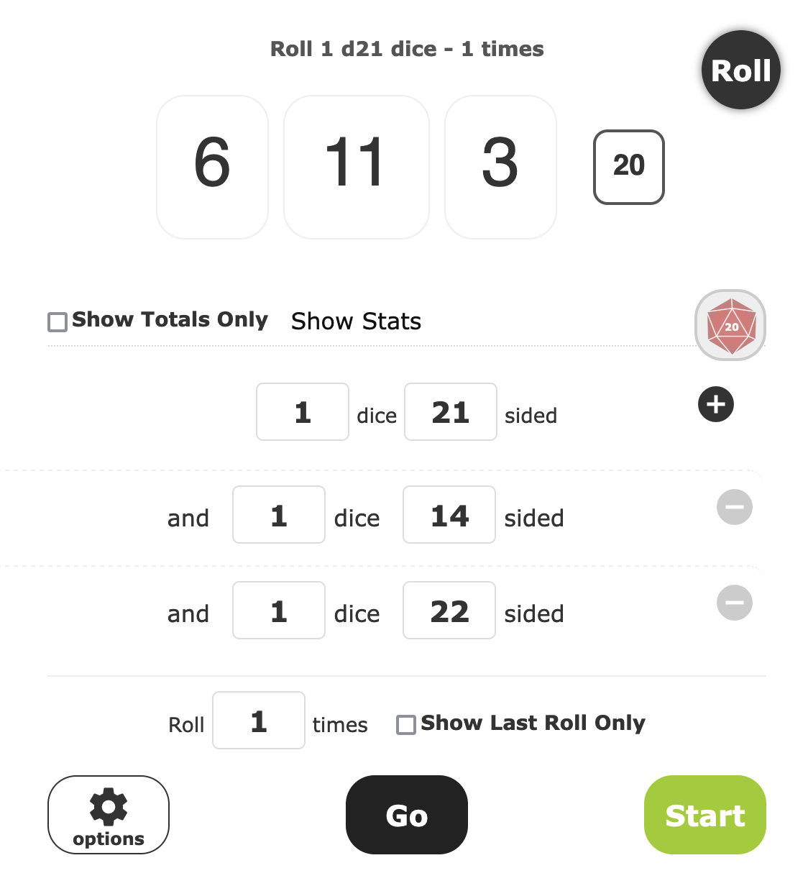

Depuis quelques temps je me suis un peu poussé au cul pour reprendre la photographie avec plus d'assiduité. Seul problème, mon boulot consiste à avoir ce même cul vissé sur une chaise toute la journée devant un ordinateur et ce toujours dans le même bureau, chez moi. Alors je me suis mis à penser que faire un petit challenge serait une bonne idée.

<!-- excerpt -->

## La génèse

Je voulais commencer par un challenge tranquille mais pas trop, donc ce serait un challenge 52, c'est à dire 1 photo par semaine dans l'année, soit 52 photos.\
Mais le truc un peu chiant à mon goût c'est que la plupart des challenges existants (sur lesquels je suis tombé tout du moins) tournent beaucoup autour de thématiques et ça me fait chier, j'ai pas envie de chercher spécifiquement des jolies fleurs parce que cette semaine là le thème est "fleur".\
Sinon parfois on est sur des techniques ou des compositions spécifiques et ça me fait tout autant chier, surtout parce que y a des techniques ou compositions que j'aime pas donc faire un truc que j'aime pas juste pour remplir un challenge, ça me gave.

Oui mais quoi alors ? Il faut des contraintes pour que ce soit un peu fun, sinon c'est un challenge 1 photo par semaine et YOLO… ce qui serait valide mais je cherche un truc en plus, contraignant, pour faire travailler un peu la créativité, m'voyez ?

Il me fallait un truc cohérent sur toute l'année, contraignant d'une manière ou d'une autre et fun aussi pendant qu'on y est.

Et puis en bon joueur de jeu de rôle, j'ai pensé à des dés pour faire du hasard. Genre lancer 3 dés pour obtenir des valeurs aléatoires. Des valeurs aléatoires pour des paramètres d'exposition par exemple. Des trucs comme les ISO, la vitesse d'obturation et l'ouverture, le triptyque gagnant de base de toute photographie.

C'était décidé ! J'allais lancé 3 dés, une fois par semaine, et me démerder pour essayer de faire une photo qui me ressemble et que j'aime avec ces contraintes aléatoires. Ceux qui s'y connaissent assez en optique et donc en photographie savent que ça peut vite tourner au vinaigre cette histoire, qu'on a vite fait de se retrouver avec des photos toutes noires ou toutes blanches ou… de manière plus globale des photos qu'on appellerait des ratées.\
Mais c'est bien là qu'est tout le fun du challenge je trouve, essayer de trouver comment faire un truc sympa avec des paramètres qui peuvent être facilitants ou bien complètement foireux. Et en plus ça aura le mérite de me forcer à bien prendre en main mon appareil en passant tout en manuel comme ça.

## La méthodologie

Je vais vous décrire ici comment je vais procéder pour que, si jamais ça vous tente aussi, vous puissiez reproduire l'expérience de votre côté avec votre propre matériel.

Tout d'abord il vous faut choisir un seul et unique appareil avec un seul et unique objectif.\
Pour ma part part ce sera mon **Fujifilm X-T5** avec mon objectif à focale fixe **Fujinon 35mm/f1.4**

À partir de là vous aller devoir lister le nombre de valeurs possibles que votre appareil propose pour la sensibilité (ISO), de même pour la vitesse d'obturation, puis faire une dernière fois ça avec votre objectif pour l'ouverture.
### Sensibilité (ISO)

Sur mon appareil j'ai 21 valeurs possible pour les ISO, ce qui donne un tableau de correspondance comme suit :

| Valeur dé | Valeur ISO |
| -------- | ------- |
| 1 | 125 |
| 2 | 160 |
| 3 | 200 |
| 4 | 250 |
| 5 | 320 |
| 6 | 400 |
| 7 | 500 |
| 8 | 640 |
| 9 | 800 |
| 10 | 1000 |
| 11 | 1250 |
| 12 | 1600 |
| 13 | 2000 |
| 14 | 2500 |
| 15 | 3200 |
| 16 | 4000 |
| 17 | 5000 |
| 18 | 6400 |
| 19 | 8000 |
| 20 | 10000 |
| 21 | 12800 |

### Vitesse d'obturation

Sur mon appareil j'ai 14 valeurs possible pour la vitesse d'obturation, ce qui donne un tableau de correspondance comme suit :

| Valeur dé | Valeur de vitesse |
| -------- | ------- |
| 1 | 1" |
| 2 | 1/2 |
| 3 | 1/4 |
| 4 | 1/8 |
| 5 | 1/15 |
| 6 | 1/30 |
| 7 | 1/60 |
| 8 | 1/125 |
| 9 | 1/250 |
| 10 | 1/500 |
| 11 | 1/1000 |
| 12 | 1/2000 |
| 13 | 1/4000 |
| 14 | 1/8000 |
### Ouverture

Sur mon objectif j'ai 22 valeurs possible pour l'ouverture, ce qui donne un tableau de correspondance comme suit :

| Valeur dé | Valeur d'ouverture |
| -------- | ------- |
| 1 | 16 |
| 2 | 14 |
| 3 | 13 |
| 4 | 11 |
| 5 | 10 |
| 6 | 9 |
| 7 | 8 |
| 8 | 7.1 |
| 9 | 6.4 |
| 10 | 5.6 |
| 11 | 5.0 |
| 12 | 4.5 |
| 13 | 4.0 |
| 14 | 3.6 |
| 15 | 3.2 |
| 16 | 2.8 |
| 17 | 2.5 |
| 18 | 2.2 |
| 19 | 2.0 |
| 20 | 1.8 |
| 21 | 1.6 |
| 22 | 1.4 |

### Les jets de dés

J'ai beau avoir beaucoup de dés pour mes parties de jeu de rôle, j'ai jamais eu, ni trouvé, de dé 21, 22 ou 14.\
Alors à la place on va utiliser une application en ligne, en l'occurence [Roll a Die](https://rolladie.net/) qui a le mérite de pouvoir faire des dés aux valeurs personnelles ainsi que de nous permettre de lancer les 3 dés en une fois, pour chaque fois nous générer notre challenge de la semaine.

## Yaplukafokon

Et voilà, j'ai décidé d'humblement appeler ce challenge le **Shuffle challenge** !!

Maintenant que tout est prêt, y a plus qu'à se lancer. Ce que je ferai donc dès la première semaine de janvier 2024.

Si jamais le challenge vous a tenté aussi, faites le moi savoir et partagez-moi vos clichés, ça m'intéresse, quant aux miens ce sera comme d'habitude sur [www.bloogart.com/](https://www.bloogart.com/)

*Alea jacta est* comme disait l'autre.
