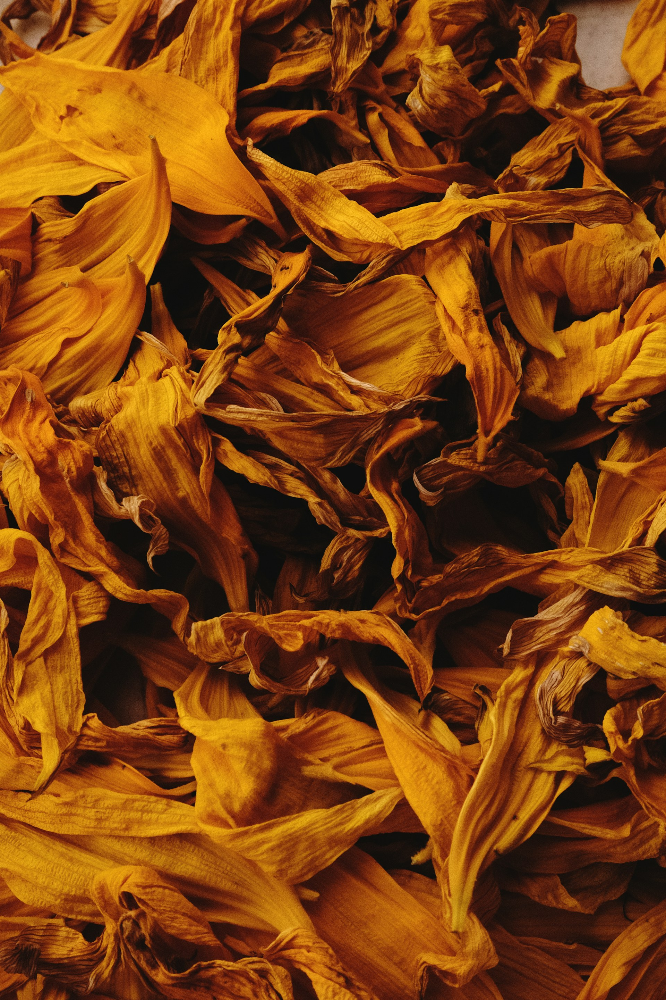
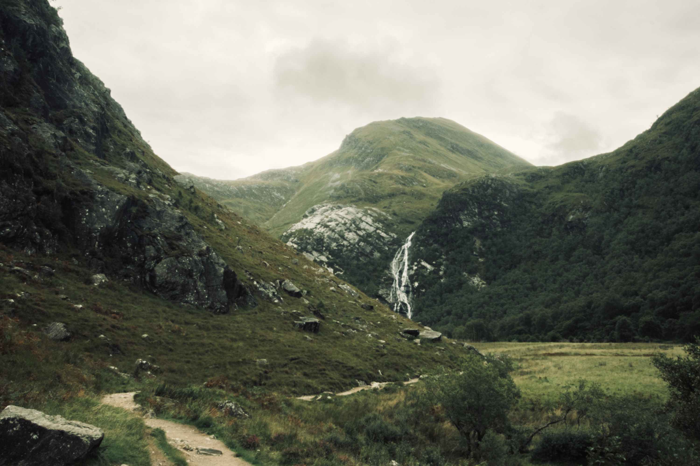

Cela fait bien longtemps que je pratique la photographie, depuis mes 15 ou 16 ans avec une régularité plus que variable, donc j’ai eu le temps de tester moult choses, découvrir ce que je n’aimais pas ou ce que j’aimais prendre en photo et ce qui me laissait pantois ou impassible à regarder.

<!-- excerpt -->

Si aujourd’hui je me cherche encore ou en tout cas je cherche à comprendre ce qui me fait le plus vibrer pour en faire des séries ou des projets, j’ai tout de même une liste de choses avec un avis plus ou moins bien arrêté. Comme vous le verrez, mon avis a évolué avec le temps donc rien ne dit que je ne changerai pas encore d'avis dans le futur.

> [!NOTE]
> Toutes les photographies sans auteur spécifié sont de moi et à retrouver sur <a href="https://gooz.photography">gooz.photography</a>

## Ce que je n’aime pas voir ni faire

### L’urbex (urban exploration)

Globalement il est rare que l’urbex me fasse beaucoup d'effet. Voir de vieux bâtiments inhabités et vides si ce n’est la présence excessive de gravas et de tags me laisse souvent sur ma faim. J'y trouve en fait très souvent de la redondance.  
Si en plus vous y ajouter des modèles, habillés ou pas, dans cet environnement là, sans rien raconter d’autre, souvent je pleure.  
Et si la photo fait dans le HDR excessif, je me crève les yeux.  
Par contre si c’est une série de photo comme une expédition à Tchernobyl, dans un village abandonné subitement ou une maison qui n’a pas été vidé des traces de vie de ses derniers occupants, là y a un petit côté tranche de vie que j’apprécie beaucoup.  
Et pour finir si c’est un lieu abandonné depuis si longtemps que la nature y a repris ses droits, ça aussi ça peut me plaire.

### La macro

_par [gildardorh8](https://unsplash.com/fr/@gildardorh8)_

Je n’ai aucun problème avec les insectes, au contraire il existe plusieurs espèces que je trouve très belles ou les zooms sur des détails fins et de texture avancées mais la photo de macro ne me fait aucun effet la plupart du temps. J’ai l’impression que c’est finalement plus proche de la photographie commerciale de packshot mais pour les insectes ou la nature, c’est plus une question de réussir à mettre en valeur une beauté évidente mais souvent ignorée, plus technique que ressenti je dirais. A vrai dire, j’ai l’impression que la macro est plus une question de matériel que de thématique, la plus grosse difficulté résiderait probablement plus dans la recherche des sujets qu’autre chose.

### Le nu érotique/porno

Je ne m’arrêterai pas sur le côté sexiste et le male gaze dont c’est la plus belle représentation, même si c’est un sujet très intéressant au demeurant. Pour faire bref, je n’aime pas la photographie de nu érotique qui se veut artistique qui n’est là que pour mettre en valeur le corps d’une femme (ou d’un homme même si c’est clairement plus rare) comme si c’était un objet de catalogue. De base, si ce n’est que ça je lâche généralement un soupir d’exaspération. Si en plus y a aucun travail sur la lumière ou la composition ou l'émotion je ne peux m’empêcher d’imaginer l’auteur comme un vieux beauf cringe à la Claudy (interprété par François Damiens) dans le film **Dikkenek**.  
Disons juste qu’il me faut bien plus que ça pour attirer mon attention mais on y reviendra plus tard.

### Le sport

_par [svkj](https://unsplash.com/fr/@svkj)_

Je n’ai jamais été sportif ni amateur de sport en général alors vous pensez bien que la photo sportive… je n’aime pas. Mais je reconnais bien facilement que c’est une thématique particulière et complexe qui demande énormément de réflexes et de dextérité. Mais c’est juste pas pour moi, tant comme spectateur qu'auteur.

### Le documentaire

_par [ilvagabiondo](https://unsplash.com/fr/@ilvagabiondo)_

Ce n’est pas tellement que je n’aime pas ça mais plutôt que j’ai rarement aimé des séries de ce type. Pourtant j’aime bien les histoires et les tranches de vie mais j’ai rarement vu des photos de ce type avec une belle composition ou une belle lumière. C’est plus souvent pris sur le vif alors ça n’aide pas j’en conviens mais du coup je suis souvent un peu déçu. Mais je sais qu'il y a des exceptions alors je ne m'empêche pas d'aller en voir si je tombe dessus mais je n'irai probablement pas les chercher non plus.

### La mode

_par [shotbyjudeus](https://unsplash.com/fr/@shotbyjudeus)_

Comme pour le sport je ne suis pas franchement branché mode donc forcément ça ne me parle pas trop non plus mais il est vrai que très souvent la frontière entre mode et portrait n’est pas toujours très nette et parfois je me retrouve à en aimer certaines.  
Évidemment les rares photo de mode qui me plaisent sont celles qui s’éloignent le plus souvent beaucoup des standards de la mode.

### La double exposition

_par [antoniolio](https://unsplash.com/fr/@antoniolio)_

Je ne m’explique pas pourquoi mais j’ai toujours eu du mal avec la double (ou plus) exposition. Je n’arrive pas à trouver ça intéressant visuellement. Et pourtant je sais reconnaître le travail technique ou créatif qu'il y a derrière mais rien n’y fait, je ne m’enlève pas cette sensation de brouillon.
Les goûts et les couleurs hein.

### Le diptyque / triptyque

_par [taramaemil](https://unsplash.com/fr/@taramaemil)_

J’aime bien le principe, de raconter des choses en plusieurs images, seulement je vois trop de diptyques qui au final ne racontent rien, ou alors je ne comprends pas ce que ça veut raconter ce qui est une possibilité. Bref finalement je finis trop souvent déçu, pour ne pas dire tout le temps, et j’ai développé avec le temps une sorte de réaction naturelle de rejet…

### SOOC (Straight Out Of Camera)

_par [kazusaki_sagar](https://unsplash.com/fr/@kazusaki_sagar)_

Technique qui consiste à ne pas faire de post-traitement et de tout faire à la prise de vue directement depuis l'appareil. Je peux comprendre que ce soit intéressant pour apprendre à bien maitriser son appareil mais c'est bien le seul avantage que je lui trouve. Après évidemment chacun fait comme il veut mais moi ça ne m'intéresse pas. Du tout. Surtout que très souvent quand je pars en vadrouille photographique je ne suis pas seul donc je ne peux pas faire attendre les gens des dizaines de minutes pour quelques images.

De plus, j'essaye de ne pas trop donner de crédit à ses sympatisants mais, j'ai lu trop de trucs d'évangélistes du SOOC qui pensent être de meilleurs photographes ou des vrais photographes par rapport aux autres parce qu'il ne font pas de post-traitement. Comme si c'était une maladie nouvelle propre aux générations de la photo numérique, alors que le traitement photo est aussi vieux que la photographie elle-même. Je trouve ça un poil pseudo-élitiste et hypocrite pour être honnête dès que ça sort du contexte d'exercice ou de la nécessité.

### Le light painting

_par [mariolagr](https://unsplash.com/fr/@mariolagr)_

J’aime bien pourtant ce qu’on peut faire avec les poses longues mais je suis complètement hermétique à ce genre de photographie. Enfin je suis surtout hermétique quand on a un fond (une rue, une plaine, etc) ou un sujet avec juste les tracés de lumière par dessus. Je pense que ça se rapproche de mon aversion pour la double exposition, je trouve ça un peu dégueulasse.  
Mais utiliser la lumière pour dessiner des choses sur un fond uni, tel une toile, pour en faire un truc plus abstrait me parle déjà beaucoup plus.

## Ce que j’aime voir et que j’aime ou j’aimerais faire

### La nature

Je fais souvent de la randonnée alors de la nature j’en vois souvent et j’apprécie beaucoup ça.  
Il me parait donc tout naturel d’aimer voir sa beauté naturelle mise en valeur. Pour en faire, je peux dire que la difficulté réside à réussir à retranscrire dans son cadrage ce que les yeux voient et ce n’est pas chose simple. Je ne compte plus les prises que j’ai faites en me disant « oh c’est joli ça » mais me rendre compte une fois sur l’écran que ça rend beaucoup moins bien. L’effet coupable est le plus souvent qu’avec ses yeux on a un angle de vue nettement supérieur à celui d’un objectif et donc c’est plus difficile de tout « rentrer » dans ce plus petit format.

### Le paysage

J’ai eu une relation compliquée avec le paysage. J’ai longtemps trouvé ça chiant (quand j'étais plus jeune surtout) mais on a appris à se connaître et je sais maintenant ô combien ce qui parait être comme la discipline la plus simple ne l’est finalement pas tellement. Déjà faut les trouver les plus beaux paysages, ça tombe pas du ciel comme ça. Et puis il faut y être au bon moment aussi, la lumière naturelle étant tout ce qu’on a, une seule heure suffit pour changer l’angle ou l’intensité du soleil et tout changer à la prise de vue.

### Le portrait

Ça a toujours été mon chouchou le portrait. Et dieu sait que c’est pas facile. C’est je pense ce que je fais le moins dans ce que j’aime faire le plus. Mais je crois que la raison à ça c’est que contrairement à beaucoup d’autres thématiques, celle-ci nécessite plus que soi-même, cela nécessite au moins une autre personne. Et pour peu que cette autre personne ne soit pas à l’aise devant l’objectif cela rajoutera une difficulté supplémentaire.  
Bref, j’adore en regarder et malgré la difficulté j’aime aussi en faire.  
C’est bizarre d’ailleurs quand j’y pense parce que je suis plutôt introverti et pas spécialement à l’aise en société ou avec du monde mais la photographie de portrait est ce que je préfère.

### La rue

J’adore la photographie de rue et j’en fais quand je peux mais c’est fou comme c’est compliqué. Au même titre que pour le sport, c’est une discipline qui demande beaucoup de réflexe et de dextérité mais j’irais même jusqu’à dire que c’est un cran au dessus, puisqu’il faut être capable de rapidement changer ses paramètres pour le bien de la vue qu‘on veut produire au risque sinon de rater le bon moment. Et on en rate forcément. Ça doit être une des choses qu’on apprend le plus rapidement d’ailleurs, faire le deuil du shot perdu à jamais parce qu’on était pas prêt.

### L’abstrait

Une discipline que je n’aimais que trop rarement fut un temps mais que j’ai appris à apprécier avec le temps. Prendre en photo des choses dans un contexte particulier qui rend le sujet méconnaissable mais qui produit autre chose de nettement plus graphique, je trouve ça cool. Personnellement, je pense que c’est la discipline qui se rapproche le plus des arts plastiques comme la peinture mais qui utilise la lumière et l’appareil comme pinceau. Le seul problème que j’ai avec l'abstrait c’est que ça demande beaucoup plus de réflexion créative (ou de la chance avec un shot raté), il ne suffit pas faire avec ce qu’on a devant les yeux et je ne suis pas très doué pour ça.

### Le minimalisme

Discipline qui consiste à prendre en photo des sujets très sommaires, pas de place pour la fioriture dans le minimalisme. Comme il y a peu à montrer on pourrait naïvement croire que c’est simple alors que c’est exactement l’inverse. Ça demande un contrôle de l’environnement total et une prise de vue parfaite et sans défaut pour la simple et bonne raison que tout défaut, aussi petit soit-il, ne pourra pas être dissimulé, il se verra comme le nez au milieu de la figure.

### Le nu

_par [emilianovittoriosi](https://unsplash.com/fr/@emilianovittoriosi)_

J’aime quand c’est pour utiliser le corps humain, entier ou en partie, pour jouer avec les formes et la lumière. J’aime quand c’est mettre en place des petites scènettes candides qui racontent une histoire. J’aime quand on suggère plus qu’on ne montre. En bref, j’aime un peu tout nu qui ne serait pas explicitement sexuel. Je sais que c’est difficile de tracer une ligne bien nette pour ça et c’est plus rare qu’il n’y parait de voir des photos de nu qui ne tombent justement pas dans l’explicite. Je regrette aussi qu’il n’y ait pas plus de photos d’hommes nus et pas forcément des éphèbes foutus comme des athlètes. Le corps masculin lui aussi peut être sublimer.

### Les lignes et les formes

Indéniablement, mon chouchou le plus récent. Je me suis surpris à aimer voir et chercher les lignes et les formes dans certaines de mes compositions. J’aime quand la photo n’a pas l’air de montrer grand chose de spécial mais qu’il y a une sorte de deuxième lecture pour œil averti ou pour celui qui prend le temps d'observer au-delà de ce qui est montré.  
Je me rappellerai toujours la fois où, alors que je visitais une expo de photographes amateurs, j’ai entendu un autre visiteur chuchoter à son ami qu’il voyait pas l’intérêt d’une photographie que j’ai trouvé superbement bien composée et pleine de lignes. Il ne suffit pas de les voir, il faut les regarder. J’ai moi-même appris depuis à regarder le monde autour de moi, à la recherche de ces lignes et de ces formes cachées devant nos yeux.  
Et j’aime ça.

## Ce que j’aime voir mais que je n’aime pas faire

### L’architectural

Je n’y connais pas grand chose en architecture pour être tout à fait honnête mais je sais apprécier certaines choses tout de même et la mise en valeur de bâtiments me fait souvent plaisir à voir. Est-ce parce qu’il y a très souvent beaucoup de lignes et de formes ? Très probablement, oui. Mais à part ça, il me semble que c’est un des rares arts qui se marie bien avec la photographie. C’est moins le cas pour les autres.  
Mais même si j’aime bien en voir, je n’aime pas trop en faire moi-même, surtout parce que je n’ai pas le matériel adapté, ni l’envie d’acheter le dit matériel pour pouvoir en faire convenablement.

### L’aérien

_par [a2eorigins](https://unsplash.com/fr/@a2eorigins)_

Qu’on ait les moyens de **Yann Arthus-Bertrand** ou qu’on soit l’heureux détenteur d’un drone, je trouve que les points de vue aériens sont toujours très intéressants à voir, c’est une toute nouvelle perspective qui s’ouvre à nous offrant de nombreuses nouvelles opportunités de composition.  
Alors peut être que l’effet de nouveauté s’estompera un jour, en tout cas pour moi, mais pour le moment j’aime bien. Par contre je n'ai ni les moyens pour un hélicoptère, ni l’envie d’acheter un drone alors ce ne sera pas pour moi.

### L’auto portrait

On pourrait croire que l’auto-portrait c’est finalement juste du portrait mais je ne suis pas d’accord. C’est un portrait qui en dit plus sur l’auteur (et donc le sujet) qui met de soi 2 fois plus dans la photo. En ce sens les auto-portrait pour moi ont plus de saveur que les portraits.  
Mais comme beaucoup d’autres photographes, je n’aime pas trop passer de l’autre côté de l’objectif. Ce n’est pas une question d’estime de soi mais plutôt que je n’aime pas les aller-retours incessants à l’appareil pour tester des cadrages ou réglages différents. Même si, depuis que je suis chez **Fujifilm**, une app mobile qui permet de voir en _live view_ ce que voit l'objectif ce qui a pour mérite de simplifier un peu le processus mais je ne la trouve pas encore assez fluide et pratique cette app pour me pousser à faire plus d'auto-portrait.

### La nature morte

_par [mary_skr](https://unsplash.com/fr/@mary_skr)_

J’aime l’ambiance zen qui ressort des natures mortes et le gros travail de composition qui les accompagne la majorité du temps mais c’est beaucoup de travail préparatoire et ce n’est définitivement pas la partie que je trouve la plus fun, c’est pourquoi je n’en fais jamais. Mais vraiment j’ai bien en regarder.

---

Voilà c'est tout. Tout ce à quoi j'ai pensé tout du moins.  
Mais on rigole, on rigole sauf que avec tout ça je saurais même pas dire ce qui est ma spécialité et ce qui ne l'est pas.
