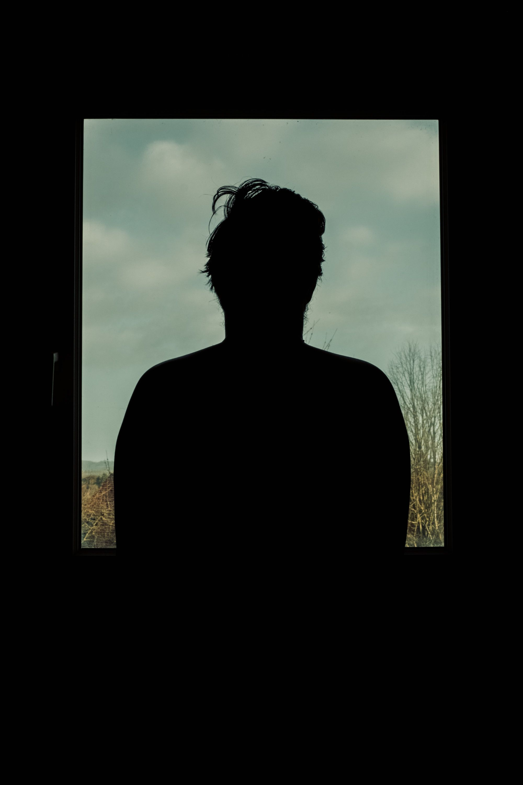
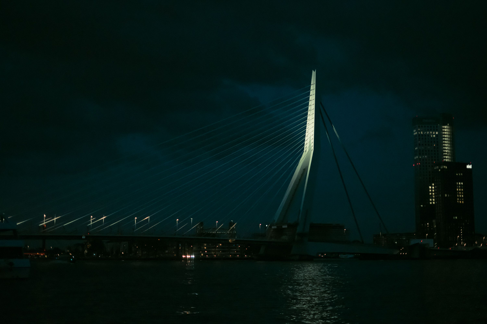
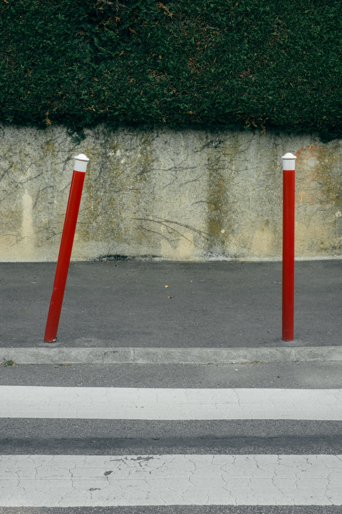
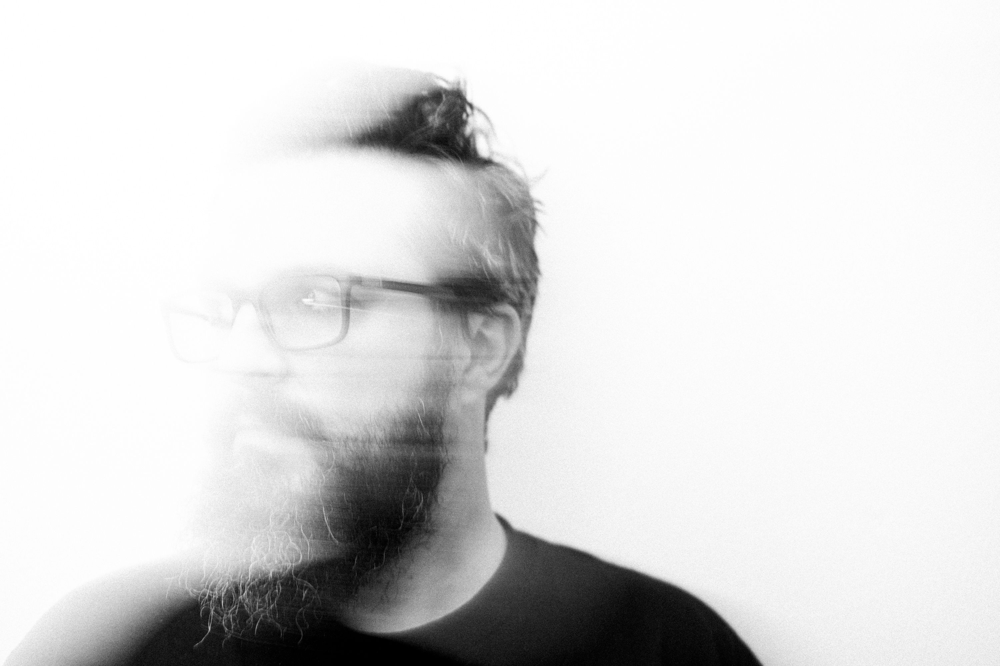

Début 2024 [j'ai décidé de me lancer dans un challenge photo](https://blog.foojin.com/2023/12/22/shuffle-mon-challenge-photo/), avec une photo par semaine, et aujourd'hui c'est la fin de l'année et donc du challenge. Faisons le point !

---

Je l'ai fini ! En respectant les conditions de bout en bout, pendant 1 an. Rien que pour ça je suis assez fier de moi. Rétrospectivement je suis content de mon choix d'avoir fait un challenge 52 (chaque semaine) plutôt que 365 (chaque jour), parce que le principe était bien trop complexe pour que je réussisse à faire ça tous les jours. Il m'est arrivé de passer la semaine à trouver quoi faire en fonction du tirage que j'avais eu.

Une chose que j'ai rapidement changé par contre c'est mon système de tirage de valeurs. J'ai vite laissé tomber le site dont je parlais dans le billet de le genèse pour passer à un bouton couplé à une fonction dans [Obsidian](https://obsidian.md/), là où je me notais tout du challenge.

Mais à part ça j'ai respecté tout de A à Z.

Parfois je faisais la photo le jour même du tirage, parfois je la faisais la veille du tirage pour la semaine suivante. Sur ce point c'était plutôt chaotique. Entre les aléas de la vie et les tirages complexes, ce n'était pas possible d'être régulier mais ça importait peu finalement. Seul le résultat final comptait.

## Ce que j'en ai tiré

Contre toute attente je n'ai pas spécialement appris plus que ça à me servir de mon appareil. Enfin je savais déjà m'en servir mais le fait de tout faire en manuel ne m'a pas débloqué de nouveau super pouvoir.

Par contre j'ai vraiment bien repris goût à la photographie. J'ai développé encore plus mon regard au point de me découvrir un goût nouveau pour les lignes notamment, en particulier les plus subtiles. J'ai me suis aussi tellement trituré les méninges que j'ai eu plusieurs idées pour de nouvelles séries.

Pour moi qui peinait à définir ma photographie, j'ai, je pense, vraiment affiné mon parcours photographique et ça c'est cool. Je ne suis toujours pas sûr à 100% mais c'est nettement moins flou que ça ne l'a été.

## Et maintenant ?

Je ne vais pas faire de nouveau challenge en 2025. C'était vraiment très bien, intéressant et inspirant mais je préfère me focaliser désormais sur ces nouvelles idées de séries que j'ai eu. J'ai envie maintenant de raconter mes histoires et non plus me reposer sur le hasard.

Et si jamais vous aviez raté ça, je vous invite à aller voir la série **Shuffle** dans son entièreté sur [mon portfolio](https://gooz.photography/tags/shuffle/).

Merci à celles et ceux qui avaient suivi mon aventure toute l'année et à bientôt pour une autre aventure !

