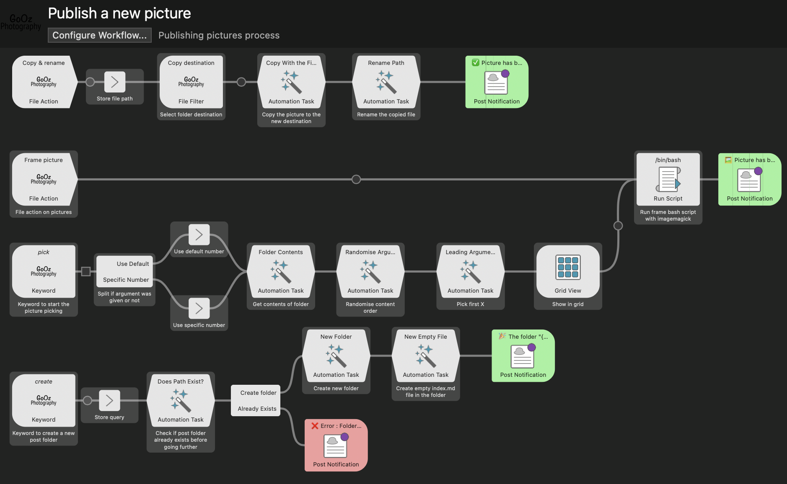
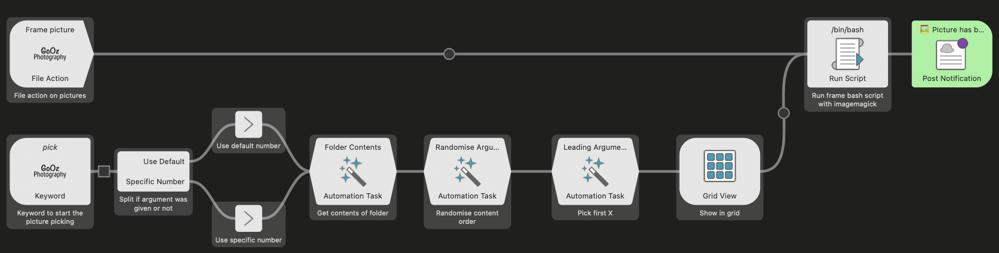
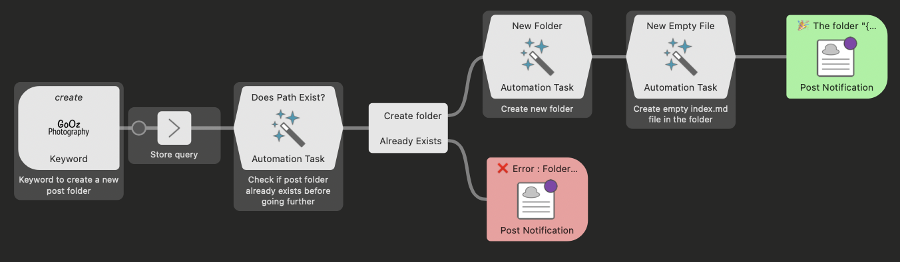
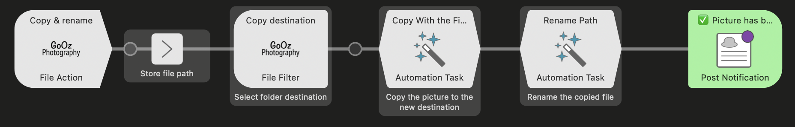

Tous les jours (ouvrés) je poste une de mes photos en ligne. Tous les jours je répète les mêmes gestes simples mais barbants. Tous les jours je me dis qu'il faudrait que je fasse quelque chose pour me faciliter la vie. C'est maintenant chose faite !

---

## Ma routine

### Étape 1 : Le choix
Je stocke mes photos exportées et prêtes à être publiées dans un dossier sur le bureau de mon ordi.  
Chaque jour je lance dans ce dossier une commande `random ./*` (commande de base dans [Fish](https://fishshell.com/)) et je fais ça 5 fois de suite.  
J'aime bien choisir une photo au hasard mais je préfère avoir un choix à faire en fonction de mon humeur du jour, donc je choisis une photo parmi ces 5 en faisant des allers-retours entre mon terminal et mon *Finder* pour voir de quelles photos on parle.

Une fois que j'ai arrêté un choix, je lance dans le terminal un petit script de ma confection pour générer une copie de l'image avec un cadre blanc et un ratio précis.  
"Pourquoi" me demanderiez-vous si justement ?  
Et bien parce que sur Instagram, pour une raison que j'ignore, quand vous leur dites de garder le format original de l'image, ils *crop* quand même les photos pour qu'elles rentrent dans leur ratio (maximum j'imagine) défini. Et si je me choisis avec beaucoup de précaution mes cadrages, c'est pas pour que Môssieur Insta prennent des libertés comme ça. Alors juste pour lui, je prépare une image avec un ratio qu'il affectionne tout en gardant mon cadrage d'origine.

### Étape 2 : La préparation
Ma philosophie sur la publication de mes photos est orientée [POSSE](https://indieweb.org/POSSE-fr), c'est à dire que ma source première est mon propre site, puis je publie ensuite des copies sur d'autres réseaux.

Et pour publier sur mon propre [portfolio](https://gooz.photography/), site statique généré avec [11ty](https://www.11ty.dev/) et mon template [Niepce](https://github.com/GoOz/Niepce) je dois créer un dossier dont le nom sera aussi l'URL, dans lequel je dois créer un fichier markdown `index.md` contenant les infos de base de la photo et enfin la photo en elle-même qui doit être nommée `photo.jpg`.

Vu que l'URL est censée être unique et ne jamais changer, il me faut donc trouver un titre original dès cette étape.

S'ensuit ensuite le `commit` et `push` de cette nouvelle photo avec mise à jour du portfolio automatiquement mais là on s'écarte du sujet.

### Étape 3 : La publication
Une fois mon portfolio mis à jour il est temps de s'occuper des réseaux.  
Au moment où j'écris ce billet je ne publie *que* sur 3 réseaux :
- [Glass](https://glass.photo/gooz)
- [Pixelfed](https://pixelfed.social/i/web/profile/422334934806983747)
- [Instagram](https://www.instagram.com/gooz/)

Je considère **Glass** comme le réseau principal, c'est celui sur lequel j'ai le plus d'interactions et il a ceci de particulier qu'il n'y a pas de hashtag, seulement des catégories de photographie alors je poste sur ce réseau en premier.

Puis vient le moment de poster sur **Instagram** et **Pixelfed** qui, du fait de leur fonctionnement similaire, utiliseront exactement les mêmes informations de publication.  
Sauf peut être la localisation parce que l'outil de localisation de **Pixelfed** est tellement mal foutu que la moitié du temps je ne le remplis pas.

Quand c'est chose faite, sur mon compte [mastodon](https://mamot.fr/@GoOz) je *retoot* la publication **Pixelfed** (c'est beau le fédivers  quand même ♥️), puis sur **Instagram** je fais une story de ma publication Insta… tout ça pour la visibilité.  
Notez que je fais ça sans vraiment savoir pourquoi.

### Conclusion
Voilà, je fais ça, tous les jours, depuis des mois. J'en ai eu un peu marre alors j'ai voulu automatiser et simplifier le plus d'étapes possible.

## Alors que revoici Alfred
Je vous avais déjà parlé d'[Alfred](https://www.alfredapp.com/) il y a… [bientôt 9 ans](https://blog.foojin.com/2016/05/05/alfred-le-messie-des-feignasses/)… ça me rajeunit pas mais au moins ça veut dire que je suis un client loyal d'Alfred. On se rassure comme on peut.

Je sais que les *cool kids* utilisent [Raycast](https://www.raycast.com/) de nos jours mais même après l'avoir testé je n'ai pas trouvé qu'il valait le coup que je change. Vous pensez bien qu'après 9 ans d'habitudes sur un outil, il va me falloir de très bonnes raisons de changer et il n'y en avait clairement pas assez.  
De plus Alfred, c'est une toute petite équipe indépendante, non soutenue par des investisseurs (le genre qui te ruine une application parce que ce sont des pompes à fric). Mine de rien ça pèse aussi dans la balance.

Bref, pour résoudre mon problème de "productivité", j'ai donc décidé de me faire un *workflow* personnalisé avec Alfred.

Mais qu'est-ce qu'un *workflow* me demanderiez-vous l'air hagard ? 

Et bien c'est "simplement" un système de suite d'actions automatisées géré par alfred. Et cette suite d'actions peut avoir différents type de "triggers" mais en très bref un *trigger* lance une *action*.

Évidemment ça c'est la version simple. Je suis allé un peu plus loin que ça.

*Spoiler alert* : in fine mon workflow ressemble à ça :

### Étape 1 Le choix
Désormais pour choisir une photo il me suffit d'ouvrir Alfred, taper `pick X` (X étant le nombre de photos que je souhaite afficher ou bien par défaut il en affichera 6), puis je clique sur l'image de mon choix qui sera dupliquée avec un contour.  
Et voilà c'est tout. Je viens de faire l'étape 1 en quelques secondes.

<video controls width="100%">
	<source src="./img/pick.webm" type="video/webm">
</video>

En détail, sur la deuxième ligne, voici ce que j'ai fait :
1. je choisis un mot clé `pick`  comme trigger
2. je lui applique un argument optionnel, le nombre de photos à afficher
3. si je ne donne pas d'argument je vais montrer 6 photos par défaut
4. je dis dans quel dossier regarder
5. je mélange le contenu du dossier aléatoirement
6. je prends les 6 ou X premières photos du dossier mélangé (s'assurant ainsi que l'aléatoire ne m'affichera pas 2 fois la même photo)
7. puis je les affiche dans une grille
8. en sélectionnant la photo,  je l'envoie au script qui va créer la copie avec cadre
9. puis pour finir j'envoie une notification pour attester que le boulot est fait

J'ai aussi rajouté une petite action sur fichier qui me permet, lorsque j'ai un fichier sélectionné, de directement l'envoyer au script pour en faire une copie avec cadre. Ça m'arrive d'avoir ce besoin ponctuel.  
Même action finale, juste un trigger différent.

### Étape 2 la préparation
Pour la préparation, c'est le mot clé `create` que j'ai choisi auquel s'ajoute l'argument obligatoire du nom du dossier. 

J'écris directement le nom du dossier en <code>kebab-case</code> pour avoir de belles URLs mais j'aurais très bien pu rajouter une étape pour forcer le formatage attendu aussi.

<video controls width="100%">
	<source src="./img/create.webm" type="video/webm">
</video>

En détail :
1. je choisis un mot clé `create` comme *trigger* suivi du nom du dossier
2. je vérifie si ce dossier existe déjà ou non avant de faire quoique ce soit parce que je n'aurais pas de d'erreur remontée par Finder si c'est le cas
3. si le dossier existe déjà, j'arrête tout et j'envoie une notification d'erreur
4. s'il n'existe pas alors je crée le dossier
5. puis dans ce dossier je crée un fichier `index.md` vide
6. finalement j'envoie une notification de succès

Notez qu'à ce moment-là j'aurais pu créer un fichier markdown partiellement pré-rempli mais comme j'édite ça dans <strong>VSCode</strong> en utilisant un template de fichier avec des arrêts de tabulation dans les zones à éditer, c'est plus pratique de juste créer le fichier vide.

Il reste donc la photo à déplacer.

Notez là aussi que j'ai préféré pour des raisons d'habitude pratique de séparer création de dossier et copie de photo en deux tâches distinctes mais j'aurais pu tout faire une seule tâche. Peut être même que je le ferai un jour. Le temps nous le dira.

Je sélectionne donc le fichier, je lance l'action sur fichier `Copy & rename` qui va demander ensuite dans quel dossier déplacer la copie et voilà la copie est déplacée et bien nommée.

<video controls width="100%">
	<source src="./img/copynrename.webm" type="video/webm">
</video>

En détail :
1. en tapant `⌥ ⌘ :` sur mon mac je lance un action sur fichier nommée `Copy & rename`
2. je vais ensuite afficher un champ de recherche de fichiers (et dossier) pour trouver le dossier dans lequel copier
3. je copie d'abord le fichier dans ce dossier
4. puis je renomme le fichier en `photo.jpg`
5. enfin j'envoie une notification de travail terminé

### Étape 3 La publication
C'est là que ça pêche…

Je ne sais pas comment automatiser cette partie mais ce ne serait sûrement pas avec Alfred.  
Je pense qu'il doit y avoir moyen de faire quelque chose avec des outils comme [Zapier](https://zapier.com) ou [IFTTT](https://ifttt.com/) mais leur version gratuite ne suffira clairement pas et je trouve leurs options payantes très vite chères pour le besoin que j'ai.

Si vous avez des recommandations d'autres solutions je suis évidemment preneur.

### Conclusion
Grâce à **Alfred** j'ai pu "automatiser" 2 étapes sur 3 et j'en suis bien content. Et ce n'était pas si compliqué que ça. Bien évidemment ça m'a pris un peu de temps pour comprendre en profondeur le fonctionnement mais une fois le principe assimilé ça va assez vite.

Je pourrais partager le workflow si ça intéresse des gens mais vu que c'est un besoin très personnel je n'ai pas jugé ça utile.
