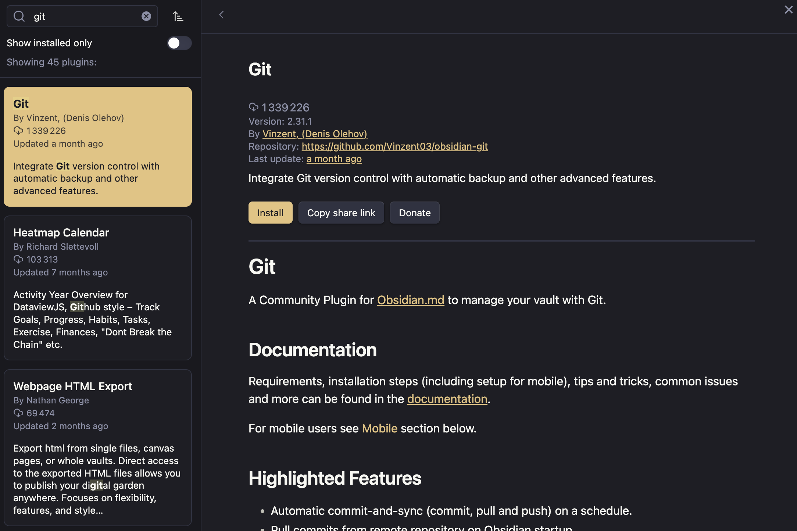

Depuis que je suis passé de **Ghost** à **Eleventy** quelque chose me manquait dans le processus de publication : la simplicité ! Il fallait que j'y remédie. Mais revenons un peu sur mon *setup* pour **Eleventy**.

<!-- excerpt -->

Avec [Ghost](https://ghost.org/) j'avais une plateforme complète qui gérait tout toute seule du début à la fin.  
En passant à [Eleventy](https://www.11ty.dev/) j'ai gagné en légèreté, rapidité et simplicité de la stack mais j'ai un peu perdu en simplicité d'utilisation et en fonctionnalité.

J'ai réduit en 3 étapes essentielles le workflow classique pour publier un nouveau billet :
1. L'écriture du billet
2. La génération des pages web
3. La publication (ou mettre en ligne si vous préférez)

Je ne vais pas parler de la génération des pages, c'est ben tout le but d'utiliser Eleventy, c'est inhérent au projet. Le simple fait de l'utiliser suffit à résoudre ce problème.

## La publication
Je pense ne pas me tromper en disant que c'est l'étape la plus perturbante pour quelqu'un qui fait la migration depuis un CMS. **11ty** n'est **pas** un CMS, c'est un moteur de génération de pages web. Ça veut donc dire qu'évidemment vous n'aurez pas d'interface *wysiwyg* ou autre pour écrire vos billets (mais ça on y reviendra plus tard) mais aussi que rien ne mettra en ligne vos pages web générées.

Générer des pages avec **11ty** c'est une seule commande : `npm run build`. Ça peut paraitre simple sauf que…

- Soit vous écrivez vos billets directement sur le serveur web où est hébergé votre site, auquel cas effectivement ce sera simple mais franchement… vous ne devriez pas. Vous n'avez aucune garantie de sauvegarde. Et ça c'est moche.
- Soit vous écrivez vos billets et vous générez les pages sur votre machine puis vous faites ensuite un transfert via (s)FTP ou autre des fichiers générés, auquel cas c'est quand même mieux mais franchement vous aimez vous emmerder.
- Soit vous écrivez vos billets sur votre machine mais vous versionnez votre site avec Git (ou autre) puis vous vous connectez au serveur pour faire un `git pull` puis `npm run build` et là on commence à parler mais il y a toujours une étape manuelle fort chiante.
- Soit vous faites tout comme avant **MAIS** vous mettez en place un webhook qui va, dès qu'il sait qu'un nouveau commit git a eu lieu, faire un `git pull` puis `npm run build` tout seul comme un grand et à votre place.

Personnellement, j'ai mis en place le denier choix . Je ne peux vous dire comment faire ce webhook partout ailleurs mais chez mon hébergeur [alwaysdata](https://www.alwaysdata.com/fr/) et avec **Github** comme gestionnaire de *repository* Git j'ai mis en place ça relativement facilement en suivant ce [guide](https://blog.alwaysdata.com/fr/2023/02/01/devops-react-we-can-be-heroes-just-for-one-app/).

Depuis dès que je `push` des choses sur git ça se retrouve mis en ligne dans les 2-3 minutes, le temps que tout passe dans les tuyaux et que ça génère les pages. 

## L'écriture du billet
C'est sûrement plus une question de goût personnel, des éditeurs de markdown il y en a pléthore, mais je trouve qu'[Obsidian](https://obsidian.md/) est particulièrement bien adapté à ce besoin là. Le confort d'écriture m'y parait idéal tout en permettant une souplesse et une certaine adaptation grâce à ses nombreuses extensions, notamment celle qui permet d'y utiliser **Git**.

D'aucuns pourraient me dire qu'utiliser un éditeur de code modulable, comme **VS Code**, ferait tout aussi bien le boulot et ils auraient raison mais je trouve que l'interface de VS Code un peu trop encombrée de base et puis j'utilise déjà **Obsidian** à côté pour mes notes personnelles donc j'aime écrire dedans donc j'ai choisi **Obsidian**. Il n'y a pas de mauvais choix dans ce cas précis. Choisissez ce avec quoi vous êtes le plus à l'aise.

Mais revenons sur **Obsidian**, puisque c'est bien de cet outil dont je veux parler.

### Gérer un coffre avec Git
Obsidian est capable de gérer n'importe quel dossier de fichiers markdown donc il n'y a rien de particulier à faire de ce côté, faites un nouveau coffre de votre clone **Git** et ce sera tout.

Mais pour pouvoir gérer **Git** depuis **Obsidian** il vous faudra installer un plugin très judicieusement appelé "Git"



Le plugin n'a pas besoin de configuration particulière pour fonctionner, vérifiez peut être que l'option `push` automatique ne soit pas activée, sauf si c'est ce que vous souhaitez.

### Un template sur mesure
**Obsidian** a une option qui permet de spécifier dans quel dossier les nouvelles notes (fichiers markdown) seront entreposées à leur création. Mais si comme moi votre architecture est un poil particulière, cette option ne suffira pas.

Mes notes sont classées comme suit `/YYYY/MM/DD/titre-du-billet/index.md` et on pourrait vite croire que ce serait vite compliqué de faire ça automatiquement mais que nenni.

Grâce la fonctionnalité native "template" d'**Obsidian** et à une autre extension nommée "templater" on va pouvoir faire de la magie.
Les templates sont assez rudimentaires dans **Obsidian**, c'est vraiment juste un modèle d'architecture de page vide à remplir à la main ensuite mais le plugin *templater*, lui, permet de pousser plus loin en permettant l'auto-remplissage des templates, d'y appliquer des scripts, de faire des ajouts dynamiques, etc.

Par exemple mon template de billet de blog ressemble à ça :

```md
<%*
let title = await tp.system.prompt("Titre du billet")
titleFolder = title.normalize("NFD").replace(/[\u0300-\u036f]/g, "").replace(/[.,\/#!$%\^&\*;:{}=\-_`~()]/g,"").trim().replace(/\s+/g, '-').toLowerCase()
let year = tp.date.now('YYYY') 
let month = tp.date.now('MM') 
let day = tp.date.now('DD') 
let newFolder = `/content/${year}/${month}/${day}/${titleFolder}/` 
await tp.file.move(newFolder + 'index');
-%>
---
title: <% title %>
date: <% tp.date.now('YYYY-MM-DD') %>
featured: img/featured.jpg
featured_author: 
featured_url: 
tags:
---

{{excerpt}}

<!-- excerpt -->

```

La partie manifestement scriptée est pour *templater*
```js
<%*
let title = await tp.system.prompt("Titre du billet")
titleFolder = title.normalize("NFD").replace(/[\u0300-\u036f]/g, "").replace(/[.,\/#!$%\^&\*;:{}=\-_`~()]/g,"").trim().replace(/\s+/g, '-').toLowerCase()
let year = tp.date.now('YYYY') 
let month = tp.date.now('MM') 
let day = tp.date.now('DD') 
let newFolder = `/content/${year}/${month}/${day}/${titleFolder}/` 
await tp.file.move(newFolder + 'index');
-%>
```
C'est principalement fait pour créer la bonne architecture de dossier.

En bref, je demande à ouvrir une fenêtre dialog pour demander le titre du billet, puis à partir de ce titre j'en crée une variable au format kebab-case, ensuite je récupère l'année, le mois et le jour et enfin à partir de tout ça je crée le dossier de destination de la note.

Puis vient le véritable template de billet pour **Eleventy**
```md
---
title: <% title %>
date: <% tp.date.now('YYYY-MM-DD') %>
featured: img/featured.jpg
featured_author: 
featured_url: 
tags:
---

{{excerpt}}

<!-- excerpt -->
```

Dans le *frontmatter* (tout ce qu'il y a entre les `---`), les metadonnées qui peuvent être automatisées le sont grâce à *templater*. C'est donc le cas de la date du jour et le titre du billet.
Evidemment si je décide de changer le titre ou la date, je peux toujours le faire manuellement à tout moment, il s'agit juste un point de départ.

## Le résultat

Avec tout ça, lorsque je veux écrire un nouveau billet, la création est très amplement simplifié.

<video controls width="100%">
	<source src="./img/new-post.webm" type="video/webm">
</video>

Une fois que j'ai fini d'écrire mon billet en markdown, je n'ai plus qu'à ouvrir le panneau latéral d'**Obsidian** pour afficher l'interface du plugin Git, `add` les fichiers que je veux ajouter, faire un `commit` et `push`.

Tout ça passera par le webhook, qui mettra à jour les sources sur le serveur et lancera la génération des pages et finalement tout sera posté en ligne dans la foulée.

J'ai donc récupéré un workflow plutôt transparent et aussi fonctionnel que lorsque j'étais sur **Ghost**.  
Pour tout vous dire, je ne sais pas ce que je pourrais améliorer de plus. 

Mais si vous avez d'autres tips alors je veux bien que vous me les partagiez. :)