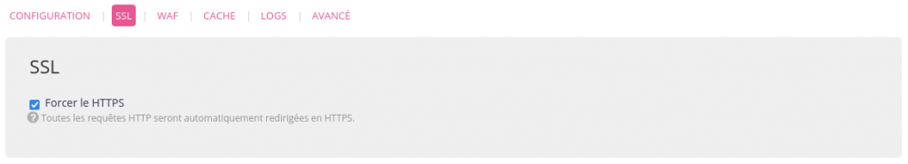

Utiliser un moteur de site statique c'est sympa, léger, économique mais la mise en ligne des dernières mises à jour finit souvent comme un processus manuel, parfois laborieux, souvent répétitif.
Mais comme pour tout processus répétitif, on se sent mieux quand on automatise des choses.

<!-- excerpt -->

La [dernière fois](/2025/02/03/eleventy-devant-obsidian-derriere/) je vous avais parlé de comment j'utilisais [11ty](https://www.11ty.dev/) comme moteur et [Obsidian](https://obsidian.md/) comme éditeur de contenu mais j'avais occulté sur le processus de mise en ligne et il est temps d'y remédier.

> [!NOTE]
> Par soucis de simplicité et parce que c'est ce que je connais le mieux, je vais décrire mon processus avec un repository Git hébergé sur <a href="https://github.com/">Github</a> et un hébergement du site chez <a href="https://www.alwaysdata.com/">alwaysdata</a> mais le principe est a priori transposable dans des contextes différents.

Comme on avait vu la dernière fois ce blog est sur un repository **Git** et à chaque nouvelle mise à jour, je fais donc un `commit` que je `push` ensuite sur **Github**.  
Maintenant il faut trouver un moyen de dire à **Github** que, dès qu'il reçoit une mise à jour, il lui faudra envoyer un message au serveur d'hébergement du site pour que ce dernier puisse récupérer ces mises à jours et les mettent en ligne.
Pour ce faire, il existe les *webhooks*.

## Configuration d'un site pour diffuser vos pages statiques chez alwaysdata
Servir un site statique sur alwaysdata est sûrement ce qu'il y a de plus simple.

Rendez-vous sur l'admin d'alwaysdata dans la section `Web > Sites` et cliquez sur le bouton "Ajouter un site", puis :
1. Dans le champ **adresse**, mettez l'adresse URL à laquelle  vous souhaitez que votre site apparaisse
2. Dans le champ **type**, choisissez `Fichiers statiques`
3. Dans le champ **répertoire de travail**, mettez `dossierDeVotreSite/dossierDeBuild` 

Le `dossierDeVotreSite` est le dossier dans lequel vous aurez cloné votre repository **Git**, donc par défaut le nom du projet sur **Github**.  
Le `dossierDeBuild` est déterminé par la façon dont vous avez configuré votre site **11ty**, chez moi c'est `_site` mais ça pourrait tout autant être `dist` ou `build` ou `foobar`, etc. Vérifiez donc ça directement sur la config de votre projet.

Pour finir validez ça et laissons ça de côté pour passer à la suite.
## Setup du webhook chez alwaysdata
Le webhook est un nouveau service qu'il vous faudra ajouter et activer vous même sur votre compte alwaysdata.

Pour ça, il vous faudra donc :
1. Ajouter une library de gestion de webhooks comme [adnanh/webhook](https://github.com/adnanh/webhook/)
2. Créer un site `webhook` sur votre compte **alwaysdata**
### Installer la library
Connectez-vous en SSH sur votre compte **alwaysdata** pour créer un dossier `webhook` et y installer la library :

```sh
$ mkdir webhook
$ wget -O- https://github.com/adnanh/webhook/releases/download/2.8.0/webhook-linux-amd64.tar.gz | tar -xz --strip-components=1 -C webhook
```

### Créer un site webhook sur alwaysdata
Rendez-vous sur l'admin d'alwaysdata dans la section `Web > Sites` et cliquez sur le bouton "Ajouter un site", puis :
1. Dans le champ **adresse**, mettez `<votreNomDeCompte>.alwaysdata.net/webhook`
2. Dans le champ **type**, choisissez `Programme utilisateur`
3. Dans le champ **commande**, mettez-y la commande qui devra être exécuté `./webhook -port $PORT -hooks ./hooks.json -logfile webhook.log`
4. Dans le champ **répertoire de travail**, mettez `webhook` (ou le nom du dossier où vous avez installé la library webhook de l'étape d'avant)
5. Dans l'onglet **SSL**, *Forcez le HTTPS* si ce n'est pas déjà le cas
6. Dans l'onglet **Avancé**, *Excluez le chemin*





On en a pas vraiment fini avec **alwaysdata** mais il nous faudra y revenir plus tard. Maintenant parlons de **Github**.
## Setup de Github
Rendez-vous donc sur la page Github de votre projet, puis allez sur l'onglet "Settings", ensuite dans le menu de gauche, dans la section "Code and automation", allez sur "Webhooks" et enfin cliquez sur le bouton "Add Webhook".

À partir de là :
1. Dans le champ **Payload URL**, mettez `https://<votreNomDeCompte>.alwaysdata.net/webhook/hooks/deploy`
2. Dans le champ **Content type**, choisissez `application/json`
3. Dans le champ **Secret**, tapez un mot de passe (et vous allez me faire le plaisir de le noter dans un gestionnaire de mots de passe, parce qu'on va s'en resservir très vite et que, si jamais un truc foire, vous n'ayez pas à tout refaire parce que vous ne vous souvenez plus de celui-là)
4. Gardez le reste par défaut (sauf si vous souhaitez faire autre chose)
5. Et Ajoutez ce webhook nouvellement configuré.


On pourrait naïvement croire que c'est fini mais non. À ce stade chaque nouveau push va en effet envoyer une requête au serveur **alwaysdata** mais côté serveur il n'y a rien qui permette d'authentifier la requête comme légitime, ni dise quoi faire une fois cette requête reçue.

## Configuration du webhook sur alwaysdata
### Authentification et configuration
Vous allez donc devoir créer un fichier `hooks.json` de configuration. Pour ce faire, soit vous vous connectez en SSH sur le serveur et l'ajoutez à la main, soit vous créez ce fichier localement et l'envoyez sur le serveur par SFTP. Peu importe vraiment, ce qui compte c'est que ce fichier existe sur le serveur au final.

Dans mon cas, et comme stipulé dans la commande à exécuter de la configuration du site `webhook`, je l'ai mis dans le dossier `webhook`. Ce n'est pas obligatoire mais si vous faites différemment pensez à bien uniformiser ça partout.

Ce fichier json devra ressembler à ceci :

```json
[
  {
    "id": "deploy",
    "execute-command": "/home/votreNomDeCompte/webhook/deploy.sh",
    "command-working-directory": "/home/votreNomDeCompte",
    "trigger-signature-soft-failures": true,
    "pass-arguments-to-command": [
      {
        "source": "payload",
        "name": "repository.name"
      },
      {
        "source": "payload",
        "name": "repository.clone_url"
      },
      {
        "source": "payload",
        "name": "head_commit.id"
      }
    ],
    "trigger-rule": {
      "and": [
        {
          "match": {
            "type": "value",
            "value": "refs/heads/main",
            "parameter": {
              "source": "payload",
              "name": "ref"
            }
          }
        },
        {
          "or": [
            {
              "match": {
                "type": "payload-hmac-sha1",
                "secret": "VotreSuperMotDePasseQueVousAvezNotéDansVotreGestionaire",
                "parameter": {
                  "source": "header",
                  "name": "X-Hub-Signature"
                }
              }
            }
          ]
        }
      ]
    }
  }
]
```

À noter que :
- Pour la clé `id`, mettez donc ce que vous voulez mais je conseille de donner le même nom que le nom de votre fichier de commande ci-après
- Pour la clé `execute-command`, choisissez le chemin et le nom de fichier `sh` que vous souhaitez. Par soucis de simplicité je garde tout dans le dossier `webhook` mais ce n'est pas obligatoire. 
- Si votre branche principale n'est pas `main` mais `master`, pensez alors à changer `"value": "refs/heads/main",` par `"value": "refs/heads/master",`

Et si vous avez plusieurs sites 11ty à déployer de la même façon, vous pourrez juste modifier la partie `trigger-rule` et y ajouter une nouvelle authentification :

```json
"or": [
	{
	  "match": {
		"type": "payload-hmac-sha1",
		"secret": "MotDePasseDeMonSite1",
		"parameter": {
		  "source": "header",
		  "name": "X-Hub-Signature"
		}
	  }
	},
	{
	  "match": {
		"type": "payload-hmac-sha1",
		"secret": "MotDePasseDeMonSite2",
		"parameter": {
		  "source": "header",
		  "name": "X-Hub-Signature"
		}
	  }
	}
  ]
```

Notez donc que la seule différence entre les deux entrées sera le `secret`.

On a donc désormais l'authentification en place et la commande à éxécuter, sauf que si vous suivez bien ce fichier `deploy.sh` n'existe pas (encore).

### Configuration du déploiement
Que vous suiviez ma façon de faire en créant un fichier `webhook/deploy.sh` ou que vous préfériez faire à votre sauce, faites dans tous les cas un nouveau fichier *.sh* dans lequel vous allez y écrire la ou les commandes à éxécuter quand un nouveau push à été notifié.

Dans le cas d'un site fait avec **11ty**, je propose donc un simple script comme suit :

```sh
#!/bin/bash

NAME=$1

DEST_DIR=${HOME}/${NAME,,}

cd ${DEST_DIR}
git pull origin main --rebase
npm ci && npm run build
```

Dans ce script on y récupère le nom du repository via `NAME` qui dans mon cas s'avère être aussi le nom du dossier où mon site **11ty** est cloné. Ce n'est pas obligatoire mais si comme moi vous vous retrouvez avec plusieurs sites **11ty** de la sorte vous pourrez utiliser le même script de déploiement pour tous vos sites au lieu de le dupliquer, mais c'est à vous de voir.

Donc ce script va, depuis votre *home*, :
1. Aller dans le dossier du projet
2. Mettre à jour sa codebase en allant `pull --rebase` les modifications récentes
3. Faire un `npm i` pour installer les nouvelles dépendances le cas échéant
4. Faire un `npm run build` pour générer les changements opérés dans le dernier `push` et les publier

Pour finir il vous faudra donner les droits d'exécution à ce script alors connectez-vous en SSH sur le serveur **alwaysdata** et tapez `chmod +x path/to/deploy.sh`.

Et voilà ! Normalement si tout s'est bien passé vous devriez pouvoir faire un petit test en faisant un `push` de modifications mineures et voir ces changements apparaitre. 
## Troubleshooting 
Si jamais dans les 2 minutes (et encore je suis large) vous ne voyez pas vos modifications en ligne il s'est probablement passé quelque chose d'imprévu.  
Dans ce cas, je vous invite à aller lire les logs dans le fichier `webhook/webhook.log` sur le serveur **alwaysdata**. Vous devriez y trouver une réponse assez rapidement. Je ne vais malheureusement pas trop pouvoir vous aider plus que ça étant donné la diversité des problèmes possibles que vous pourriez rencontrer.

J'espère en tout cas que tout ça vous sera utile. ❤️
