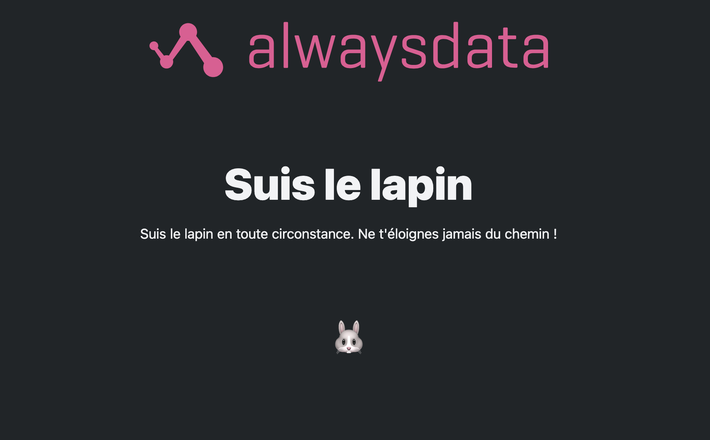
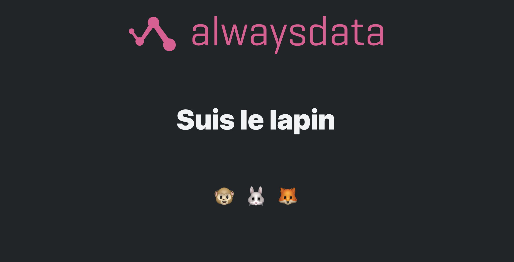
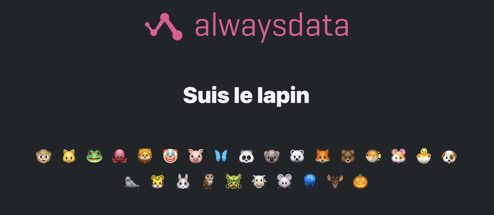
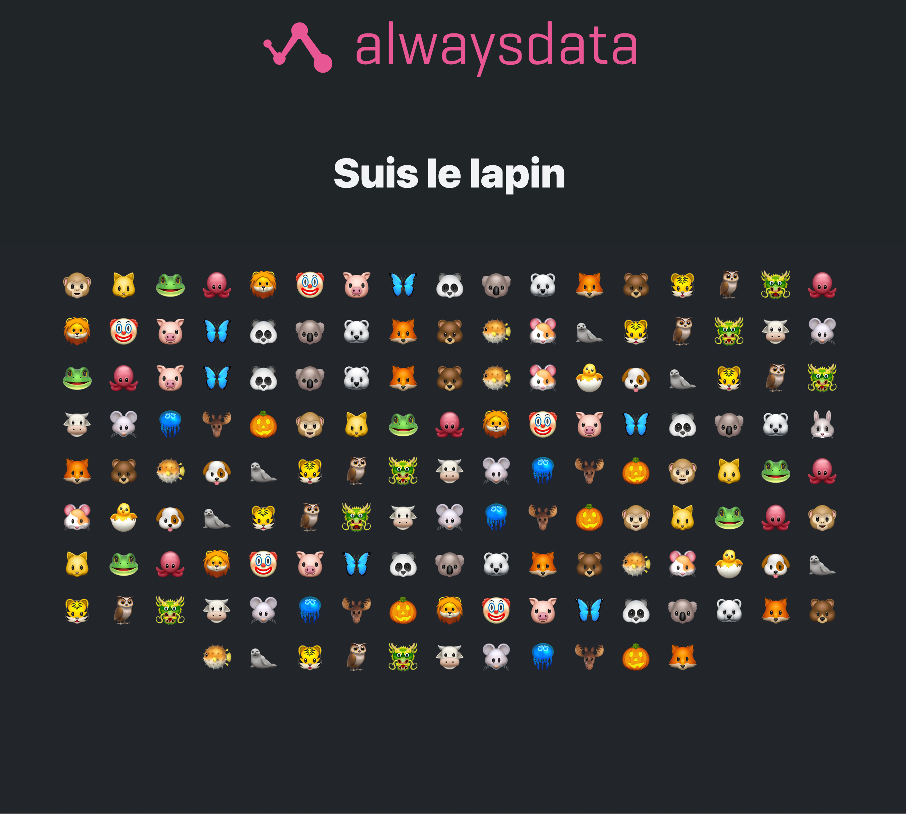
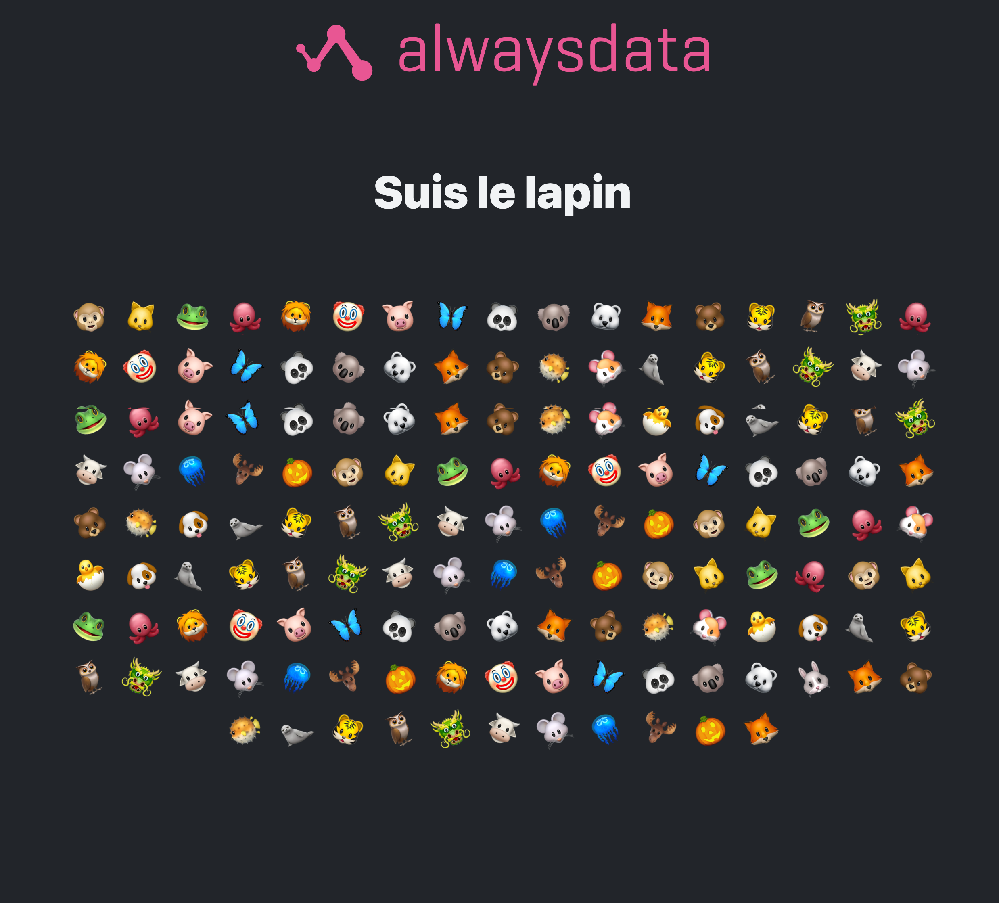
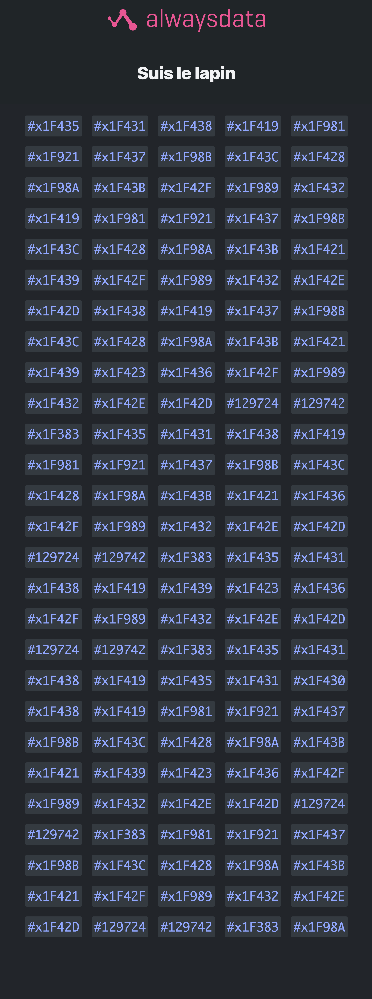
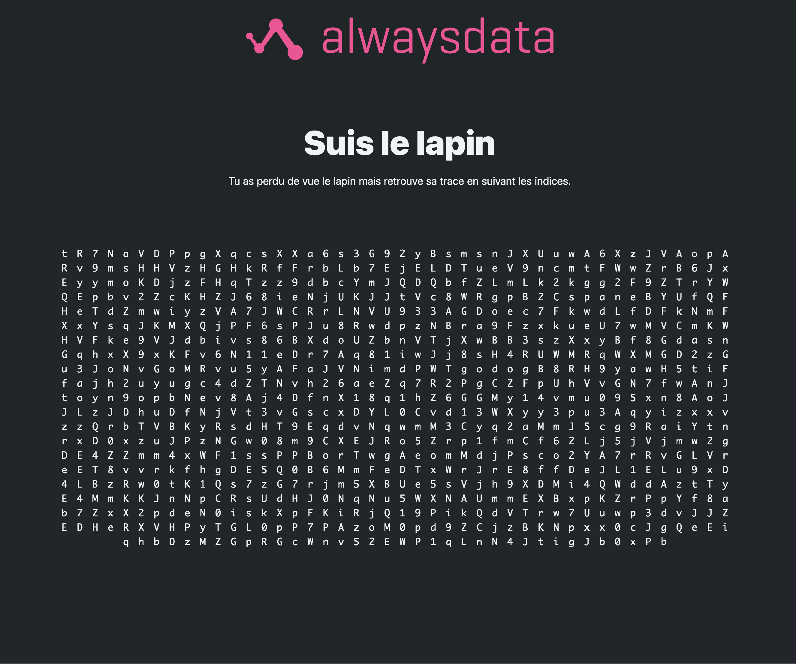
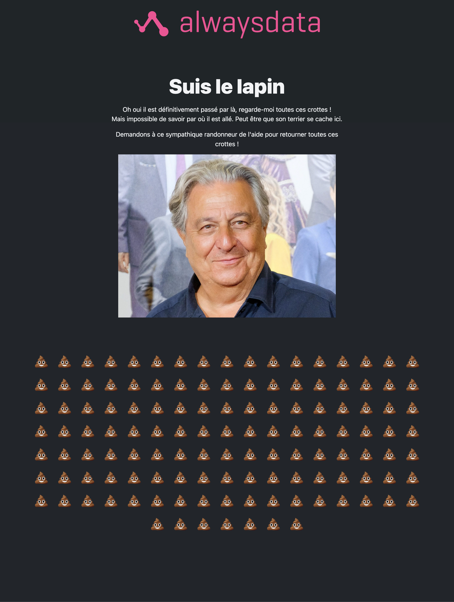
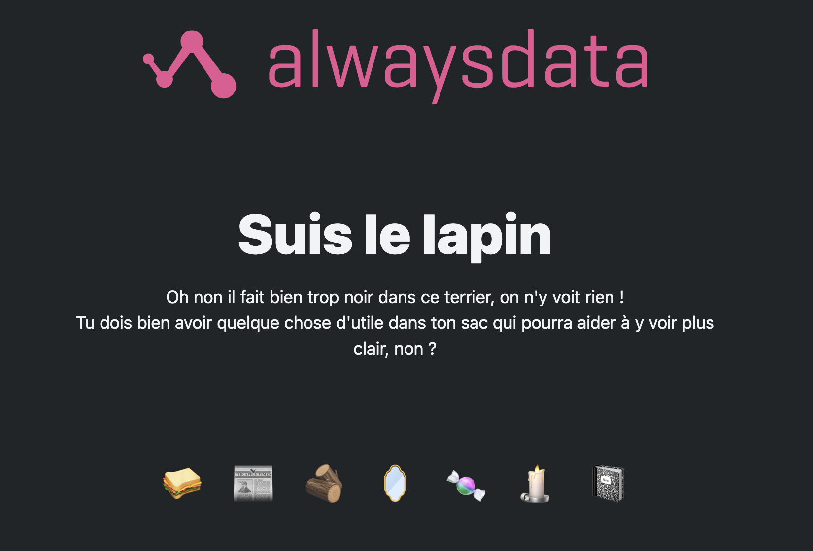
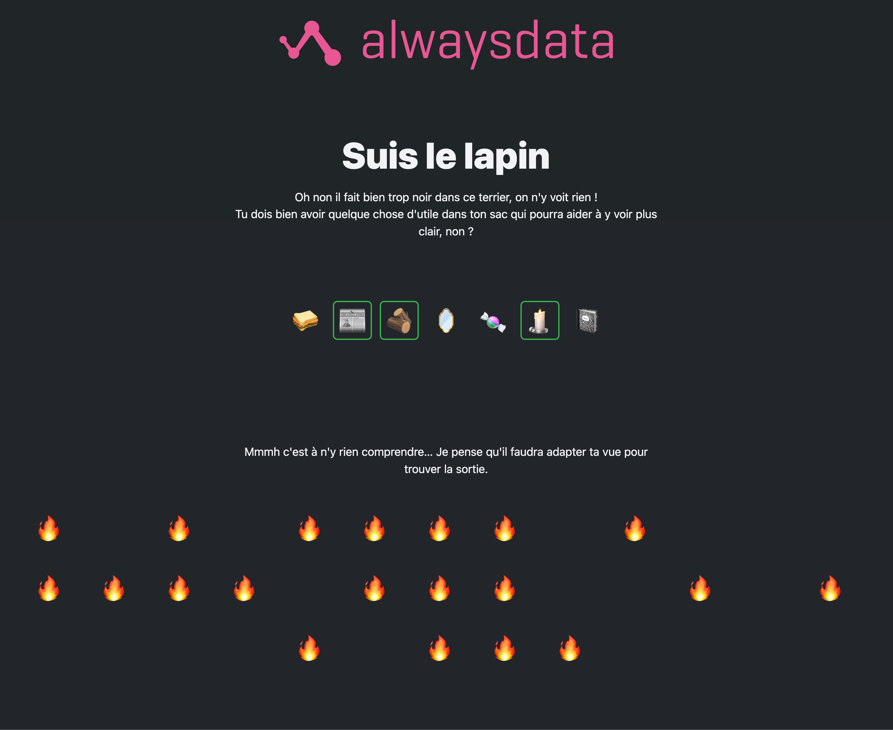

Une fois par an chez alwaysdata, l'équipe (full remote) se retrouve pour un séminaire d'une semaine, quelque part en France ou ailleurs, dont la destination est tenue secrète jusqu'au dernier moment par les organisateurs et souvent révélée via un petit jeu.

<!-- excerpt -->

## L'idée de base
Cette année j'étais un des organisateurs et j'aime bien jouer alors c'est tout naturellement que j'ai proposé de m'occuper de ce petit jeu.  
J'avais déjà en tête de faire une pâle copie d'**Ouverture Facile** (les vrais sachent), ce vieux site d'énigmes directement dans ton navigateur, mais en vachement plus court et plus simple.  
L'idée était d'avoir une énigme par page dont la solution mènerait à une page suivante et ainsi de suite jusqu'à arriver sur la page annonçant la destination du séminaire.

À la base je voulais faire au plus simple parce que je n'avais pas du temps illimité dessus non plus alors je me suis dit que j'allais faire en sorte d'utiliser le moins possible de JavaScript.
Finalement, je me suis tellement pris au jeu que j'ai fait exclusivement sans JS (à une ou deux exceptions près). Des énigmes purement dans le navigateur et basées principalement sur techniques CSS et un peu de HTML.

Je me suis bien amusé à faire ce petit jeu sans prétention et juste pour le fun.

Si vous voulez tester ça vous-même et sans spoiler, rendez-vous sur [https://gooz.alwaysdata.net/seminaire/](https://gooz.alwaysdata.net/seminaire/) et partez donc à la poursuite du lapin ! Avant de revenir ici.

> [!WARNING]
Attention ce petit jeu n'est pas vraiment pas accessible par moment. Je n'ai même pas essayé de tester mais vu ce que j'ai fait à certains endroits c'est certain qu'il ne l'est pas.

## Les énigmes (avec spoilers)
Je voulais partir vraiment tout doucement et graduellement mais augmenter sûrement la difficulté.  

### Page d'accueil
Sur cette page je voulais juste mettre en place "l'histoire" du petit lapin à poursuivre et mettre en évidence ce que les joueureuses devront chercher. En l'occurrence un emoji de visage de lapin sur lequel il suffit de cliquer pour passer à la page suivante.  
Pas vraiment une énigme en soi ici, j'en conviens, disons que c'est juste une case départ.

### Énigme 1
Pour peu qu'on puisse appeler ça une énigme… j'affiche 3 emojis dont 1 de lapin. Trouver le lapin est au delà du jeu d'enfant à ce stade.  
Il suffit de toujours cliquer dessus pour passer à la suite.

### Énigme 2
Toujours la même chose sauf qu'on multiplie presque par 10 le nombre d'emojis affichés.

### Énigme 3 
Re-belote mais on multiplie ça de nouveau par 5… ça commence à devenir laborieux mais l'idée est de faire croire au joueur que ça ne va faire qu'augmenter en nombre, sauf que non.

### Énigme 4
**AH !** Même nombre d'emojis qu'on a mélangé mais cette fois ils tournent sur eux-même et pas forcément dans le même sens. C'est un poil plus laborieux encore. D'aucun pourrait même dire gerbant.

### Énigme 5
BIM je _disrupte_ ! Plus d'emoji ! Enfin si mais j'affiche les codes HTML de la même liste qu'avant (mais dans le désordre).  
La petite difficulté ici est qu'il existe plusieurs emojis de lapin et qu'il ne faut pas se tromper pour trouver le bon code. Et si vous aviez remarqué l'URL des pages jusque là, qui allait de `/1/` à `/5/`, j'ai aussi disrupté l'URL de la page suivante. :3  
La page `/6/` n'existe pas ! MWAHAHAHA 😈

### Énigme 6
**BAM ! DISRUPTIVISATION !** Aux chiottes les emojis, on est plus des gamins !  
À la place une suite de caractères alphanumériques, en minuscule ou majuscule.
Mais qu'est-ce que ça peut bien vouloir dire ?!

Réponse : **Rien** !

Il suffit de sélectionner tous ces caractères pour mettre en exergue certains d'entre eux ce qui vous permettra de construire l'URL de la prochaine énigme !

J'ai juste styler le pseudo-element `::selection` de manière bien peu accessible. Ne reproduisez pas ça chez vous.

### Énigme 7
C'est le retour des emojis, je sais qu'ils vous manquaient.  
C'est une de celles qui ont donné le plus de fil à retordre à mes joueurs (béta-testeurs ou officiels).

Cette photo de *Christian Clavier* n'est évidemment pas là pour faire joli. Elle est là, avec le petit texte, pour donner un indice sur la façon de résoudre cette énigme.

Il suffit de naviguer entre les emojis, lien après lien, en utilisant le **clavier** pour trouver la crotte qui cache le **trou** de l'entrée du terrier ! 


Pour ce faire, rien de plus simple, au `:focus-visible` je cache l'emoji de crotte et affiche un autre emoji à la place.
### Énigme 8
**BOM DISRUPTANCE !1!**
Cette fois-ci l'énigme est en deux parties.

La première consiste à trouver comment faire **assez** de lumière et assez longtemps en sélectionnant les objets adéquats. 
Et évidemment il faut faire du feu grâce à la bougie. Mais que faire brûler ? Le journal ? ça fonctionnera pas assez longtemps. Les bûches ? Ça risque d'être compliqué de brûler des bûches avec une bougie. 
Il fallait en effet choisir les 3 pour faire un feu qui tienne la route !

Ce faisant, vous activez la deuxième partie de l'énigme en affichant plusieurs emojis de feu bizarrement affichés. On vous invite alors à *adapter* votre vue !

Et oui, il suffit de redimensionner la fenêtre de votre navigateur (ou zoomer, ça marche aussi) pour que les flammes finissent par former un nombre, le nombre de l'URL de la prochaine étape.

Si cette page est à l'URL `/800/` ce n'est pas pour rien non plus. En mettant le viewport en 800px de largeur vous arriviez directement à la bonne taille. Mais il semble que personne n'ait remarqué ça.

En bref, rien de bien folichon, juste un layout en flexbox responsive.
Par contre pour les objets à sélectionner de la première partie, c'est un peu plus pointu.

Pour s'assurer en CSS que des items en particulier soient sélectionnés, mais pas les autres, afin d'afficher l'élément suivant on doit faire des trucs un poil *borderline* comme ça :
```css
.bag:has(#sandwich:not(:checked) + #newspaper:checked + #wood:checked + #mirror:not(:checked) + #candy:not(:checked) + #candle:checked + #notebook:not(:checked)) + .dark {
	color: var(--text-1);
	user-select: initial;

	& .fire-wrapper {
		visibility: visible;
	}
}
```

Ne faites pas ça non plus chez vous. C'est moche.

### Énigme 9
On arrive au bout avec une dernière énigme montrant plusieurs images dont le but est de faire penser à une ville :
- une chouette
- un vieux portrait crayonné
- une plante jaune
- Emily (de la série Emily in Paris) un verre à la main
- un blason

Une fois que vous avez la réponse vous n'avez plus qu'à la rentrer dans le formulaire en bas de page.

Cette fois-ci rien de technique donc, juste de la "culture".
- La chouette est un emblème de la ville
- Le portrait est celui de Gustave Eiffel qui est né dans cette ville
- La plante j'aune n'est pas du colza mais de la moutarde
- Emily tient un vers de kir cassis
- Le blason est celui du Duc de Bourgogne.

La bonne réponse est donc **Dijon**.

C'est sur cette page que j'ai utilisé **enfin** du JS pour gérer le formulaire de réponse. J'ai même été jusque crypter la bonne réponse dans le code pour contrer les petits malins du `CTRL/⌘+U` ou des devtools.

Ah, il y a aussi du JS sur la dernière page, celle des félicitations, pour faire les feux d'artifice mais là c'est purement décoratif.

## Le Setup
Je n'ai pas utilisé grand chose pour faire tout ça, c'était surtout dans le but de me faire gagner du temps.

### 11ty
Si vous êtes habitués des lieux vous savez l'amour que je porte à [11ty](https://www.11ty.dev/) et encore une fois je l'ai utilisé pour ce petit projet. C'était clairement pas indispensable mais comme je voulais créer plusieurs pages fantômes et une 404 c'était plus simple de passer par un template géré par **11ty**.

### Open-props
Ce petit projet [Open-Props](https://open-props.style/) créé par [Adam Argyle](https://nerdy.dev/) et que j'apprécie beaucoup propose tout un set de CSS Custom Properties préfaites et un theme de rendu par défaut que j'ai donc utilisé ici.
Très pratique pour des petits projets comme celui-là, ou encore des prototypes. Je recommande.

Et c'est tout !!! 
Le reste c'est ~200 lignes de CSS maison,  ~60 lignes de JS (dont la moitié ne sert littéralement à rien d'autre qu'à faire joli), du setup de 11ty et *YOLO* !

## Mots de fin
Je me suis vraiment beaucoup amusé à trouver et implémenter des énigmes en utilisant du CSS ou du HTML. C'était un bon exercice de sortir un peu des sentiers battus je trouve.  
J'ai fait ça vraiment rapidement, étalé sur une semaine et je pense qu'avec plus de temps j'aurais pu trouver d'autres trucs cools à faire mais je pense aussi que pour faire un jeu comme ça auquel tout le monde peut jouer ça devient très compliqué puisque c'était carrément pas accessible aux non-voyants par exemple.
