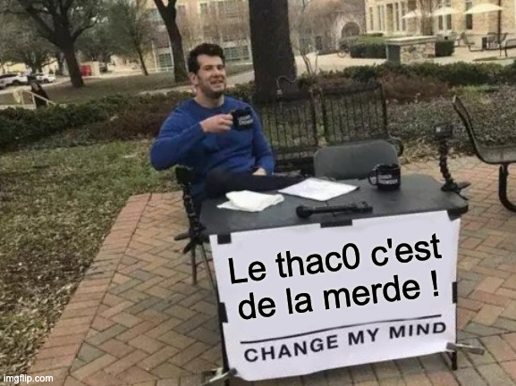

Certainement une des mécaniques les plus controversées parmi les joueurs et joueuses de Donjons et Dragons, le Thac0 continue de diviser aujourd'hui encore. Preuve en est, je vais en remettre une couche. 
Spoiler alert : Je déteste !

<!-- excerpt -->

## C'est quoi le Thac0 ?

Dans les premières versions de Donjons et Dragons (le premier jeu de rôle et le plus connu dans le monde), quand un personnage veut attaquer un monstre, le joueur doit lancer un dé (à 20 faces) pour savoir si son attaque touche le dit monstre et pour ce faire il doit utiliser la mécanique appelée **Thac0** ou *To Hit Armor Class (of) 0* ou encore en bon français "Pour toucher une classe d'armure de 0".  
La class d'armure (CA) étant donc le niveau d'armure d'un personnage/monstre/etc qu'il faut atteindre pour pouvoir prétendre le toucher.

Dans les premières versions donc, la CA était par défaut de 10 et est descendante, c'est à dire que plus le score de CA était bas, plus il était difficile de toucher avec une attaque.

Le **thac0** lui est une valeur fluctuante qui peut changer selon la classe, le niveau, les compétences, les armes, etc de notre personnage.

Sur le papier tout ça a l'air simple, il suffit à chaque jet de dé de prendre son thac0 et lui soustraire la valeur du dé lancé : `Thac0 - D20 = CA touchée`.

Par exemple, un personnage qu'on appellera **Takor**, guerrier humain de niveau 11, aura un thac0 de `10` (selon les règles) ce qui est pas mal puisque ça veut dire que sur un d20, il doit faire au moins 10 pour toucher, soit 50% de chance de toucher une CA de 0 (qui est déjà une grosse CA).

Pas si compliqué, on est d'accord ?

## Sauf que…

Ça c'est un exemple simple, sur le papier, mais en réalité il y a beaucoup d'autres paramètres contre-intuitifs.

Notamment les bonus du matériel. Il est très courant pour un personnage de trouver du matériel avec un bonus, tel un `bouclier +1`. Ce fameux `+1` va donc s'ajouter à la CA et si j'ai une CA de `2` et que je rajoute ce bouclier à mon inventaire, ma nouvelle CA sera donc de… `1`.  
Rappelez-vous, j'ai dit que la CA était descendante ! Suivez un peu !  
Bref, donc si je me rajoute des points de CA, son score total va donc diminuer.

Et là vous vous demandez : "mais si j'ajoute plein de choses qui ajoutent de la CA, je risque de passer sous la barre de `0`, non ?! Et bien oui et ce n'est pas rare.  
Vous pouvez tomber sur un monstre avec une CA de `-5` par exemple. Ce serait clairement à plus haut niveau mais ce n'est pas tellement exceptionnel.

À côté de ça vous pouvez aussi trouver une `épée +2` mais à quoi correspond ce +2 ?! Au touché que diable ! Donc évidemment ça changera indirectement votre thac0 si vous utilisez cette arme pour attaquer.  
Je dis "indirectement" puisque dans les faits votre valeur de thac0 reste inchangée, c'est juste un bonus qui viendra changer le résultat final, mais le fait est que si votre thac0 est de `10` et que vous utilisez cette arme vous toucherez à partir de là une CA de `0` en faisant un `8` ou plus sur le dé. Oui de `8`, c'est certes +2 mais on est toujours dans un contexte descendant donc ou soustrait.

J'espère que vous commencez à saisir la complexité grandissante mais prenons un cas concret.

Disons que **Takor** s'est trouvé une `épée +2` et qu'il s'est spécialisé dans les épées ce qui lui confère un `+1` au touché. Et puis au détour d'un donjon *bien sombre* (`-4`) il tombe sur un chevalier malfaisant en armure de plate et tout le bordel qui a une CA de `-5`.

> [!Note] Normalement le joueur n'est pas censé connaître la CA de l'adversaire mais pour le bien de l'exemple et puisque quelqu'un va bien devoir faire le calcul, on va dire qu'il est au courant

On a donc un Thac0 de `10` de base auquel on va soustraire le `+2` de l'épée et le `+1` de la compétence de spécialisation, mais on lui rajoute le `-4` parce que le combat se passe dans l'obscurité et on aurait pu s'arrêter là si la CA de l'adversaire était de `0` mais ce n'est pas le cas donc on va rajouter le `-5` de différence, soit donc : `10 - (2+1) - (-4) - (-5) = 16`  
Il faudra donc faire 16 ou plus sur le d20 d'attaque pour toucher.

Je ne suis qu'à moitié de mauvaise foi, c'est juste littéralement comme ça que le livre de règles explique les calculs mais dans les faits les joueurs ont développé des méthodes pour simplifier tout ça, notamment des matrices de touché en fonction des armes etc.

Mais ça n'enlève rien au fait que j'ai toujours trouvé ça inutilement compliqué.

## Mais ça c'était avant.

Depuis la troisième édition de **D&D**, les règles ont changé et désormais la CA est ascendante et il n'y a plus de thac0.

Désormais lorsque que un personnage veut attaquer un monstre il doit faire : `D20 + bonus en tout genre = CA touché`

Disons que si on est dans la même situation qu'avant et qu'on a un **Takor** avec les mêmes compétences et armes, on aura donc `D20 + 2 (épée) + 1 spécialisation - 4 (obscurité) = CA touché`. La CA restant à la discrétion du maître de jeu.

On est donc sur une base toujours supérieure à 0, principalement basé sur l'addition. 

> [!Note] Le `-4` de l'obscurité peut très bien géré subtilement (et c'est ce que personnellement je fais en tant que MJ), c'est à dire que c'est le MJ qui va rajouter `4` à la CA de base du monstre au lieu de le soustraire dans le calcul.

De nos jours il n'existe plus de jeu, à ma connaissance, utilisant le thac0 (ou équivalent) à l'exception des premières et deuxièmes édition de D&D et autres variantes qui en ont découlé.

## Mais pourquoi je déteste vraiment ça ?

Il est vrai je pourrais juste m'en foutre mais non ce n'est pas juste quelque chose que je n'aime pas. Je le déteste, pour tout ce que ce que cela représente.

Déjà je déteste quand les gens qui le défendent refusent d'admettre que c'est inutilement compliqué et que ça crée une porte d'entrée non accueillante pour les nouveaux.

Il faut savoir que le thac0 est juste une mécanique que **Gary Gygax** (l'un des créateurs de D&D) avait pompé sur des jeux de wargame de l'époque, sauf que dans le contexte des wargames ça avait plus de sens. Ça n'a rien d'original et c'était juste ce qu'il avait trouvé de mieux et le plus simple à intégrer à l'époque. La première édition de D&D n'est pas le graal, elle n'est pas sans défaut et pour moi le thac0 en est un gros (et y en a d'autres hein, mais les autres je les déteste pas donc ça va).

Et, peut être que de par mon métier je me préoccupe beaucoup d'expérience utilisateur et accessibilité mais, les arguments d'en face du type "c'est juste des math basiques" ça marche pas avec moi quand en fait les math basiques sont des additions de valeurs parfois positives, parfois négatives pour obtenir des valeurs qui plus elles sont négatives meilleures elles sont.

Je pense qu'il y a beaucoup de mépris qui traine là-dedans.

Je pense qu'il y a le même effet qu'on a lorsque qu'on parle de simplifier l'orthographe française; Ce relent de "Non, on en a chié étant gamin à apprendre toutes ces conneries de règles et exceptions , je suis pas d'accord pour que les générations futures aient la vie facile que je n'ai pas eu !"

Très vite aussi on tombe dans le mépris des gens moins à l'aise en math, une sorte de *gatekeeping* malaisant alors que le jeu de rôle c'est pas des math, c'est de l'imagination avant tout. Ce n'est d'ailleurs probablement pas pour rien si plus le temps passe plus les jeux qui sortent se simplifient et limitent les calculs au maximum.

Et puis il y a toujours ceux qui disent c'était mieux avant parce qu'ils ont la nostalgie d'un temps perdu. Ils ont passé des années à y jouer, à une époque où il n'y avait que D&D, se sont fait à ces complexités qui sont devenues comme une deuxième nature et ne veulent pas comprendre que, vu le choix énorme de jeux de rôles aujourd'hui, plus personne n'a de temps à perdre dans complexités superflues.

Bref… Le thac0 c'est de la merde ! *Change my mind!*

