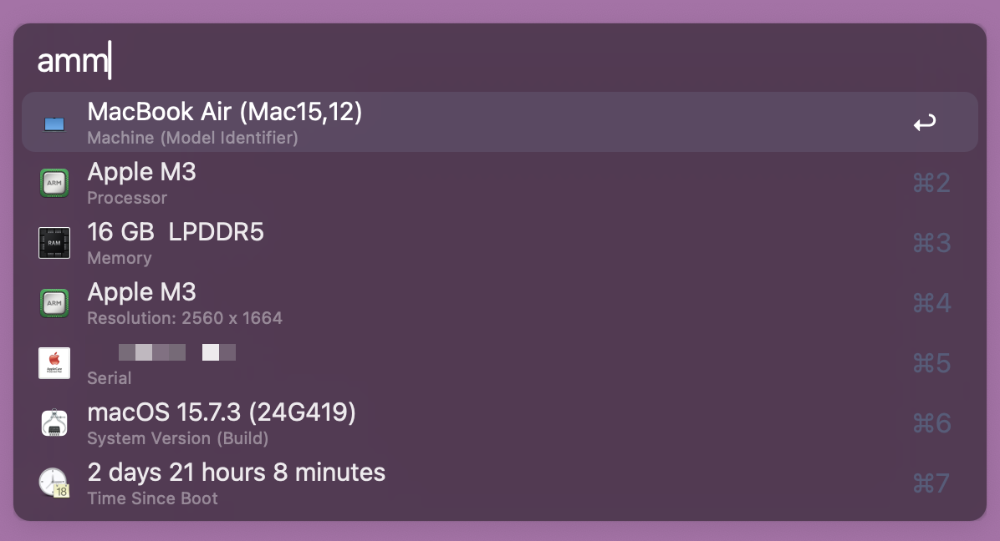
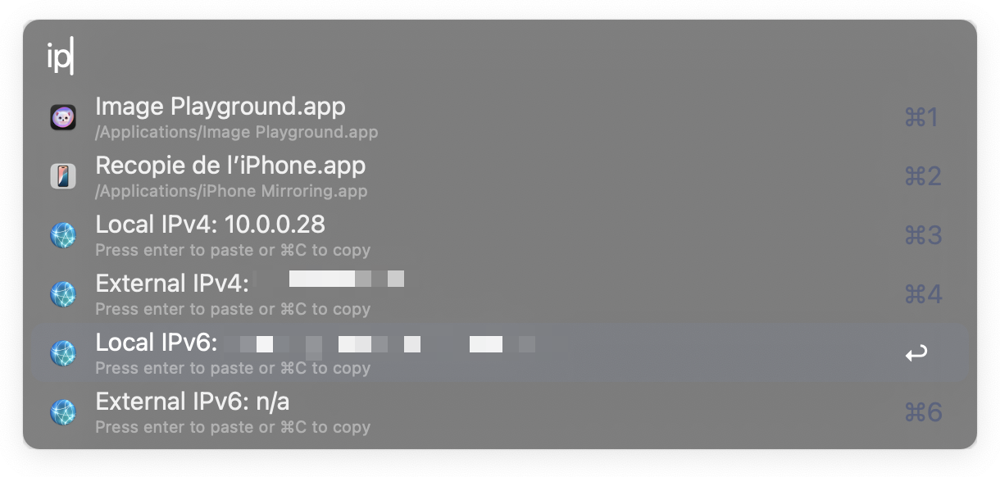
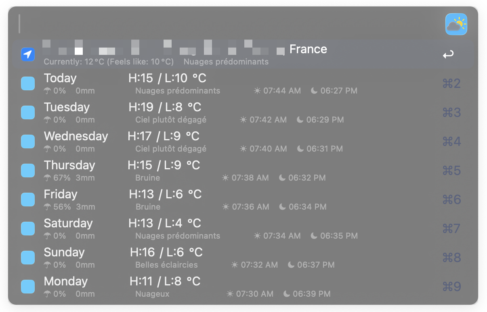
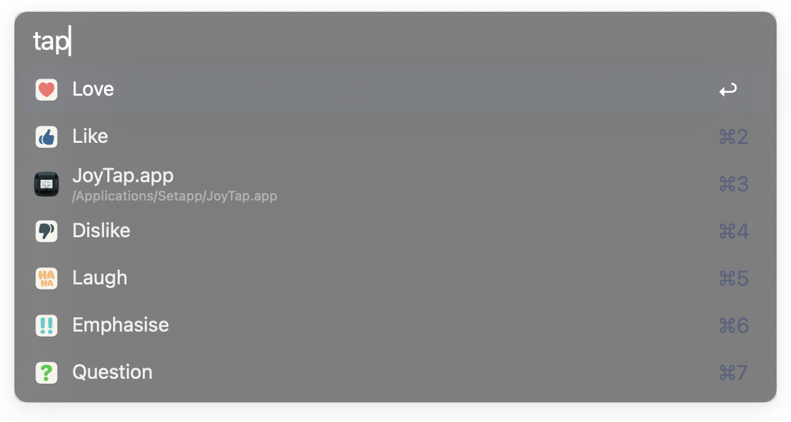

Je vous avais pour la première fois parlé d'Alfred [il y a de ça 10 ans](/2016/05/05/alfred-le-messie-des-feignasses/) (putain 10 ans…) et je me suis rendu compte récemment que je l'utilise toujours et toujours autant mais que ne nombreuses choses ont changé.  
Si le fonctionnement de base (mises à part les quelques *updates* du logiciel entre temps) n'a pas changé, j'ai pas mal chamboulé ma collection de workflows et je me suis dit que ce serait pas mal de faire un point de mise à jour.

<!-- excerpt -->

Je ne vais pas repasser sur les *workflows* que j'utilisais il y a 10 ans, la majorité étant hors-service, mais plutôt passer en revue tout ceux que j'utilise donc aujourd'hui.

## Mes créations à moi

Si je n'ai pas partagé sur le web la majorité d'entre eux parce que trop triviaux ou alors trop spécifiques à mes usages personnels, je vous les montre malgré tout, en guise d'exemple de petits trucs sympa que permet **Alfred**.

### Lien Markdown
Juste un petit raccourci pratique que je me suis fait pour quand j'écris du markdown dans une app qui supporte le markdown mais sans proposer de raccourci clavier pour créer un lien markdown. Ne me demandez pas de nom… je ne suis pas une balance.

<video controls width="100%">
	<source src="./img/markdown-link.webm" type="video/webm">
</video>

### Coller du texte brut
Ça vous est déjà arrivé de copier du texte d'un fichier ou d'une page web puis de coller ailleurs et de voir que le formatage du texte est resté ? C'est chiant, hein ?  
Alors certains logiciels gèrent la possibilité de retirer le formatage en copiant mais c'est loin d'être le cas partout.  
Du coup je me suis créé un raccourci tout con pour y remédier.

<video controls width="100%">
	<source src="./img/plain-text.webm" type="video/webm">
</video>

### Publication d'une nouvelle photo
Je ne vais pas m'étendre sur celui-ci plus que ça puisque j'en ai parlé longuement déjà dans [un autre billet](/2025/01/30/pourquoi-faire-long-et-simple-quand-on-peut-faire-rapide-et-complique/) mais si c'est un workflow bien plus compliqué qu'un bête raccourci, ce dernier m'a quand même permis de drastiquement réduire le temps qu'il me fallait pour publier une de mes photos en ligne sur les réseaux.  
Et rien que pour ça je dis : "Merci Alfred ! 🙇" !

### Snippets de merde
J'en avais aussi déjà parlé… *[il y a 10 ans](/2016/12/17/snippets-de-merde/)*…  mais je me suis fait une collection de snippets avec moult répliques du film *La classe américaine* parce que j'aime sortir des répliques de trucs de pop culture.  
Il est donc toujours disponible sur [Github](https://github.com/GoOz/snippetsdemerde) si ça vous intéresse.

Honnêtement je suis à ça 🤏 de faire la même pour *Kaamelott* et *La cité de la peur*… j'ai juste un peu beaucoup la flemme pour le moment.

## Les créations des autres

> [!NOTE] 
> Les workflows présentés ici ne sont pas tous trouvables au même endroit sur le web, certains sont sur la[ galerie de workflow officielle d'Alfred](https://alfred.app/), d'autres sur **Github**. Partez donc du principe que si je ne mets pas de lien c'est que vous le trouverez sur la galerie.

### 1Password
Je suis client de **1Password** depuis des lustres, j'en suis d'ailleurs très content mais couplé à ce workflow, on gagne un temps de dingue.

Pour des raisons évidentes de confidentialité je ne ferai pas de démo en vidéo mais grosso modo il vous permet de lister et/ou chercher un item dans votre coffre et en récupérer ce que vous souhaitez en deux coups de cuillère à pot grâce à des raccourcis simples :
- `↩` Ouvrir la page web et remplir les informations d'authentification.
- `⌘↩` Voir l'item dans 1Password.
- `⌥↩` Copier le username.
- `⌃↩` Copier le mot de passe.
- `⇧↩` Copier le code de double authentification

C'est beau, c'est rapide, c'est simple, c'est twingo !

### About This Mac
Pas transcendant mais fort habile, ce petit workflow vous permet d'obtenir en 2 secondes des infos matériels et pratiques de votre mac.  
Vous n'avez qu'à taper `amm` (pour about my mac), choisir l'item de votre choix et taper `⌘↩️`  pour copier ses infos.

### Atop
Si vous voulez rapidement voir ce qu'il se passe sur votre mac, il y a ce petit workflow qui ne paye pas de mine mais qui fait des merveilles. Que vous souhaitiez vérifier la consommation de votre processeur ou de votre ram, l'activité de votre réseau ou encore la vitesse de votre connexion internet pour ne nommer que ça il sera là, pragmatique et efficace.

<video controls width="100%">
	<source src="./img/atop.webm" type="video/webm">
</video>

### Calendar++
*Voir sur [Github](https://github.com/zeitlings/alfred-calendar) 🐙.*

Gérer son calendrier en quelques coups de clavier ça fait rêver non ? Et bien grâce à ce workflow vous pouvez consulter et même ajouter des événements en un rien de temps sans avoir l'app Calendar d'ouverte.

Pratique quand vous faites autre chose alors qu'on vous propose un rendez-vous en loucedé que votre Calendrier est fermé et que vous n'avez pas de post-it sous la main.

#### Ajouter un événement

<video controls width="100%">
	<source src="./img/calendar.webm" type="video/webm">
</video>

#### Consulter son calendrier

<video controls width="100%">
	<source src="./img/calendar2.webm" type="video/webm">
</video>

### Calm notifications
Vous êtes en pleine réunion de vidéoconférence et on vous demande de manière impromptue de partager votre écran ? Vite ! Il faut préparer ça et couper les notifications pour éviter tout moment gênant ! 

<video controls width="100%">
	<source src="./img/dnd.webm" type="video/webm">
</video>

### ChatGPT / DALL-E
Je ne suis pas un gros client de l'IA, je dois l'avouer, mais je m'en sers principalement et de manière très ponctuelle pour mes parties de jeu de rôle en ligne quand c'est moi le MJ. Ça me sert surtout à créer à la volée des personnages avec un peu de profondeur pour mes joueurs quand l'occasion se présente.

> [!WARNING] 
> Normalement il est beaucoup plus rapide à répondre mais le jour où j'ai enregistré la vidéo ChatGPT était un peu dans les choux…

<video controls width="100%">
	<source src="./img/chatgpt.webm" type="video/webm">
</video>

### CleanShot
Voir sur [Github](https://github.com/Asikur22/Color-Converter-Alfred-Workflow/) 🐙

J'utilise beaucoup [CleanShot](https://cleanshot.com/) que ce soit pour des raisons pro ou perso (j'y ai accès sans surcoût grâce à mon abonnement [Setapp](https://setapp.com/fr)) et normalement, pour l'utiliser, il faut principalement utiliser la souris… plus maintenant !

<video controls width="100%">
	<source src="./img/cleanshot.webm" type="video/webm">
</video>

> [!NOTE] 
> Il existe aussi un autre workflow un poil plus récent sur [la galerie officielle](https://alfred.app/workflows/stephenc/cleanshot-x/) qui fait grosso modo la même chose. Je n'ai pas eu l'occasion de le tester mais là j'ai la flemme de changer parce que celui là fonctionne toujours bien malgré le fait que sa dernière mise à jour date d'il y a 4 ans x)
### Color Converter
*Voir sur [Github](https://github.com/Asikur22/Color-Converter-Alfred-Workflow/) 🐙*

J'utilisais déjà un workflow similaire il y a 10 ans il est malheureusement décédé des suites d'une incompatibilité python.
Voici donc le remplaçant, il propose moins de couleur que l'ancien mais il couvre mes besoins alors bon…
Bref, proposez une couleur Hexa, RGB(a) ou HSL, choisissez le formatage qui vous convient, taper Entrée et boom c'est dans le presse-papier.

<video controls width="100%">
	<source src="./img/color.webm" type="video/webm">
</video>

### Common Folders
Voir sur [Github](https://github.com/rknightuk/alfred-workflows/tree/main/workflows/common-folders) 🐙

Celui là je pense que ça devrait être une fonctionnalité native pour être honnête (dans Alfred v6 peut être🤞), parce que j'ai pris ce workflow comme base mais j'ai tout changé pour convenir à mes besoins. Mais en bref, si vous avez des dossiers sur votre machine que vous visitez souvent, ça permet de le "mettre en favoris" pour faciliter son ouverture dans Finder.

<video controls width="100%">
	<source src="./img/common-folders.webm" type="video/webm">
</video>
### Currency Converter
Attends… ça fait combien 20£ en € déjà ?

<video controls width="100%">
	<source src="./img/currency.webm" type="video/webm">
</video>

Ah ok, 22,89€ ! Cool !
### Fakum
Si vous travaillez dans le web et qu'il vous arrive de tester des interfaces ou des fonctionnalités d'un site web, vous aurez à remplir des formulaires avec des données diverses et variées sauf que c'est vite chiant, surtout pour des données niche comme… un IBAN, un numéro de carte, etc.

Plus de soucis avec Fakum, c'est vite fait, bien fait !

<video controls width="100%">
	<source src="./img/fakum.webm" type="video/webm">
</video>

### Fastest Emoji Search
*Voir sur [Github](https://github.com/mr-pennyworth/alfred-fastest-emoji/) 🐙*

Les emojis c'est cool mais y en a beaucoup… très beaucoup. Je sais pas vous mais moi j'arrive pas à me souvenir où dans la liste des emojis ils apparaissent, ni de la moitié des mots-clés liés aux emojis que j'utilise souvent donc ne parlons même pas de ceux dont je me sers que sporadiquement.

Heureusement j'ai un peu d'aide avec ce plugin qui supporte en prime les teintes de couleurs de peau et aussi [Emoji Kitchen](https://emojikitchen.dev/) (pour générer des emojis à la volée).

<video controls width="100%">
	<source src="./img/fastest-emoji-search.webm" type="video/webm">
</video>
### Gif Search & Giphy
J'aime bien utiliser les emojis dans mes conversations mais j'aime aussi beaucoup utiliser des gifs (qu'on prononce gif et non gif, bande de sauvages !).  
Dans mon cas j'ai deux sources : une source locale de gifs glanés au fur et à mesure des années et une source en ligne.  
Pour chaque source son workflow !
#### Gif Search
<video controls width="100%">
	<source src="./img/gif-search.webm" type="video/webm">
</video>

#### Giphy
*Voir sur [Github](https://github.com/kejadlen/giphy.alfredworkflow) 🐙*

<video controls width="100%">
	<source src="./img/giphy.webm" type="video/webm">
</video>
Vous pouvez aussi copier le gif directement mais selon le support de l'app ça peut rendre le gif statique, à voir selon vos besoins du coup.
### GitFred
Vous utilisez Github souvent ? vous avez vos propres repository et vous voulez pouvoir avoir un rapide coup d'œil sur ce qui s'y passe sans avoir à ouvrir la page dans votre navigateur ? Bah voilà !

Ce workflow permet même plus pour peu qu'on lui donne les accès de surveiller ses notifications et repository privés.

<video controls width="100%">
	<source src="./img/gitfred.webm" type="video/webm">
</video>
### Google Suggest
Par défaut, quand vous tapez du texte dans Alfred, que ça ne correspond à rien sur votre machine, le comportement de fallback envoie la requête sur Google, en considérant çacomme une recherche sur le web.
Il manquait juste un petit truc pour améliorer l'utilisation de Google, ce sont les suggestions.

<video controls width="100%">
	<source src="./img/google-suggest.webm" type="video/webm">
</video>

### HEIC to JPEG

Qu'on aime ou pas le format HEIC d'iOS il est là mais il peut rapidement devenir contraignant, notamment lorsque que l'on veut partager à des gens qui n'ont pas de de machine Apple.  
Alors des logiciels d'encodage y en a pléthore mais ce workflow a le mérite d'être très rapide puisqu'il n'y a pas de logiciel à lancer, c'est juste un *FileAction* sur Alfred (c'est à dire un workflow qui fonctionne sans requête, juste une opération sur un fichier et/ou dossier).

<video controls width="100%">
	<source src="./img/heic-to-jpeg.webm" type="video/webm">
</video>

### IP Address
Bon ben, c'est simple et direct, c'est juste un workflow qui te renvoie ton adresse Ip local et distante, IPv4 et IPv6.

### Lorem Ipsum
En tant que développeur j'utilise souvent du texte *lorem ipsum* pour remplir mes pages de faux texte mais ça peut vite de venir contraignant d'avoir un site fournissant un tel service toujours ouvert, à devoir jongler entre ce dernier et mon éditeur de code.  
Mais ça c'était avant ce workflow

<video controls width="100%">
	<source src="./img/lorem-ipsum.webm" type="video/webm">
</video>

### Maps Suggest

Même principe que pour **Google Suggest** mais appliqué à *Plans.app*. Et vous pouvez choisir entre Apple Plans ou Google Maps, rien que pour ça c'est cool.

<video controls width="100%">
	<source src="./img/maps-suggest.webm" type="video/webm">
</video>

### Menu Bar Search
Alors celui-là est peu particulier mais j'aime beaucoup. Parfois, quand j'utilise un logiciel de manière trop ponctuelle, j'ai un peu du mal à me souvenir des raccourcis clavier et je me retrouve à aller fouiller les menus déroulant de l'application à la recherche de la fonctionnalité que je souhaite lancer. Mais c'est chiant et c'est long et c'est chiant.  
Grâce à ce workflow, je peux chercher dans l'app active directement avec Alfred la fonctionnalité souhaitée.

<video controls width="100%">
	<source src="./img/menu-bar-search.webm" type="video/webm">
</video>
### Mini Weather
Juste un simple workflow pour avoir un aperçu en un clin d'œil de la météo par heure ou par jour où que vous soyez.

### Optimize Images
Un *FileAction* qui utilise [ImageOptim](https://imageoptim.com/fr) en sous-marin (qu'il faudra donc avoir installé avant sur sa machine).

<video controls width="100%">
	<source src="./img/optimize-images.webm" type="video/webm">
</video>

### Percent Change
*Voir sur [Github](https://github.com/bradmontgomery/alfred-percent-change) 🐙*

Attends… si un vendeur me fait une réduc de 15% sur un produit à 786€ ça va au final me coûter… alors le produit en croix… et je retiens 12… plus l'âge de la comtesse… oh et puis merde

<video controls width="100%">
	<source src="./img/percent-change.webm" type="video/webm">
</video>

### Reminders Today
Avoir des choses à faire c'est chiant. Avoir l'app Rappels (Reminders) toujours ouverte c'est chiant. Pouvoir vite fait rajouter des choses et les cocher comme fait c'est mieux.

<video controls width="100%">
	<source src="./img/reminders-today.webm" type="video/webm">
</video>

### Search CanIUse
Dans le genre qui aide les développeurs ce workflow de recherche sur le site [CanIUse](https://caniuse.com/) avec suggestions est fort pratique aussi.

<video controls width="100%">
	<source src="./img/caniuse.webm" type="video/webm">
</video>
### Sequential Paste
Il existe plein de logiciels qui gèrent bien mieux le copier/coller séquentiel mais pour le besoin que j'ai ce workflow fait très bien le job (et puis le *clipboard history* natif de Alfred est bien complémentaire aussi) et ça me suffit.

<video controls width="100%">
	<source src="./img/sequential-paste.webm" type="video/webm">
</video>

### Simple 2FA Paste
D'habitude, j'utilise la 2FA intégrée dans *1Password* mais il arrive que des services ne proposent que l'envoi de code par SMS ou par mail.

Ce workflow prend en charge les SMS. Il va aller chercher dans vos récents messages le ou les codes 2FA et vous n'aurez plus qu'à choisir le bon.

Bon là je n'ai pas d'exemple parce que je n'ai pas de messages récents mais je vous laisse imaginer.

À savoir qu'il existe un [workflow similaire](https://alfred.app/workflows/mayjunejuly/2fa-email-codes/) pour les mails mais qui ne se cantonne qu'à *Mail.app* et je ne l'utilise pas donc je n'ai pas grand chose à en dire.

### Tapback Message
Un petit workflow à la con c'est certain mais si comme moi vous utilisez au moins un peu les réponses *Tapback* (les réactions avec emojis) sur vos messages et que ça vous emmerde d'aller sur l'app Message, de trouver le message en question, de clic droit et choisir l'emoji alors ce workflow est fait pour vous.

Répondez donc avec un *tapback* sur votre dernier message reçu sans quitter votre clavier en un temps record !

### Unit Converter
Le web est terni d'une présence américaine constante et honnêtement je pourrais vivre avec si seulement ils utilisaient le système métrique comme tout le monde. Mais non… Bref heureusement que j'ai ce workflow pour faire mes conversions.

<video controls width="100%">
	<source src="./img/unit-converter.webm" type="video/webm">
</video>

## Et encore… c'est pas tout
Je vous ai juste fait une liste des workflows les plus intéressants selon moi mais j'en utilise encore moult qui pour diverses raisons (trop niche, déprécié mais qui fonctionne encore, trop basique, déjà évoqué précédemment, pas encore assez testé, etc) n'apparaitront pas ici. Ce billet est déjà assez long comme ça et m'a pris assez de temps comme ça.

J'espère que si vous êtes déjà utilisateur d'Alfred, vous aurez découvert quelques trucs sympas, sinon que je vous aurais au moins tenté de vous laisser séduire.

On se revoit dans 10 ans !

